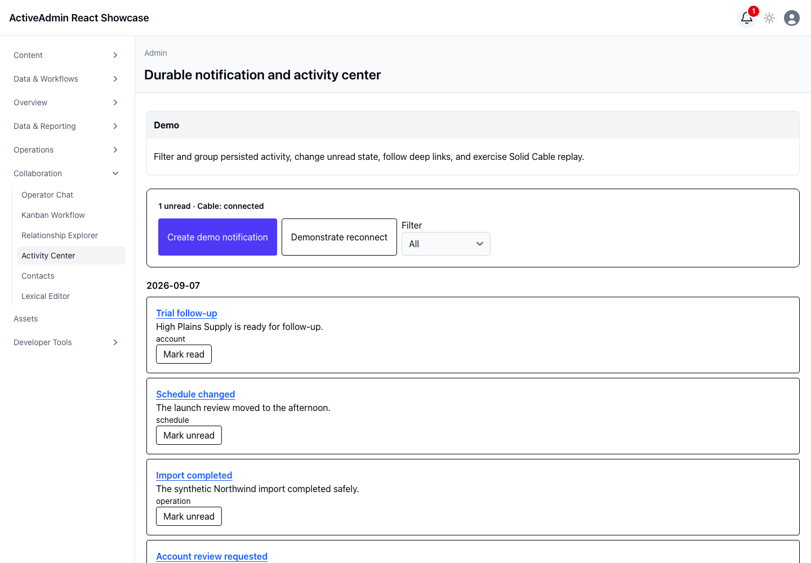

<!-- docs/activity-center.md -->

# Notifications and Activity Center

## Demo

The authenticated ActiveAdmin title bar presents a notification bell beside the theme and user controls. Its badge is hidden at zero and otherwise exposes the canonical unread count through a dynamic accessible label. Activating the bell opens the Activity Center, where operators can group and filter bounded history, change unread state, follow local deep links, create a live event, and deliberately reconnect.

## Ruby

`ActivityCenter::Create` obtains the next owner-scoped sequence, persists the notification, and only then broadcasts its serialized envelope. `ActivityCenter::UnreadProjection` derives the count from Rails-owned records and broadcasts a canonical snapshot after read-state mutations. Reads and mutations begin from `current_admin_user`; history and replay are capped at 100 rows.

## JavaScript

The page island owns transient filters and optimistic read feedback. Failed writes restore the prior canonical state and publish the inverse delta to the header. The small `NotificationBell` island accepts only the initial count, Activity Center URL, and replay cursor. Sequence-keyed delivery deduplicates notification broadcasts and reconnect replay; canonical count envelopes reconcile the projection.

## Architecture

SQLite owns records and unread state. Solid Cable is a delivery accelerator, never the source of truth. Reconnect supplies the last applied sequence so persisted gaps replay in order, then Rails sends the canonical count. The application-owned `_site_header` override is deliberately limited to the bell mount and otherwise follows the AA4 header structure; reconcile it when upgrading ActiveAdmin. Without JavaScript, the mount remains an ordinary Activity Center link. Deep links are restricted to local `/admin/` paths.

The maintained [`scarver2/seedbank`](https://github.com/scarver2/seedbank) fork
provisions the deterministic activity history through the focused
`db:seed:activity_center` task after the administrator seed. The application
pins version `0.5.0` to commit
[`12449f3`](https://github.com/scarver2/seedbank/commit/12449f33997f463d5b56f90b605dafc0a7065bff)
and uses this showcase as a Rails 8.1/Ruby 4 dogfood environment. Rendering the
page only reads persisted owner-scoped rows; it never creates demo data as a
request side effect. Dogfooding produced focused upstream reports, resolved by
[public version exposure](https://github.com/scarver2/seedbank/pull/31),
[Rails-native seed lifecycle task assertions](https://github.com/scarver2/seedbank/pull/32),
and [Ruby 4 RDoc tooling](https://github.com/scarver2/seedbank/pull/33); the
showcase consumes the maintained fixes without local shims.

## Screenshot

This durable capture was produced by Playwright in real Chromium from the
deterministic synthetic activity history. It supplements the browser interaction
suite.

—
Stan Carver II
Made in Texas 🤠
https://stancarver.com
