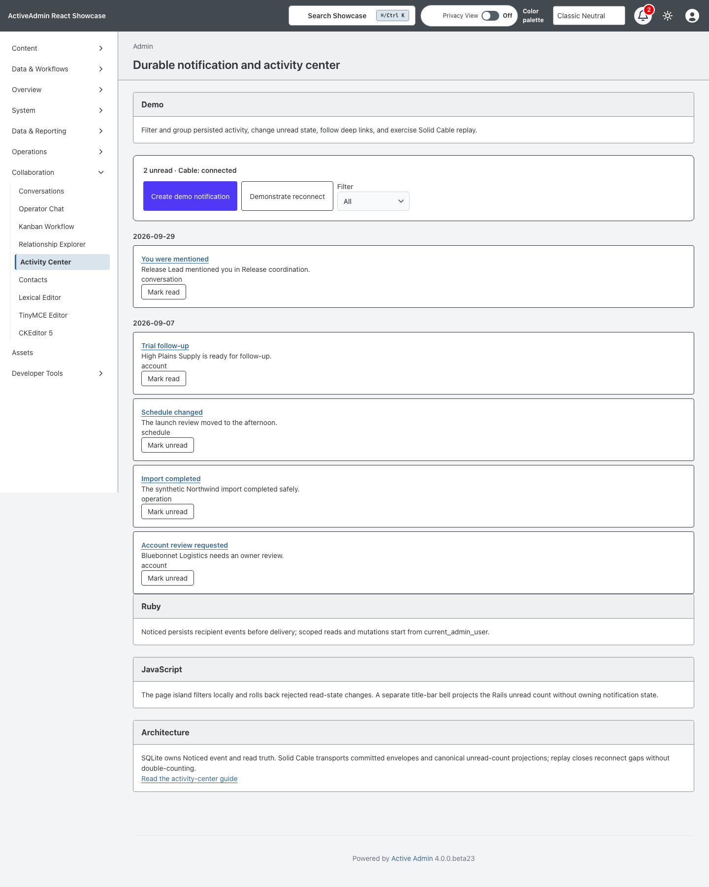
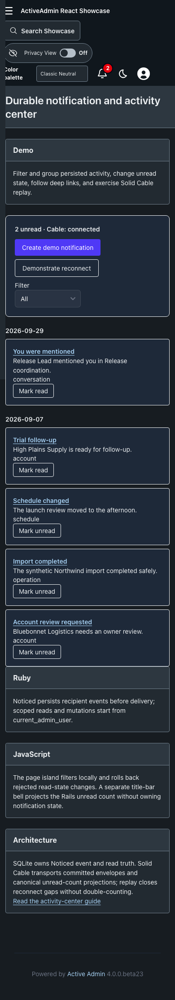
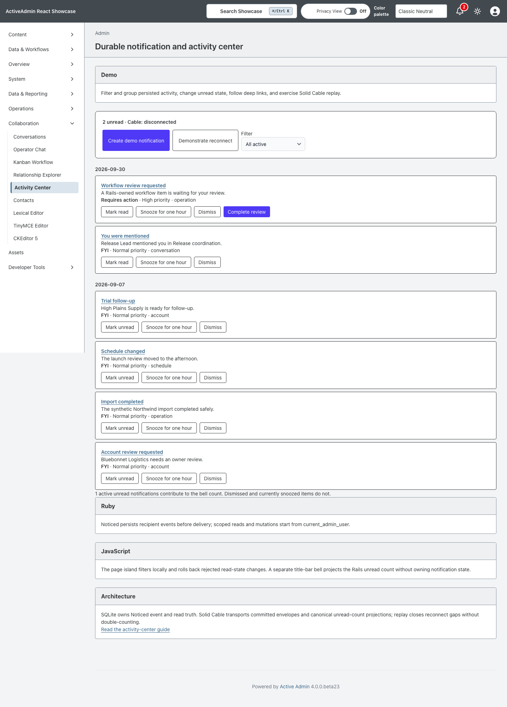
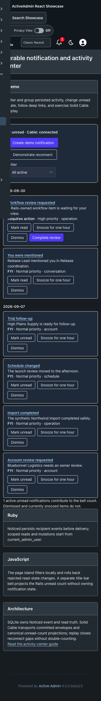

<!-- docs/activity-center.md -->

# Notifications and Activity Center

## Evaluation decision

Showcase adopts Noticed 3.0.0 as its canonical notification projection and
delivery layer. The gem is MIT-licensed, Rails-native, and supplies the four
pieces this boundary needs without claiming domain ownership: polymorphic
source records, recipient-specific durable notification rows, durable
read/unread state, and an Action Cable delivery method. Its event/notifier
shape can project future approvals, assignments, deadlines, and exceptions
without placing those business rules in the Activity Center.

The adoption is intentionally bounded. Noticed does not replace conversation
membership or authorization, message and mention records, message
dispositions, controller scoping, deep-link validation, replay semantics, or
the public bell envelope. No email, push, or third-party provider is
configured. A notification is a recipient-facing projection of already
committed truth, not a second source of business truth.

## Actionable attention inbox

The authenticated ActiveAdmin title bar presents a notification bell beside
the theme and user controls. Its badge is hidden at zero and otherwise exposes
the canonical active unread count through a dynamic accessible label.
Dismissed and currently snoozed notifications do not contribute to that count.
Activating the bell opens the Activity Center, where operators can filter
**Requires action**, **FYI**, unread, snoozed and dismissed projections; change
durable state; follow local deep links; and deliberately reconnect.

Recipient notification rows add constrained `attention_kind` and `priority`
values, durable `snoozed_until` and `dismissed_at` timestamps, and optimistic
locking. These are presentation/attention states, not business workflow state.
The demo's **Complete review** action resolves the Noticed event's canonical
`WorkflowItem`, verifies that Rails still considers it in `review`, and moves it
to `done` through `Workflow::Move`. IDs or target states placed in notification
params are never accepted as domain truth.

## Ruby

[`excid3/noticed`](https://github.com/excid3/noticed) is the notification
projection and delivery layer. `ActivityNotifier` retains the generic demo
event while `ConversationMentionNotifier` projects a committed, structured
`MessageMention` to its authenticated recipient. The Noticed event references
the originating `Message`; its params carry only a bounded summary and the
canonical `/admin/conversations/:id#message-:id` deep link, never a copy of the
message body. The callback runs after commit and reports projection failures
without rolling back durable conversation truth.

`ActivityCenter::Create` is the application adapter for generic events.
`ActivityCenter::Inbox` owns the recipient-scoped attention queries.
`ActivityCenter::MutateState` provides read, snooze, dismiss and restore
transitions, while the existing `ActivityCenter::SetReadState` API delegates to
it so the established read endpoint contract is unchanged.
`ActivityCenter::PerformAction` is the isolated adapter to Rails-owned domain
truth. `ActivityCenter::UnreadProjection` derives the canonical owner-scoped
count after mutations. Reads and mutations begin from `current_admin_user`;
history and replay are capped at 100 rows.

## JavaScript

The page island owns transient filters and optimistic read, snooze, dismiss and
restore feedback. Failed writes restore the prior canonical state, expose an
accessible error, and publish the inverse count delta to the header. Attention
kinds and priorities always include text; color is supplementary. The small
`NotificationBell` island accepts only the initial count, Activity Center URL,
and replay cursor. Sequence-keyed delivery deduplicates creation broadcasts;
canonical count envelopes reconcile mutations and reconnects.

## Architecture and ownership

SQLite owns Noticed events, recipient notifications, and attention state. Solid
Cable is a best-effort delivery accelerator, never the source of truth.
Reconnect supplies the last applied notification ID so persisted gaps replay
in order, then Rails sends the canonical count. Reloading the page therefore
recovers missed events, read state, snoozes, dismissals and completed actions
without relying on JavaScript. A Cable failure is logged after persistence and
never rolls back notification or workflow truth.

Noticed replaces the custom `ActivityNotification` table/model, manual
owner-scoped sequence allocation, custom read timestamps, and the direct
broadcast performed by the old creator. Showcase deliberately retains the
externally observable bell envelope, the `ActivityCenterChannel` replay and
count protocol, the owner-scoped controller, the ActiveAdmin page and no-JS
fallback, and the local deep-link policy. No-JavaScript forms expose the same
read, snooze, dismiss, restore and workflow action endpoints. `Conversation`, `Message`,
`MessageMention`, and `MessageDisposition` remain the domain truth. The
notifier boundary is generic enough for later approvals, assignments,
deadlines, and exceptions without embedding application-specific business
semantics here.

The application-owned `_site_header` override remains limited to the bell
mount and otherwise follows the AA4 header structure; reconcile it when
upgrading ActiveAdmin. Without JavaScript, the mount remains an ordinary
Activity Center link and the server-rendered list can follow deep links and
change read state. Deep links are restricted to local `/admin/` paths. This
slice configures no email, push, or third-party delivery provider.

This capability reserves version `0.29.0`. Its branch is independently based
on the accepted `0.25.0` master and is planned to land after the independent
`0.26.0`–`0.28.0` conversation slices; reconciliation must preserve that
ordered SemVer line without implying a code dependency.

The maintained [`scarver2/seedbank`](https://github.com/scarver2/seedbank) fork
provisions the deterministic activity history through the focused
`db:seed:activity_center` task after the administrator seed. The application
pins version `0.5.0` to commit
[`12449f3`](https://github.com/scarver2/seedbank/commit/12449f33997f463d5b56f90b605dafc0a7065bff)
and uses this showcase as a Rails 8.1/Ruby 4 dogfood environment. Rendering the
page only reads persisted owner-scoped rows; it never creates demo data as a
request side effect. Dogfooding produced focused upstream reports, resolved by
[public version exposure](https://github.com/scarver2/seedbank/pull/31),
[Rails-native seed lifecycle task assertions](https://github.com/scarver2/seedbank/pull/32),
and [Ruby 4 RDoc tooling](https://github.com/scarver2/seedbank/pull/33); the
showcase consumes the maintained fixes without local shims.

## Screenshot

These durable captures were produced by Playwright in real Chromium from the
deterministic synthetic conversation and activity history. They supplement the
browser interaction suite and demonstrate the recipient-specific mention in
the existing bell contract.

| Desktop light, 1440px | Narrow dark, 390px |
|---|---|
|  |  |

The actionable-inbox evidence uses the same deterministic Chromium path after
creating a recipient-specific Rails workflow review.

| Actionable inbox, desktop light | Actionable inbox, narrow dark |
|---|---|
|  |  |

—
Stan Carver II
Made in Texas 🤠
https://stancarver.com
