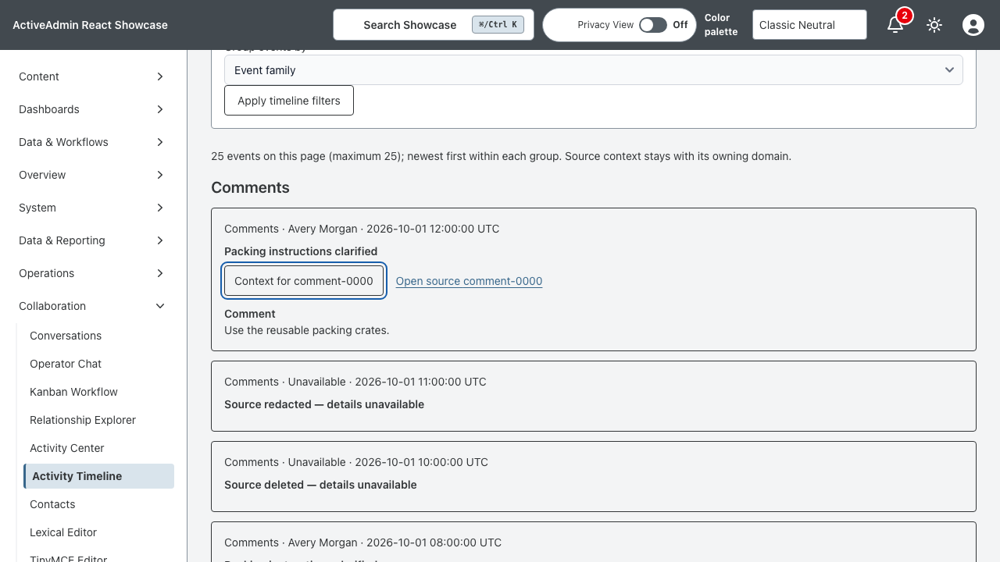
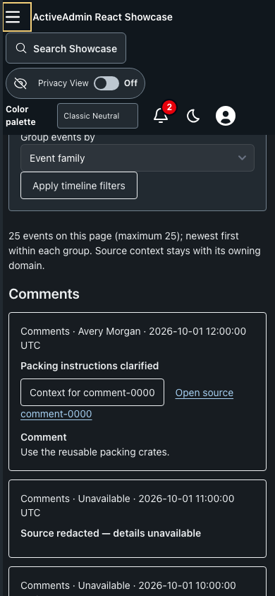

<!-- docs/activity-timeline.md -->

# Cross-Domain Activity Timeline

Open `/admin/activity_timeline` after signing in. This read-only synthetic
laboratory combines comments, status changes, approvals, files, messages,
assignments, and system events. It does not read live conversations or audit
records and makes no domain writes.

## Ownership and Ordering

`Showcase::TimelineSources` owns the seven fixture families and their distinct
context fields. The timeline projects a common identity, timestamp, family,
actor, summary, availability, and canonical source URL. Source URLs open the
owning synthetic record inspector, not an unrelated live record. Repeated source
IDs are deduplicated. Events sort descending by UTC timestamp and stable ID,
including ties. The fixture version must change when fixture history changes.

Family, actor, and inclusive UTC date filters apply before paging. Grouping is
within each page, by day, family, or actor. Each page has at most 25 events.
Signed one-hour resume links bind the last ordering key to the administrator,
filters, and fixture version. Reload/back navigation works without browser-local
state. Invalid, altered, expired, or cross-reader links offer recovery to page one.

## Availability and Accessibility

Authentication is required for both the feed and source inspection. The shared
demo excludes restricted fixtures before projection. Redacted and deleted
fixtures retain only identity, family, timestamp, and a placeholder; actor,
context, and source links are removed before actor filtering. Unavailable or
unknown source inspection returns 404. A signed cursor never grants source access.

Native labelled GET filters, headings, ordered lists, semantic times, and page
links work without JavaScript. React adds keyboard-operable context disclosure
with `aria-expanded` and `aria-controls`. No infinite feed or automatic focus
movement is used.

## Verification and Boundaries

The bounded fixture corpus has 1,400 records, 1,393 visible identities and 56
pages. Service tests traverse the complete history without omissions or repeats,
including tied timestamps, and exercise cursor integrity, expiry, filters,
deduplication, and unavailable sources. Request tests cover authentication and
the no-JavaScript fallback. Component and browser tests cover disclosure,
grouping, paging/reload, source navigation, recovery, and narrow dark layout.

This demo materializes its bounded fixture corpus in memory. It is not a claim
of production-scale database performance or a generic authorization system.
Live adapters would need domain-specific access policies and indexed keyset
queries; they must not copy sensitive domain data into a second source of truth.
No migration, background job, external service, or new dependency is required.
Use the existing [deployment](deployment.md) and [testing](testing.md) procedures.

Back to [documentation](README.md) and the [project](../README.md).

## Screenshots

—
Stan Carver II
Made in Texas 🤠
https://stancarver.com
