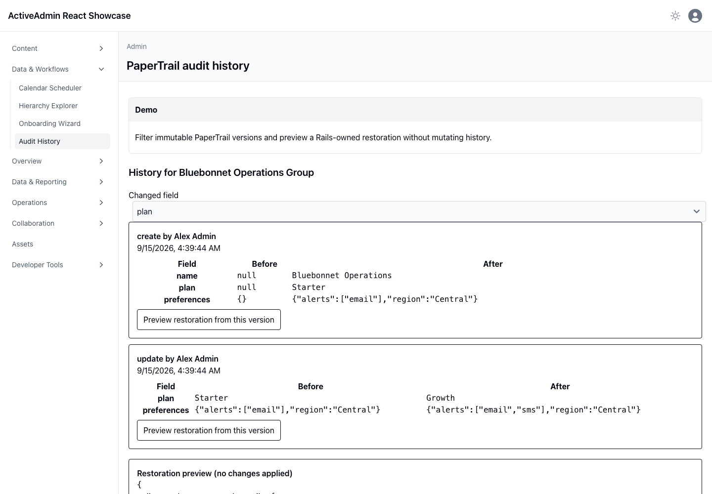

<!-- docs/audit-history.md -->

# Audit history and diffs

## Demo

The page shows deterministic synthetic PaperTrail versions, actors, timestamps, complex values, field filtering, and a non-mutating restoration preview. The seeded “Alex Admin” actor is a small shoutout to Alex Heath-Williams' `paper_trail_diff` gem used by the showcase.

## Ruby

PaperTrail 17 records immutable provenance. `paper_trail_diff` 0.12.0 compares a selected historical endpoint with the current record and returns structured immutable values. Actual restoration is deliberately absent until a separately authorized Rails command owns it.

## JavaScript

React presents field filters, chronological comparisons, and the preview. It cannot edit version rows or restore records.

## Architecture

This consumes [PaperTrail](https://github.com/paper-trail-gem/paper_trail) and Alex Heath-Williams' [paper_trail_diff](https://github.com/aheathwilliams/paper_trail_diff) through their public APIs. No application patch or upstream defect was required.

## Screenshot

This durable capture was produced by Playwright in real Chromium from synthetic
PaperTrail history. It supplements the browser interaction suite. Regenerate it
with `CAPTURE_SHOWCASE_SCREENSHOTS=1 npm run browser:test -- test/browser/audit_history.spec.ts`.

—
Stan Carver II
Made in Texas 🤠
https://stancarver.com
