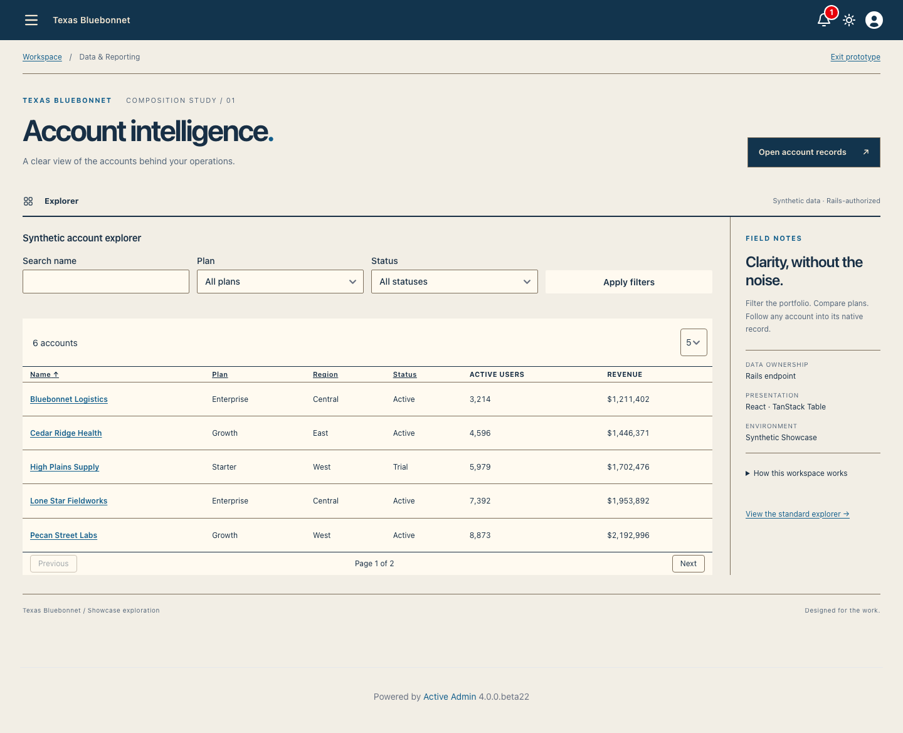
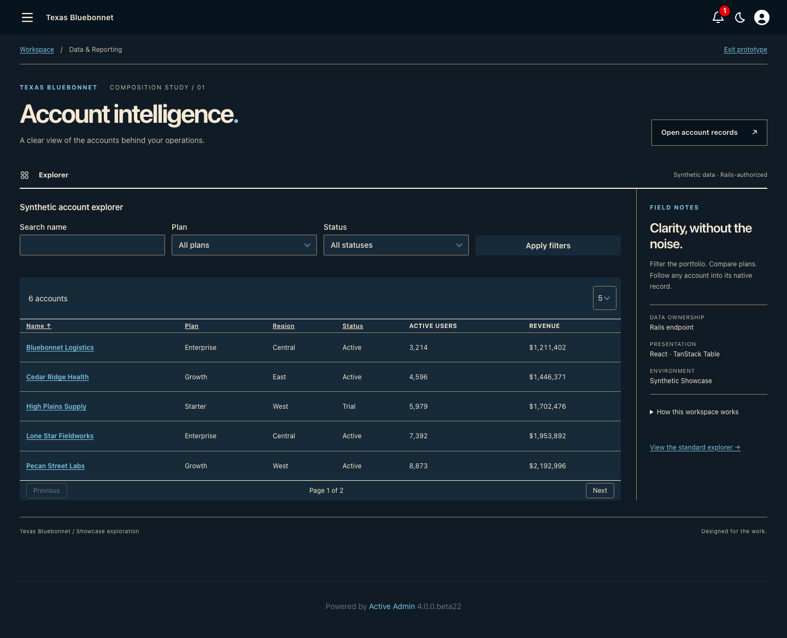
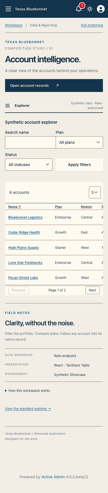
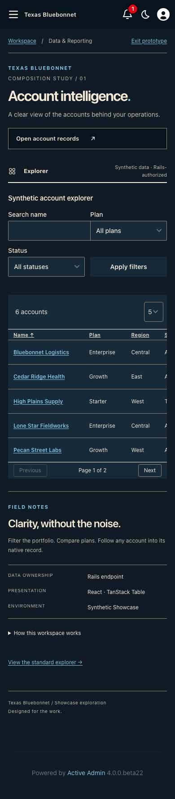

<!-- docs/bluebonnet-workspace-exploration.md -->

# Texas Bluebonnet Workspace Exploration

This began as a screenshot-review prototype and is now the executable consumer
proof for the approved reusable theme composition.
PR #69 owns persisted color palettes on the existing composition. This separate
slice explores an entire workspace at `/admin/data_explorer?composition=bluebonnet`.
The normal explorer and every other page retain their current composition.

## Design Direction

- No permanent navigation sidebar: the existing AA4 drawer remains available at
  every width, with its native interaction and keyboard dismissal.
- Full-width workspace, editorial page hierarchy, a contextual action, a compact
  workspace bar, and one continuous table surface instead of stacked cards.
- Contextual field notes sit beside the desktop data and below it on narrow screens.
- Fixed approved cream/navy palette direction for this study; the palette selector
  is intentionally absent here, so it cannot imply a selection changes this theme.
- The shared semantic `dashboard` icon supplies the geometric explorer landmark;
  native functional navigation/user controls remain unchanged. Heroicons provenance
  and license are recorded in the landed semantic icon foundation.

## Behavioral Boundary

AccountExplorer behavior and its endpoint are unchanged. Sorting, filters, pagination,
authorization and account URLs remain Rails-owned. The page still renders through
ActiveAdmin, including its menu, user controls, notifications and dark-mode control.
The prototype has a server fallback link to native Account views without JavaScript.

Presentation is now owned by exact pinned `activeadmin-themes` source. Its
installer produces one deterministic application-owned
`active_admin_texas_bluebonnet.css`; the host explicitly imports that file, opts
the page into the theme on `body`, and maps documented composition slots onto
existing semantic markup. The local monolithic prototype stylesheet has been
deleted. No route, authorization rule, React behavior, server fallback or native
ActiveAdmin interaction moved into the gem.

## Exact Screenshot Provenance

The historical design source was
`13a2557f7f92bc7d9513e96b74bb363e88e7b775`, refreshed onto `master` at
`cedad515622940ed5200a408dd98bff7e6f9a462` after the semantic icon foundation
landed. These images are fresh consumer-path evidence generated from the same
rendering source committed with them, with `activeadmin-themes` pinned to exact
commit `c29216395c358acac3ae1c8863a31a0113334cec`. Local macOS Chromium via repository-locked
Playwright; synthetic `bin/browser-server` seed; viewport height 1000, widths 1440
and 390; full-page capture. Light/dark root state is explicitly selected by the
test before capture. No production data or credentials are in these artifacts.

Command:

```sh
CI=1 PLAYWRIGHT_PORT=3185 CAPTURE_SHOWCASE_SCREENSHOTS=1 mise exec -- \
  npx playwright test test/browser/bluebonnet_workspace.spec.ts
```

All four cases pass: render, document overflow check, filter/reset, next page,
native drawer open and Escape dismissal. Assertions cover the accessible Rows
name/native tooltip, visually hidden label, matching header/table background,
compact desktop header/footer heights and retained 44px narrow Rows control.
The shared registry owns the explorer glyph and the request spec proves the
Heroicons symbol reference. All 404 RSpec examples pass at 92.24% line and 85.17%
branch coverage; TypeScript, all 173 Vitest tests at 100% coverage, the production
build, all 43 Chromium cases, RuboCop, RBS validation, Brakeman, Bundler Audit and
npm audit pass. The browser server builds the assets afresh. This is not a full
accessibility, physical-device, multi-browser, or release acceptance claim.

| Capture | SHA-256 |
| --- | --- |
| 1440 light | `4ebaeb838c177046ea1d39472eacb173d05e63dd1278ae4cd15ac527e4df1745` |
| 1440 dark | `85377fa67d2e2c9bc3680e8dedd8cbc061edb0b8edd89587d2e7f36c6b78bf1e` |
| 390 light | `88294da12da1fa717cb9e2c9c055bf9a24a5d176479eaecf75daf2a890d1d35f` |
| 390 dark | `dbf335c6a324183d2332efa87ddb2231c70e4c1acf23f09c5b42dc356a69054d` |

## Requested Table Refinement

Addresses [the review comment](https://github.com/scarver2/activeadmin-react-showcase/pull/73#issuecomment-5751992958):
the visible Rows label is hidden only in Bluebonnet while its accessible label and
native `title="Rows"` tooltip remain. The column header uses the continuous table
surface rather than a contrasting band. Header and pagination padding are reduced;
body-row density is unchanged. Narrow controls retain their 44px minimum height.
All four refreshed images were visually inspected, including value/arrow spacing.

## Review Images






## Remaining Acceptance Boundary

Narrow tables deliberately scroll horizontally, preserving the native column data.
Broader keyboard, zoom, contrast, preference and browser/device acceptance remains
necessary before adopting this as a full theme. No merge, release, publication or
Rodeo adoption is implied by this prototype.

—
Stan Carver II
Made in Texas 🤠
https://stancarver.com
