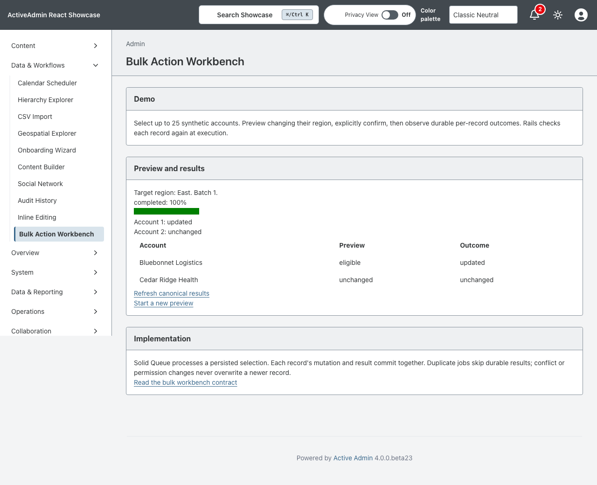
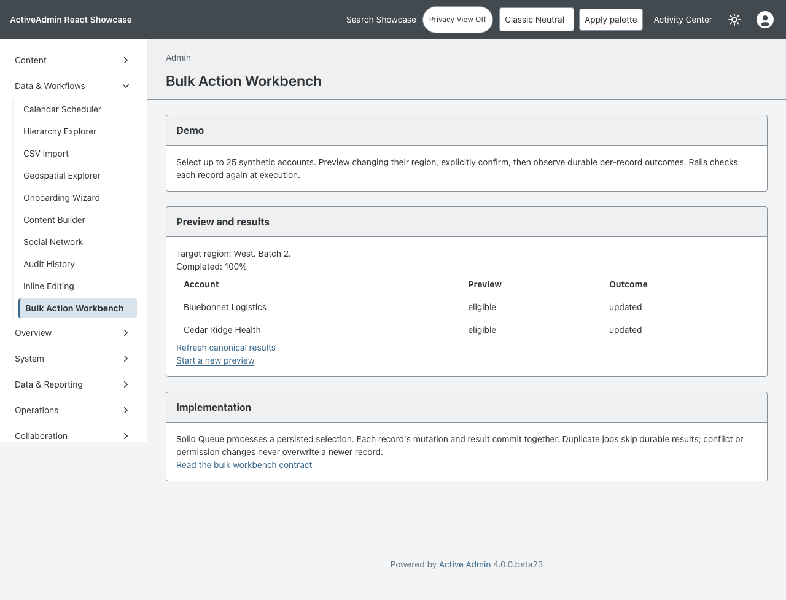

<!-- docs/bulk-workbench.md -->

# Bulk Action Workbench

[Documentation](README.md) · [Issue #95](https://github.com/scarver2/activeadmin-react-showcase/issues/95)

The **Data & Workflows → Bulk Action Workbench** demonstrates a bounded region change for up to 25 synthetic accounts. Select records, inspect the preview, explicitly confirm, then inspect individual outcomes. Preview never writes accounts. Existing account administration remains available.

Rails owns selection, authorization, confirmation and persistence. Each persisted preview records IDs and optimistic-lock revisions; execution rechecks the current region-edit policy. Inactive accounts are unauthorized, missing records are missing, unchanged targets are skipped, and changed revisions conflict rather than being overwritten. This demonstration uses the existing active-account policy, not a claim of production tenant authorization.

Solid Queue executes a dedicated job. Each account mutation and its corresponding result commit in one transaction. Duplicate jobs and repeated confirmations skip completed records. A worker interruption leaves completed outcomes intact; **Resume pending records** enqueues the same batch. A queue outage requires restoring the worker and resuming, not selecting the records again. Application validation failures are recorded as invalid; unexpected infrastructure failures remain pending and surface through the job system.

The React island only polls the owner-scoped JSON status endpoint. It never submits mutations. Failed polling offers an explicit retry. Canonical Rails forms and **Refresh canonical results** work without JavaScript; reload restores the batch by its ID. Batch receipts are private to the creating administrator. This is not a generalized bulk execution framework, mass-delete tool, or gem extraction.

## Verification

RSpec covers invalid selections, owner boundaries, preview non-mutation, changed permissions/revisions, partial success, interrupted-job recovery, duplicate concurrent workers, and migration up/down. Vitest covers read-only polling, terminal state, offline recovery and unmount races. Chromium exercises keyboard confirmation, real Solid Queue processing and canonical reload with JavaScript enabled and disabled.

Run through the mise toolchain: `bundle exec rspec`, `npm run typecheck`, `npx vitest run --coverage --maxWorkers=1`, and `npx playwright test test/browser/bulk_action_workbench.spec.ts`. The browser harness resets its isolated test database; do not run RSpec against that same database simultaneously.

## Operations and delivery

Apply the additive `CreateBulkRegionBatches` migration before serving the feature and run the existing Solid Queue worker. Rolling back drops only batch receipts; it does not undo account changes. Follow the existing [deployment](deployment.md) and telemetry procedures. Ordinary CI does not deploy. No new dependency or runtime service is introduced.

The independent branch uses the next pre-1.0 minor version, 0.30.0; reconcile version order with other accepted feature branches when landing.

—
Stan Carver II
Made in Texas 🤠
https://stancarver.com
