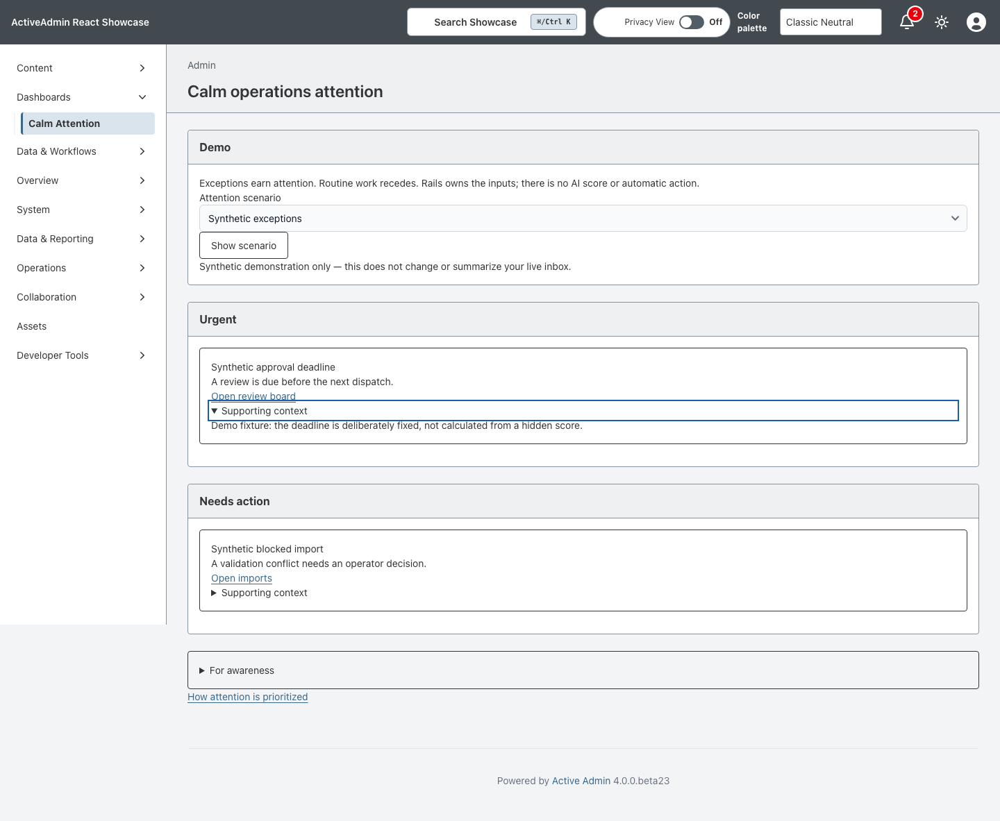
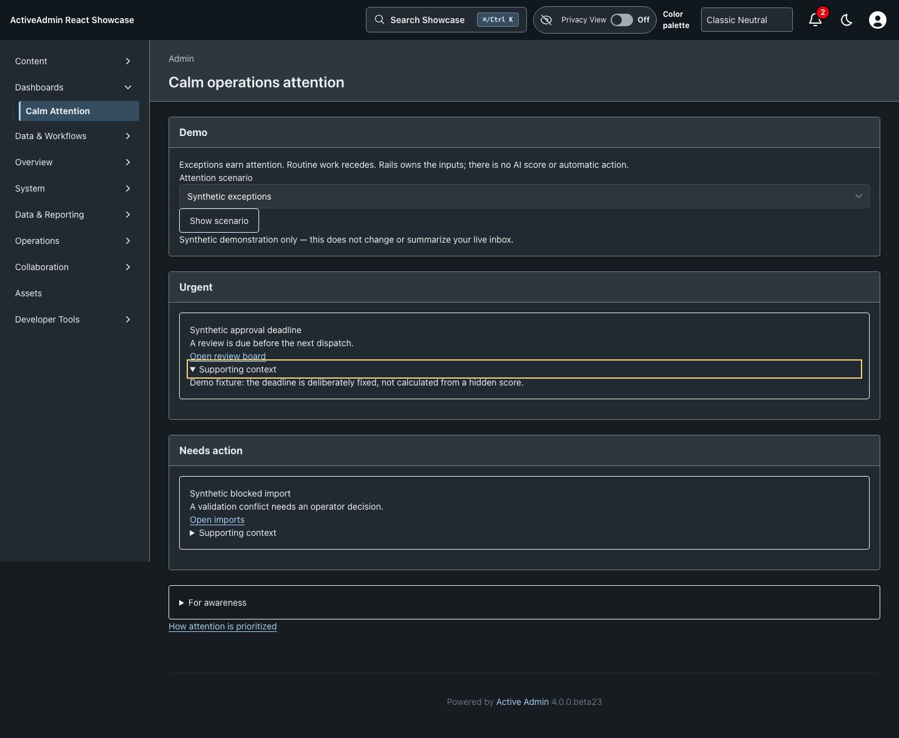
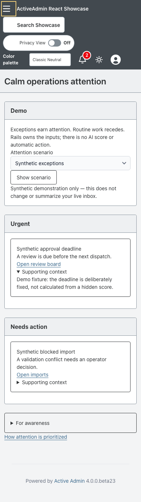
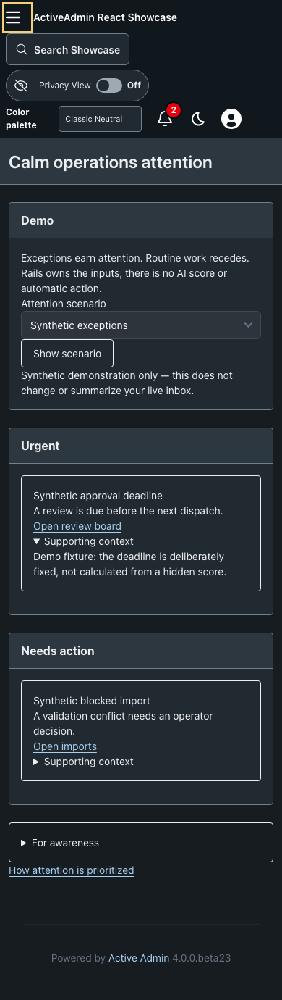

<!-- docs/calm-attention.md -->

# Calm Operations Attention

[Documentation](README.md) · [Issue #92](https://github.com/scarver2/activeadmin-react-showcase/issues/92)

**Dashboards → Calm Attention** presents three explicit groups: Urgent, Needs action, and For awareness. High-priority items only become urgent when they explicitly require action. FYIs remain informational regardless of their priority, and their group is collapsed initially. Each visible item explains why it is present, offers one source action, and discloses supporting context on demand.

The live view uses the authenticated administrator's existing Noticed inbox. Dismissed and currently snoozed items are excluded. Rails prioritizes the latest 100 active notifications using their persisted attention kind and priority, preserving newest-first order within a group. Each group displays at most three items and reports overflow; the Activity Center remains the canonical complete inbox. This is a bounded attention view, not a guarantee that older historical items are all summarized.

Two read-only synthetic scenarios demonstrate exceptions and the healthy empty state. They are explicitly labeled and never modify or conceal the live inbox. Their deadlines and conflicts are explanations of fixtures, not inferred real-world alerts or AI scoring. Source links open existing Rails pages; mutations remain subject to those pages' normal authorization and confirmation rules.

Native forms, links and details/summary disclosures support keyboard operation and useful no-JavaScript behavior. Urgency uses text, not color alone. The implementation introduces no React island because native controls satisfy this surface without extra client state.

## Proof and operation

RSpec covers owner isolation, urgency classification, snooze/dismiss exclusion, bounded groups, overflow and deterministic fixtures. Chromium verifies keyboard disclosure, healthy-state switching, no-JavaScript behavior, and no horizontal overflow at desktop/narrow widths in light/dark mode.

Use the existing [testing](testing.md), [deployment](deployment.md), and telemetry practices. No migration, new dependency, worker, hosted AI service or deployment is introduced. This is Showcase evidence only, not authorization for Rodeo adoption. Version 0.30.0 is the independent branch's next minor; reconcile accepted landing order before merge.

—
Stan Carver II
Made in Texas 🤠
https://stancarver.com
