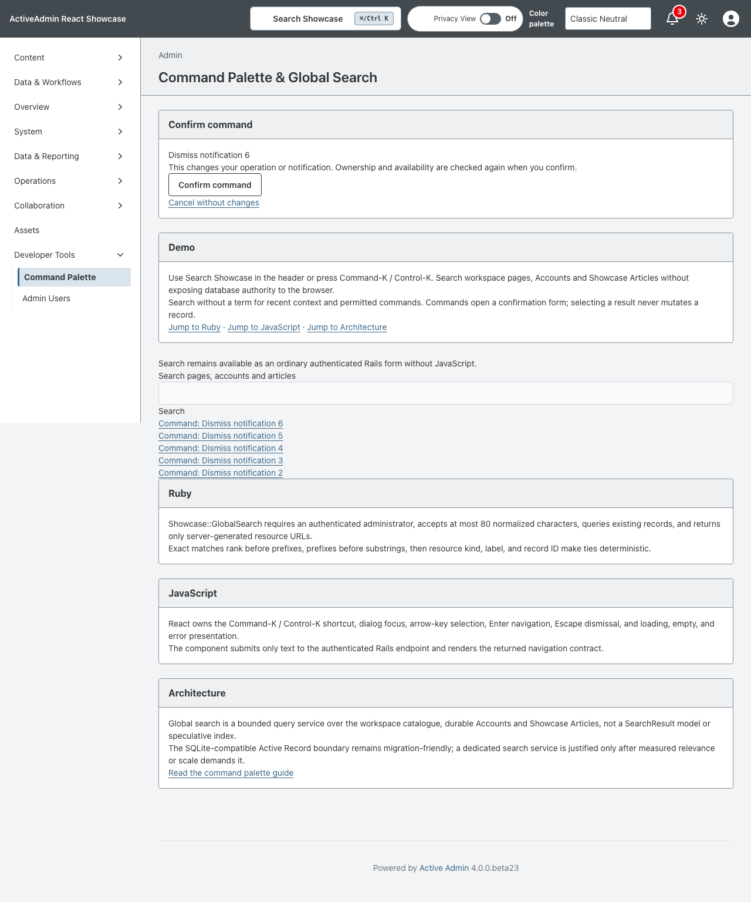
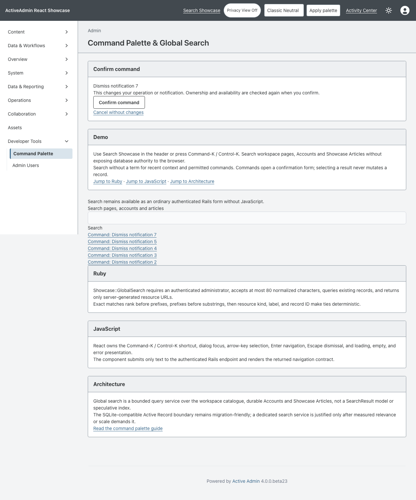

<!-- docs/command-palette.md -->

# Command Palette and Global Search

Global Search demonstrates keyboard-first navigation across existing showcase
pages and records. One palette lives in the global header on every authenticated
admin page. It is an authenticated query surface, not a new persistence model
or a browser-owned search engine. Issue #88 builds on this contract with grouped
navigation, records, recent context, and permitted commands.

## Commands and Recent Context

`Showcase::PaletteSearch` composes the existing eight-result query with up to five
session-local recent references and ten currently permitted command candidates.
Navigation precedes records, preserving existing rank within each group. Recent
context stores only bounded kind/ID references, is bound to the signed-in owner,
and resolves labels and canonical destinations again on each read. Removed records
disappear. It is not a durable activity/audit history and does not cross browsers.

Use Search with an empty query to see recent context and available commands.
Following a result uses a Rails allowlisted redirect; arbitrary URLs/model names
are rejected. Accounts and articles retain the established shared synthetic-data
policy. Navigation does not confer command access.

Two independent domain categories demonstrate the same presentation contract:
cancel an owned queued/running operation, or dismiss an owned notification.
Every command navigates to an ordinary Rails confirmation form without mutating.
Only an authenticated CSRF-protected POST with explicit confirmation invokes the
existing domain service. Rails resolves ownership and availability again. A stale,
completed, dismissed, unknown, or cross-owner command produces no new action and
asks the user to search again. React never submits a mutation or supplies an
arbitrary method, destination, or executable payload.

Existing domain concurrency/idempotency semantics remain authoritative. No generic
command framework is extracted into the gem, and no Rodeo adoption is implied.

## Rails contract

`Showcase::GlobalSearch` requires a persisted administrator and accepts no more
than 80 normalized characters. It queries Accounts by name and Showcase
Articles by title or summary, and matches labels, descriptions, and group names
from the shared Rails `WorkspaceCatalog`. It caps each candidate relation and
returns at most eight results. Every result contains only a stable identifier,
kind, label, description, and a Rails-generated ActiveAdmin URL.

Ranking is deterministic:

1. exact field matches;
2. field-prefix matches;
3. field-substring matches;
4. resource kind, normalized label, then record ID for ties.

Workspace pages participate in the same deterministic ranking. The catalogue
contains canonical deep links and presentation vocabulary only; each destination
retains its own Rails authorization when followed.

The endpoint rejects unauthenticated requests before querying. Its durable
candidate service loads every indexed hit through an explicit authorized
Active Record relation. Today every persisted showcase administrator may see
all synthetic Accounts and Showcase Articles; a future row-level policy belongs
in those relations, not in the browser or the index. Tests prove a hit excluded
by a relation cannot leave Rails. Adding another resource requires an explicit
searchable-field, authorization, description, URL, ranking, and test decision
in Rails. The application does not persist `SearchResult` rows.

## Active Search plumbing

Durable Account and Showcase Article candidates use Basecamp Active Search
v0.1.0 at exact release commit
`1fb3967b4a3243e363947ccf141f66d3f929bcf8` (MIT). The release is not yet
published to RubyGems, so Bundler pins the official Git source. Active Search
owns FTS5 document storage, indexing callbacks, record loading, and supported
full-text candidate discovery. `Showcase::GlobalSearchRecords` keeps that
dependency behind a replaceable Rails boundary; neither the endpoint nor React
knows it exists.

This replaces the two previous Ransack `LIKE` candidate queries for searches of
three or more characters. It deliberately does not replace application-owned
authorization, exact/prefix/substring ranking, resource ordering, result
shaping, canonical URLs, query bounds, the one- and two-character compatibility
queries, or workspace-page matching. Active Search relevance now chooses the
bounded durable candidate window before the accepted Rails ranking is applied,
so a dataset larger than that window could differ from the old database order.
That is the intentional relevance boundary; the public response schema and
final ranking rules remain unchanged.

The SQLite indexes use FTS5's built-in trigram tokenizer so Active Search can
preserve the accepted case-insensitive mid-token substring contract. FTS5
trigrams cannot match a query shorter than three characters, so the Rails
boundary retains the previous bounded Ransack query only for one- and
two-character searches. It reapplies ID order and the 25-record candidate cap
before `Showcase::GlobalSearch` owns exact/prefix/substring ranking, resource
order, result shaping, canonical URLs, and the global eight-result cap. This is
an application compatibility boundary, not a private Active Search patch.

Account and Showcase Article writes index inline after commit to preserve the
existing immediate-consistency behavior. Creating, updating, and destroying a
record adds, replaces, and removes its document. `global_search:rebuild` repairs
both indexes from their authoritative Rails rows in 500-operation batches and
removes orphan document IDs. Run it after restoring a database, suspected index
loss, or an indexing outage:

```sh
mise exec -- bin/rails active_search:verify global_search:rebuild
```

The two document migrations are ordinary application migrations. Deploy them
before serving the new code; an ordinary `db:rollback:primary` drops both the
document and virtual FTS5 tables. Rollback discards derived search data only,
not Accounts or Showcase Articles. Reapplying the migrations followed by the
rebuild command restores the indexes.

The production topology remains SQLite and uses the gem's FTS5 adapter. Active
Search also supplies a PostgreSQL `tsvector` adapter, but PostgreSQL would need
adapter-specific generated migrations and a measured migration plan; the
Showcase does not claim byte-compatible index portability. The Rails boundary,
authorized relations, source models, and public response remain portable; the
SQLite virtual-table DDL and substring-oriented trigram behavior do not. A
PostgreSQL move must regenerate the document migrations, validate GIN/tsvector
plans, and re-baseline relevance before changing `config/search.yml`. Replacing
Active Search requires changing only the durable-candidate service and index
lifecycle, not the browser contract.

The runtime cost is one pinned Ruby gem, two small metadata tables, and two
SQLite FTS5 virtual tables. Inline indexing adds a local database write after a
durable-record commit. There is no extra process, network service, credential,
browser package, or React bundle cost. The exact v0.1.0 release commit was
selected after reviewing the official MIT-licensed repository, README, open
issues, and open pull requests on September 29, 2026. Upstream had no open
issues and two dependency-update pull requests (#4 and #5); neither changes
this integration. No maintainer contact or private patch is part of the work.

## Browser interaction

React owns the header trigger, Command-K / Control-K shortcut, modal focus trap,
focus restoration, arrow-key selection, Enter navigation, Escape dismissal, and
loading, empty, stale-response, and error feedback. It submits only the bounded
text query and cannot select columns, alter ranking, construct resource URLs,
or bypass Rails authentication.

Without JavaScript, the same page renders an ordinary GET search form and
server-ranked links. This fallback uses the same service and authorization
boundary as the JSON endpoint.

## Verification

The command extension adds ownership, explicit confirmation, stale availability,
canonical redirect, removed-record and cross-session-owner request proofs. Vitest
proves grouping and Rails-provided navigation; Chromium covers keyboard-only
confirmation and recent context with JavaScript enabled and disabled.





- RSpec proves authorization, bounds, searchable resource scope, stable
  ranking, result caps, Rails URLs, fallback rendering, and endpoint errors.
- Vitest proves shortcuts, focus restoration, dialog dismissal, keyboard
  selection, navigation, loading, empty, error, and retry states.
- Playwright proves authenticated Rails search and navigation in Chromium plus
  the complete no-JavaScript form and link path.

The current SQLite query boundary is sufficient for the deliberately small
showcase dataset. An external search service belongs here only after measured
relevance, latency, or scale demonstrates the need.

## Screenshot

No new screenshot is required for the Active Search adoption because it changes
only the Rails-owned durable-candidate implementation, document schema, and
operations. The React palette, header, JSON response, and no-JavaScript form are
intentionally unchanged. The previously accepted capture remains the visual
baseline below.

The [gallery capture](screenshots/command-palette.png) shows the global header
control and focused search results over authorized synthetic Rails data. The
accepted Privacy View control from the base branch is visible in the shared
header, but this remains a Search-owned capture and makes no Master Dashboard or
Privacy View evidence claims.

Captured from committed source `657c9dfc114124d898906488ddf6cf822d5edc3d`
on September 28, 2026 with Playwright 1.63.0 / Chromium, Desktop Chrome's
1280×720 viewport (1280×1201 full-page output), default zoom, and the seeded
test host. The complete focused scenario passed, including the workspace-page
result, Account result, deep-link navigation, empty/error states, keyboard
interaction, and no-JavaScript fallback.

```sh
CAPTURE_SHOWCASE_SCREENSHOTS=1 CI=1 PLAYWRIGHT_PORT=3191 mise exec -- npx playwright test test/browser/command_palette.spec.ts
```

SHA256: `e564613f7ab4b888da23867c9f3a7ad2d376717114fbebaaff48eddae1a70f61`

—
Stan Carver II
Made in Texas 🤠
https://stancarver.com
