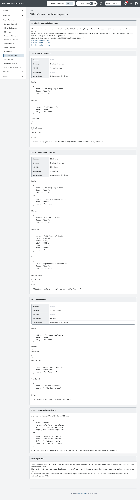
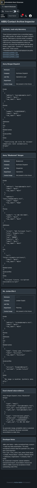

<!-- docs/contact-archives.md -->

# ABBU Contact Archive Inspector

Showcase 0.39.0 begins [#152](https://github.com/scarver2/activeadmin-react-showcase/issues/152)
with an authenticated, native Rails inspector at `/admin/contact_archives`.
It is a read-only educational slice, not the completed upload/import/round-trip laboratory.

## Provenance and ownership

The application consumes `abbu` 0.9.0 from accepted upstream revision
`77eaedaeb0e5d328957c53df7dd5d04134cd4ffa` (upstream default branch is `main`).
Parsing, normalization, duplicate evidence and CSV/JSON/vCard writing belong to
[abbu](https://github.com/scarver2/abbu). No format implementation is copied into Showcase.

`data/contact_archives/Northstar.abbu` contains three handcrafted XML plist
records, authored for this demonstration. All names, organizations, addresses,
reserved `example.test` domains and 555 phone numbers are fictional. No private
contact archive, Apple database, image or institutional data is included.
The bundle is a legacy-parser fixture, **not proof of Apple Contacts import compatibility**.

Fixture SHA-256 receipts:

| Record | SHA-256 |
| --- | --- |
| avery-alternate.abcdp | `0bbdef216bd3747f3aa178965552bea51a26661271b1b1e3d30a3e7d10385640` |
| avery.abcdp | `a93accfa7e2a1fa7d5296615373f6e34ec5bb9aefd95df008e485e0895b42dde` |
| jordan.abcdp | `f934623b9a36e2dced9e8110d48d483131cb1f190fe5706dfb2927815229ccbe` |

## Executable mapping

| Source field | Normalized Ruby field | Inspector |
| --- | --- | --- |
| First / Last | first_name / last_name / full_name | Contact heading |
| Organization / JobTitle / Department | company / job_title / department | Native attributes |
| Email / Phone values | emails / phones with labels | Escaped JSON field lists |
| Address values | structured addresses | Escaped JSON field list |
| URLs / RelatedNames / SocialProfile / Note | urls / related_names / social_profiles / notes | Escaped JSON field lists |

The fixture deliberately includes differing job titles and a shared email and
international phone. The UI displays only those exact shared-value signals from
`Abbu::Utils::Deduplicator`, not its scores or probabilistic identity labels.
Shared values do not establish identity; nothing is automatically merged.

## Safety and progressive enhancement

- Administrator authentication protects the inspector and every download.
- The parser receives one fixed committed directory with strict parsing.
- No upload, arbitrary path, archive extraction, live-store access or image decoding is exposed.
- No CRM record is written by inspection or downloads; no database migration is needed.
- Rails escapes fixture text, including a deliberate script-shaped note.
- Three allowlisted formats delegate to upstream exporters using an automatically
  cleaned temporary file; responses are attachments, private/no-store and nosniff.
- Export-only contact copies omit absolute parser source paths while retaining
  relative provenance; neither the upstream parser nor its original contacts are mutated.
- The complete current workflow works without JavaScript. React adds no value to
  this bounded read-only slice and is intentionally not introduced.

## Remaining #152 acceptance

Bounded uploads and safe archive/path handling; modern SQLite fixture evidence;
reviewer-controlled reconciliation; explicit transactional/idempotent CRM import;
authorized selected-CRM export; image handling; and field-preservation round-trip
proof remain outstanding. ABBU archive writing remains upstream work: neither
normalized SQLite export nor a hand-authored fixture is an Apple-compatible writer.
Do not close #152 based on this slice, publish, deploy or adopt it in Rodeo.

## Verification

Request/service specs cover real parsing and exporter behavior, fixture field
preservation, exact evidence, escaping, authentication, format rejection and
read-only integrity. Chromium covers native inspection/download with JavaScript
enabled and disabled, desktop and narrow/dark presentation.
Local gates: 800 RSpec examples, zero failures (94.47% line / 85.00% branch
coverage); 324 frontend tests with 100% coverage; TypeScript and Vite build;
613 Ruby files without offenses; RBS validation; zero Brakeman warnings; two
Chromium scenarios passed. No migrations or new frontend runtime dependencies.
Use the existing [testing](testing.md) and [deployment](deployment.md)
procedures; no new remote service is introduced. Downloads do not log contact
payloads; existing request telemetry remains applicable.

Screenshot SHA-256 receipts (Chromium, synthetic fixture only):

- Desktop: `88ef457c1b35e941236905041ea439fac5a89a36806cfadd80ad85d499302013`
- Narrow/dark: `2b89dbd08bbcc1005715ab6204a7992c197b309eef5cdab90a5fb37303c944bc`

—
Stan Carver II
Made in Texas 🤠
https://stancarver.com
