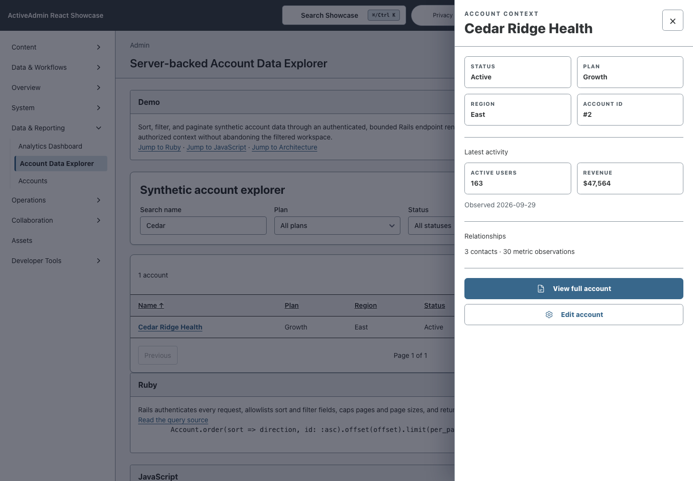
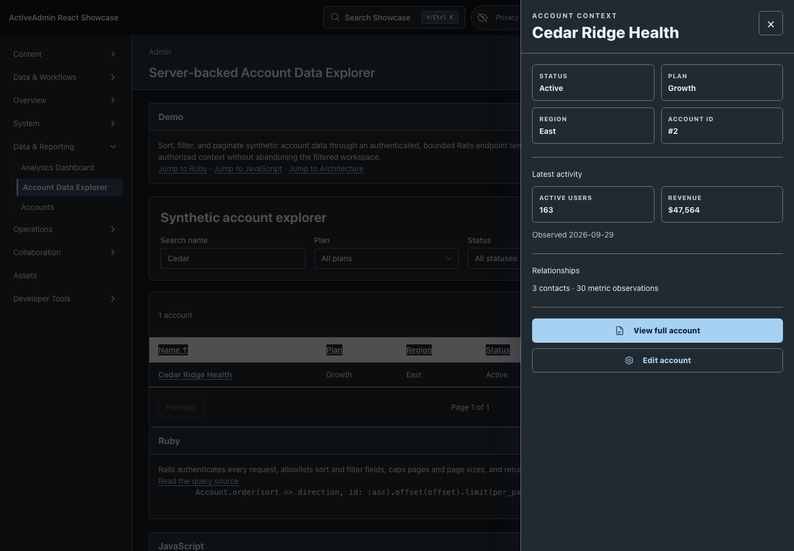
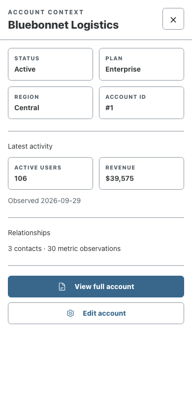
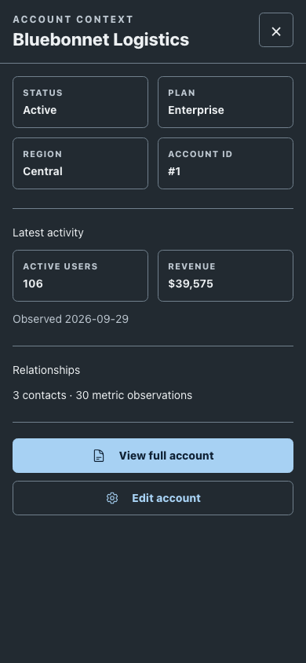

<!-- docs/contextual-inspector.md -->

# Contextual Inspector

The Account Data Explorer and ordinary ActiveAdmin Accounts index demonstrate a
shared right-side inspector for dense operator work. Selecting an account keeps
the originating surface mounted while an accessible modal drawer loads bounded
account context from Rails. This is the accepted proof for issue
[#89](https://github.com/scarver2/activeadmin-react-showcase/issues/89).

## Ownership contract

- Rails owns account data, authentication, authorization, canonical record and
  edit destinations, relationship counts, current metrics, errors, and whether
  the edit action is present.
- React owns the drawer, bounded loading and error presentation, keyboard focus,
  Escape dismissal, and the transient browser-history entry.
- The account name remains an ordinary link to the canonical ActiveAdmin record.
  With JavaScript disabled, modified-clicked, refreshed, or opened in a new tab,
  it navigates normally.
- A drawer history entry uses a surface-local `#account-inspector-ID` deep link.
  Back closes the drawer and restores preserved table/filter/scroll state;
  Forward or a shared inspector URL reopens it by replaying the Rails request.
  Canonical record and action links always open the full Rails page. A Cable
  event or client cache is never authoritative.
- Both dense surfaces use the same `AccountInspectorLauncher`, JSON endpoint,
  `Showcase::AccountInspector` projection, focus discipline, and error grammar.
- Turbo-owned history entries reopen only after Turbo restores and remounts the
  page. The old launcher must not open a temporary dialog during `popstate`:
  Turbo would immediately unmount it, losing Escape keys between the two mounts.
  Native history entries still replay locally; direct inspector URLs still open
  on mount. No Turbo restoration is canceled or intercepted.

## Failure behavior

- A deleted account produces a stale-record message and offers the canonical
  account collection instead of a dead detail link.
- A 401, 403, or authentication redirect is presented as changed access rather
  than silently retaining previously loaded data; reauthentication continues
  through the canonical account destination.
- Inspector payloads are replaced on every selection and aborted requests are
  ignored, so context from one account cannot leak into another.
- Inspector requests time out after eight seconds and retain an ordinary
  canonical recovery path.

## Verification

- RSpec covers the serializer, authenticated endpoint, unauthenticated response,
  stale record, canonical destinations, and authorization-shaped actions.
- Vitest covers history state, Back/Forward replay, Escape, focus return, focus
  trapping, access changes, stale records, and semantic-icon accessibility.
- Playwright covers the authenticated desktop workflow, a 390-pixel viewport,
  Account-index reuse, canonical no-JavaScript navigation, browser history,
  focus/keyboard behavior, stale and changed-auth handling, and screenshots.
- A controlled Forward-restoration test pauses Turbo rendering and verifies that
  no dialog was exposed before the outgoing page was cached. After resuming, the
  close control receives focus and Escape removes the hash and returns focus.

## Visual evidence

The committed captures use deterministic synthetic accounts and real Chromium.
They prove the right-side pattern at desktop width, the full-width narrow
adaptation, and both light and dark presentations. They supplement rather than
replace the behavioral browser suite.

| Viewport | Light | Dark |
| --- | --- | --- |
| Desktop, 1440 × 1000 |  |  |
| Narrow, 390 × 844 |  |  |

SHA-256 provenance:

- `1440-light`: `bbdd411427d96e989c160d28662e8b63e378b681a58c5354779f7701054f9b44`
- `1440-dark`: `3662e84d797368873856f9e3151d212d26d0144b85e337e576bec7361fddf730`
- `390-light`: `c5c92b07b86b1d3975d01c2354343de57e5050ecc74054edb53f294e9b254f8d`
- `390-dark`: `dde0e08c2a44d477404fb3ddfd168e81bac8475de8b77499d2f3c62af1f66652`

Capture command:

```sh
CI=1 CAPTURE_SHOWCASE_SCREENSHOTS=1 mise exec -- \
  npx playwright test test/browser/contextual_inspector.spec.ts
```

—
Stan Carver II
Made in Texas 🤠
https://stancarver.com
