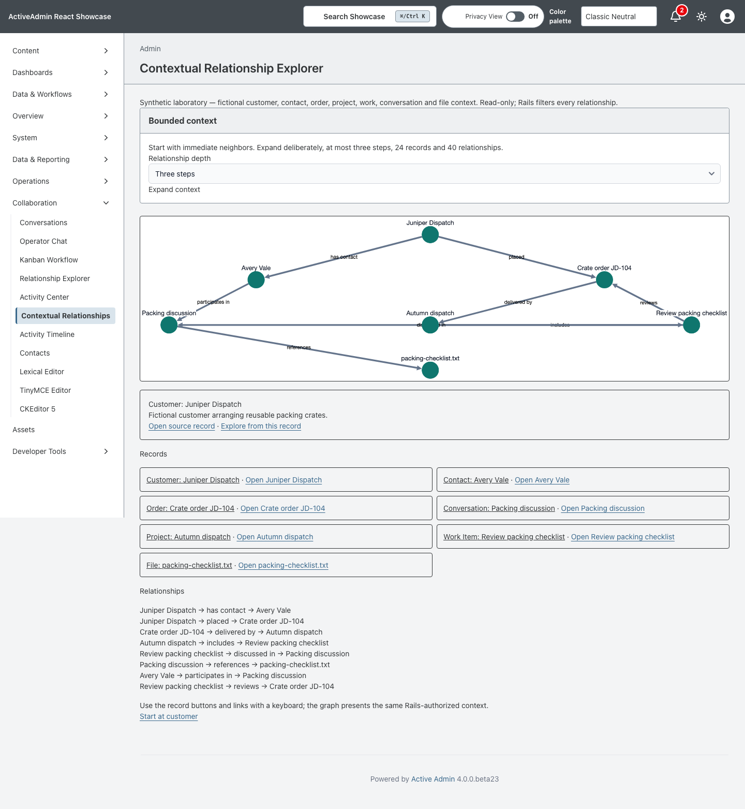
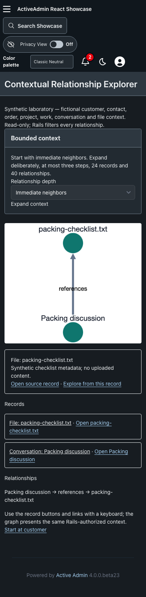

<!-- docs/contextual-relationships.md -->

# Contextual Relationship Explorer

Issue [#97](https://github.com/scarver2/activeadmin-react-showcase/issues/97)
adds a read-only synthetic context laboratory at
`/admin/contextual_relationships`. The existing Account/Contact Relationship
Explorer links to it; its persisted search remains useful independently.

Start with Juniper Dispatch and two immediate neighbors. Native GET forms expand
one, two or three steps. Every record has a canonical source inspector and a
link to explore from that record. Rails owns both destinations and projections.
React/Cytoscape supplies the graph and selection; keyboard buttons expose the same
records and a text list explains every directed relationship.

## Source and policy mapping

| Source | Relationship | Target |
| --- | --- | --- |
| Customer | has contact | Contact |
| Customer | placed | Order |
| Order | delivered by | Project |
| Project | includes | Work Item |
| Work Item | discussed in | Conversation |
| Conversation | references | File |
| Contact | participates in | Conversation |
| Work Item | reviews | Order |

Fixtures are fictional and generated locally in
`Showcase::ContextualRelationships`; no private records or upstream IP is used.
The policy allows persisted authenticated administrators to inspect shared
available fixtures. Restricted, deleted and missing endpoints are excluded
before traversal, including their edges and content. Direct unavailable source
requests return empty 404s. This demonstrates a filtering boundary, not a
production CRM permission system: live adapters must apply each owning domain's
policy before supplying nodes and edges.

## Bounds and recovery

Visited identities suppress cycles. Traversal is deterministic and limited to
three steps, 24 nodes and 40 edges; every returned edge has two returned endpoints.
The context limit is announced and users can restart from a neighboring record.
Invalid depths return 400. Navigation, expansion and source inspection work
without JavaScript, and a lost graph mount does not remove the native fallback.
The graph canvas is decorative to assistive technology; the full interactive
list remains the keyboard and screen-reader path.

No migrations, mutable workflow, external network service or graph database is
introduced. Data is intentionally a small in-memory educational fixture set.

## Verification and provenance

Service tests cover authorization, withheld sources, cycles, deterministic
expansion, high fanout and limits. Request tests cover native routes and rejected
inputs. Component tests cover both selection paths, canonical links and cleanup.
Chromium covers JavaScript/no-JavaScript expansion, source navigation, keyboard
selection and a narrow dark layout. Screenshots are generated by
`test/browser/contextual_relationships.spec.ts` from synthetic fixtures.

SHA-256 receipts for the accepted local screenshots:

- Desktop: `850ad66e9a8d35acd34d1e98085c54d58a33f4e02fdbf5bac63df2301a20c3dd`
- Narrow dark: `d9b8633d2c254c55b13313a5f273f715611b3c208e8dcaecdb149e7f39f7cf66`

—
Stan Carver II
Made in Texas 🤠
https://stancarver.com
