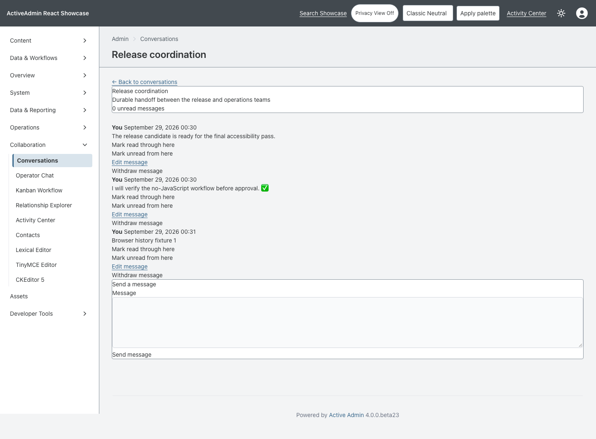
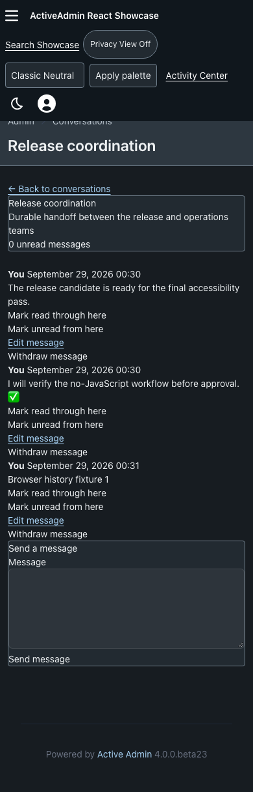
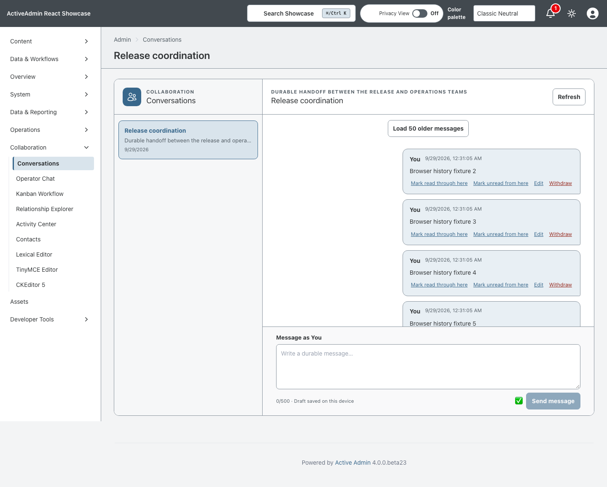
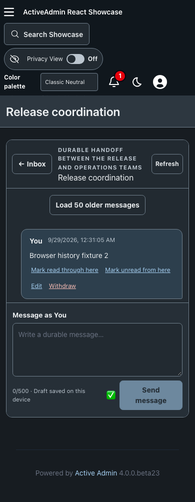

<!-- docs/conversations.md -->

# Conversation Workspace

Issue #137's second slice established the complete authenticated inbox and
thread workflow. The third slice progressively enhances that exact Rails
surface with a responsive React workspace while keeping Rails authoritative
and the accepted no-JavaScript interface intact.

## React enhancement

- Desktop uses a bounded split inbox/thread workspace; narrow screens use an
  explicit inbox-to-thread navigation flow with the composer always reachable.
- The island fetches canonical membership-authorized JSON from the existing
  inbox and explicit nested message routes. Every mutation retains CSRF and
  reconciles from Rails; there is no Action Cable or speculative durable state.
- Message history loads in 50-record pages, deduplicates by stable public ID,
  preserves chronological order, retains the scroll anchor, and cannot regress
  its earliest loaded cursor after a refresh.
- Unsent text is stored locally per authenticated membership and conversation,
  preventing one administrator from inheriting another administrator's draft
  in a shared browser profile; storage failures remain non-fatal. A successful
  send clears only the exact submitted draft, so typing during a pending
  request or navigating to another thread cannot lose newer text.
- Aborted, out-of-order, and cross-thread responses cannot overwrite a newer
  selection or leak stale errors. Navigation and disappearing history controls
  restore focus deliberately.
- React renders all message bodies as text. Rails continues to own membership,
  authorization, persistence, edit/withdraw rules, read state, route identity,
  and the canonical response.

## Rails authority

- ActiveAdmin owns the inbox and thread routes, menu and layout.
- Every thread or mutation begins from the signed-in administrator's
  `ConversationMembership`; missing and unauthorized public IDs are both 404.
- The inbox is capped at 50 recent memberships and projects unread counts with
  one grouped Arel query without preloading message history.
- A thread fetches the newest 50 messages in descending SQL order, reverses
  them for chronological reading, and accepts only positive older cursors.
- Sending persists a plain-text message and advances the sender read cursor in
  one transaction with lock order conversation then membership.
- Authors may edit for 15 minutes. An unchanged normalized edit is a true
  no-op. Withdrawal replaces the persisted body with the fixed `[withdrawn]`
  tombstone and is idempotent for its author.
- Explicit POST/DELETE read-state forms move a same-conversation cursor;
  marking unread never advances it.

All mutations use conventional forms, CSRF protection and POST-redirect-GET.
Message bodies are escaped plain text, including multiline and emoji content.
The seeded browser proof runs with JavaScript disabled.

## Browser evidence

The committed Chromium captures cover both layers: the authenticated React
workspace in desktop light and narrow dark presentation, plus the unchanged
server-rendered workflow with JavaScript disabled.

| Desktop light, 1440px | Narrow dark, 390px |
|---|---|
|  |  |

| React workspace · desktop light, 1440px | React workspace · narrow dark, 390px |
|---|---|
|  |  |

Regenerate both files with
`SHOWCASE_CONVERSATIONS_ENABLED=true CAPTURE_SHOWCASE_SCREENSHOTS=1 CI=1 PLAYWRIGHT_PORT=3247 mise exec -- npx playwright test test/browser/conversations_no_js.spec.ts test/browser/conversation_workspace.spec.ts`.

## Legacy isolation

The earlier Operator Chat remains available at its original route and retains
its React/Cable behavior. Its controller, channel, post and reset services are
hard-pinned to `support-operations`; they reject every general conversation ID
so the compatibility surface cannot inject, stream or delete durable inbox
history.

Production defaults this capability off unless
`SHOWCASE_CONVERSATIONS_ENABLED=true`. Rollout is deliberately two-phase:

1. deploy the legacy hard-pin and nullable columns while the flag remains off;
2. retire every previous application process;
3. set the flag to the exact lowercase value `true`, restart every new
   application process so the boot-time routes and ActiveAdmin resource are
   registered, and only then run the conversation seed after no unrestricted
   old controller or channel can reach the shared tables.

Kamal passes this non-secret flag through `config/deploy.yml` and defaults it
to `false`. The second-phase deployment must export the exact lowercase value
`true`; a typo, `1`, or `yes` remains disabled.

This gate is not optional during the compatibility release. Development and
test default on so the full server-rendered contract remains executable.
It is a rollout and UI activation gate, not authorization or a global domain
kill switch: it guards the seed, menu, routes and HTTP entrypoints. Foundational
services remain callable because the legacy Operator Chat uses the shared
message creator; trusted console and service calls remain an operator
responsibility. Membership authorization still governs every enabled HTTP
request.

## Deferred capabilities

Cable delivery, dispositions, replies, mentions, scheduling, saved messages,
search and attachments remain deliberately deferred to later stacked #137
slices.

—
Stan Carver II
Made in Texas 🤠
https://stancarver.com
