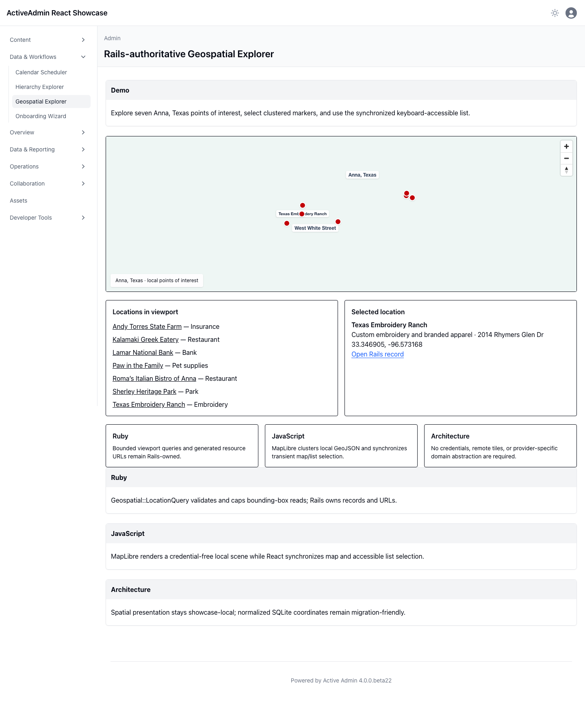

<!-- docs/geospatial-explorer.md -->

# Geospatial Explorer

## Demo

The ActiveAdmin page focuses on Anna, Texas and renders seven public points of interest selected by the project owner: Texas Embroidery Ranch, Andy Torres State Farm, Kalamaki Greek Eatery, Lamar National Bank, Roma’s Italian Bistro of Anna, Paw in the Family, and Sherley Heritage Park. Pan or zoom the credential-free MapLibre canvas, select markers, or use the synchronized keyboard-accessible list. A small local reference layer supplies city bounds and street context without contacting a tile provider. The ordinary fallback table links to the same Rails records.

## Ruby

`ShowcaseLocation` stores normalized coordinates. `Geospatial::LocationQuery` accepts only ordered, valid bounding boxes no larger than twelve degrees in either direction and returns at most 100 authorized records. Rails generates every record URL.

## JavaScript

The lazily loaded React island gives bounded GeoJSON to MapLibre. Map state, clustering, focus, and selection remain transient. Viewport changes fetch a new bounded projection and abort with the island lifecycle.

## Architecture

No API key, remote tile service, or geospatial database is required. The lightweight street context and geocoded coordinates are deterministic presentation data, not a navigation product or substitute for a production basemap. Provider code stays in the showcase; SQLite remains authoritative and the normalized schema remains portable to PostgreSQL if measured demand warrants it.

## Location sources

Public street addresses were verified against the [Texas Embroidery Ranch site](https://www.texasembroideryranch.com/about), [Andy Torres State Farm office page](https://www.statefarm.com/agent/us/tx/anna/andy-torres-1h9rv6d9sgf), [Kalamaki location page](https://www.kalamakigreekeatery.com/location/greek-eatery/), [Lamar National Bank contact page](https://www.lamarnationalbank.com/contact/), [Roma’s Italian Bistro site](https://romasitalianbistroofanna.com/en-US), [Paw of the Family retailer listing](https://frommfamily.com/r/17515), and the [City of Anna’s Sherley Heritage Park page](https://www.annatexas.gov/1228/Sherley-Heritage-Park). Coordinates are bounded display approximations derived from those public addresses.

## Screenshot

This durable capture was produced by Playwright in real Chromium from the seven
deterministic Anna points of interest. It supplements the browser interaction suite.
Regenerate it with `CAPTURE_SHOWCASE_SCREENSHOTS=1 bin/browser-test`.

—
Stan Carver II
Made in Texas 🤠
https://stancarver.com
