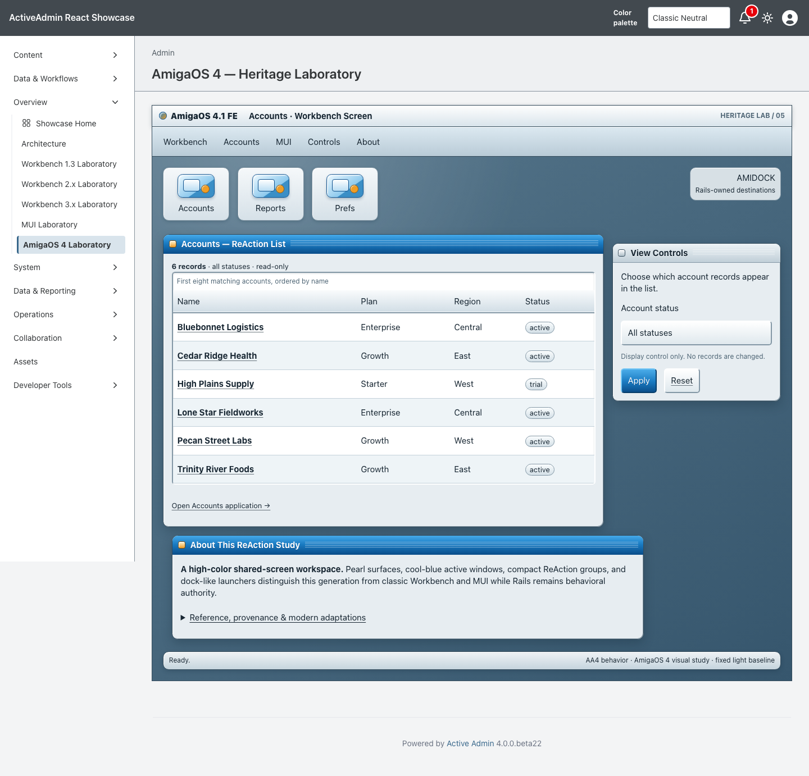
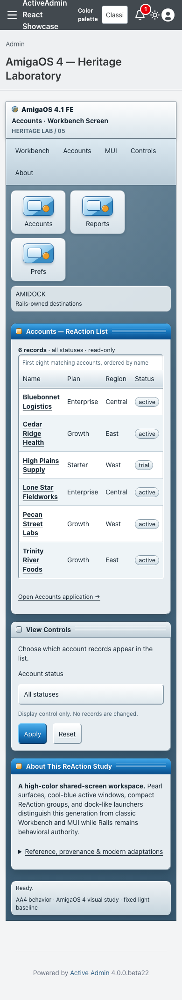

<!-- docs/heritage-amigaos-4.md -->

# AmigaOS 4 Heritage Laboratory

Consumer proof for the fifth promoted theme in [Heritage Themes #103](https://github.com/scarver2/activeadmin-react-showcase/issues/103).
Visit `/admin/amigaos_4_laboratory` after signing in, or choose **Overview →
AmigaOS 4 Laboratory**. It is a separate page rather than a skin on a classic
Workbench or MUI laboratory.

Presentation comes from stacked `activeadmin-themes` PR #36 at exact head
`618d05f60ebadd73984b94865338aa70c386b617`. Showcase commits the installed
stylesheet, maps the gem's immutable 24 semantic roles onto host-owned Rails
markup, and keeps routes, records, authorization, filtering, accessibility, and
native behavior local. It contains no Showcase presentation patch.

## Reference And Provenance

The reference corpus was inspected September 21, 2026:

- [AmigaOS 4.1 Final Edition announcement](https://www.hyperion-entertainment.com/index.php/news/36-amigaos-4x/157-amigaos-41-final-edition) and [official What's New](https://www.amigaos.net/content/2/what%E2%80%99s-new), bounding the study to the 2014 Final Edition era.
- [Official AmigaOS Features](https://amigaos.net/content/1/features), documenting Workbench, AmiDock, system themes, anti-aliased fonts, scalable true-color icons, shadows, and adjustable transparency.
- [Programming AmigaOS 4: GUI Toolkit ReAction](https://wiki.amigaos.net/wiki/Programming_AmigaOS_4%3A_GUI_Toolkit_ReAction), documenting automatic layout, nested groups, keyboard shortcuts, BubbleHelp, and configurable frames and colors.
- [UI Style Guide: Workbench](https://wiki.amigaos.net/wiki/UI_Style_Guide_Workbench), [Basics](https://wiki.amigaos.net/wiki/UI_Style_Guide_Basics), [Windows and Requesters](https://wiki.amigaos.net/wiki/UI_Style_Guide_Windows_and_Requesters), and [Gadgets](https://wiki.amigaos.net/wiki/UI_Style_Guide_Gadgets), establishing lighting, grouping, window, feedback, and gadget vocabulary.
- [Workbench Prefs](https://wiki.amigaos.net/wiki/Workbench/Prefs) and [official AmigaOS history](https://www.amigaos.net/content/10/history-amigaos), cross-checking configurability and release separation.

No screenshot, icon, backdrop, font, wordmark, title-bar glyph, installer art,
Boing Ball, or historical system asset is redistributed. All installed geometry,
palette, gradients, and states are original CSS supplied by the gem. Amiga,
AmigaOS, Workbench, ReAction, and related marks may belong to their respective
owners; this independent study is not an official product or endorsement.

## Historical Reference → Constraint → Adaptation

| Historical reference | AA4 / modern constraint | AmigaOS 4 adaptation |
| --- | --- | --- |
| High-color AmigaOS 4.1 Final Edition Workbench | The collection must remain distinct from classic Workbench and MUI | Cool blue, pearl, graphite, modest gradients, and composited depth establish a separate generation |
| Shared public screen with adaptable application windows | AA4 routes and semantics remain authoritative at desktop and narrow widths | A public-screen field contains flexible ReAction-style window groups without emulating an operating system |
| ReAction automatic nested layout | Source order and access must survive reflow | The same semantic markup moves from primary/side/wide layout to a single narrow flow |
| AmiDock and scalable true-color icons | Proprietary icons and launcher behavior cannot be copied | Original CSS launcher art labels ordinary Rails destinations and remains decorative only |
| Raised gadgets and recessed display regions | Native controls need accessible names, focus, and predictable activation | Native select, submit, links, table and disclosure retain browser behavior inside gem-owned frames |
| Configurable system presentation | Consumer evidence needs a deterministic exact-head baseline | All values remain semantic gem tokens, but this proof applies no host override and fixes a light review baseline |
| Historical fixed-screen and preference assumptions | Current access preferences are required | Local overflow, 44px targets, visible focus, reduced motion, forced colors, and no-JS behavior |

## Behavior And Ownership

ActiveAdmin owns authentication, navigation, resource routes and actions. The
unchanged `Showcase::HeritageAccountsWorkspace` allowlists account status,
orders by name and id, and returns at most eight existing records. Rails escapes
record content and generates every URL. The page adds no write action,
persistence, JavaScript state machine, network dependency, or production data.

Only this route opts into `data-activeadmin-theme="amigaos_4"`. The gem owns
every `--amigaos-4-*` token, composition selector, and installed byte. Showcase
owns semantic markup, accessible names, behavior, tests, and evidence. An
integration spec rejects any AmigaOS 4 token or selector in the host entrypoint
beyond its explicit stylesheet import.

## Verification

Request coverage verifies authentication, all 24 recipe roles, GET filtering,
escaping, empty recovery, route isolation, and byte-identical installation.
Chromium verifies desktop and narrow layouts, the fixed baseline under host dark
preference, keyboard use, focusable local overflow, no document overflow,
native filtering/navigation, reduced motion, forced colors, and a no-JS path.

Actual browser 200% zoom, physical devices, and additional engines are not
claimed. A 390px viewport is responsive evidence, not genuine browser zoom.

## Screenshot Provenance

Captured from implementation source
`1fa13835e03ee7816211ab978259d7422fd84eab` on September 21, 2026, using
Playwright 1.63.0 / Chromium 153.0.8010.12 on macOS 26.7. The host pins
`activeadmin-themes` exact head
`618d05f60ebadd73984b94865338aa70c386b617`; installed AmigaOS 4 CSS SHA-256
is `a035b1fe024392fb09af4324a43c886e0379aeb3042486b764e475613028f2ce`.
Seeded synthetic accounts, default zoom, and a fresh page/context were used for
each 1440×1000 desktop and 390×1000 narrow capture. Both images were visually
inspected before review.

```sh
CAPTURE_SHOWCASE_SCREENSHOTS=1 CI=1 PLAYWRIGHT_PORT=3188 mise exec -- npx playwright test test/browser/amigaos_4_laboratory.spec.ts
```





SHA256:

```text
amigaos-4-1440.png  9989055be817030b049f37ad14177e4dd9995326f3ef57c19740191e4e6481de
amigaos-4-390.png   12223980d5e018daacbf017c7502f153043064e54f8ca3041f3fe730b7ed29d3
```

## Collection Remains Open

This PR does not complete #103. AROS/Wanderer/Zune, Haiku beta6, Video Toaster
4000/period LightWave, Mercury Flight, and subsequent Heritage studies remain
independently scoped. No release, deployment, publication, or Rodeo adoption is
authorized.

—
Stan Carver II
Made in Texas 🤠
https://stancarver.com
