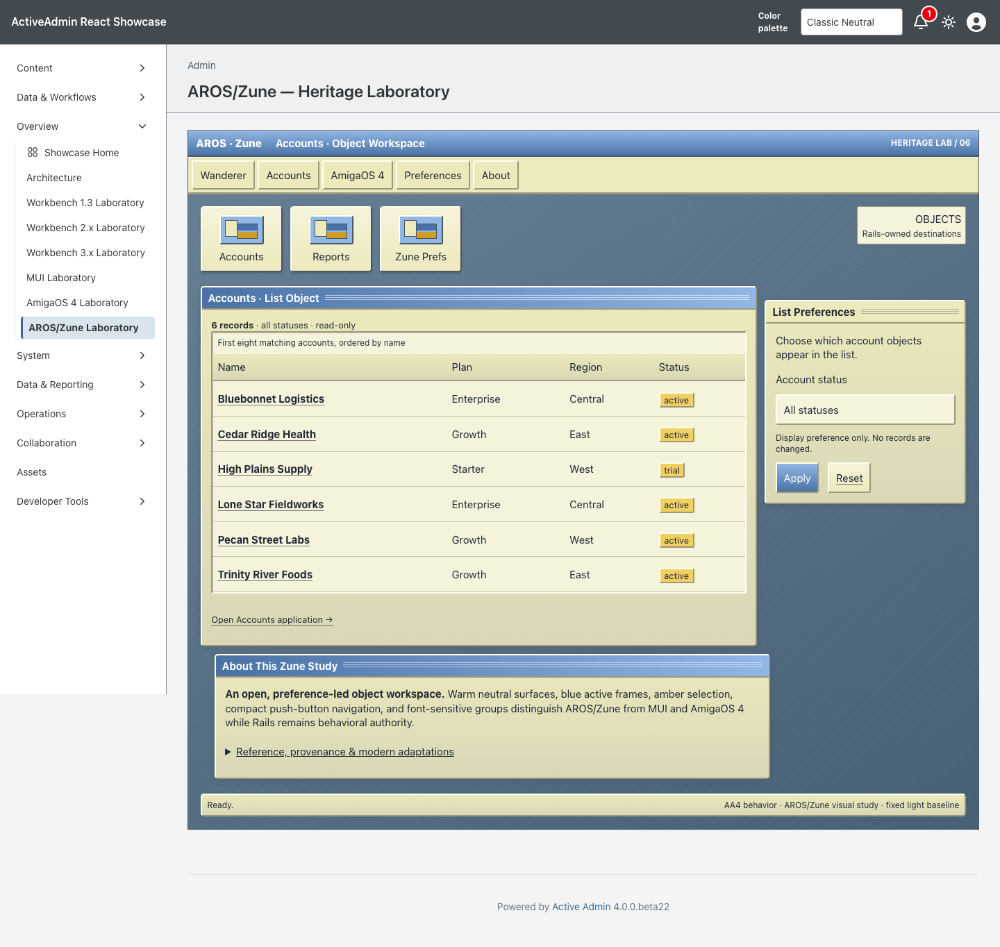
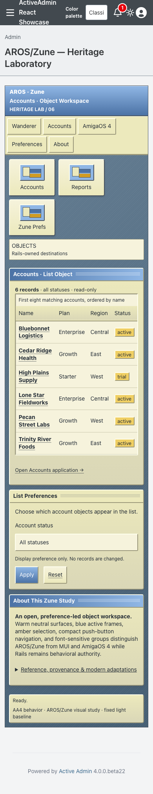

<!-- docs/heritage-aros-zune.md -->

# AROS/Zune Heritage Laboratory

Consumer proof for the sixth promoted theme in [Heritage Themes #103](https://github.com/scarver2/activeadmin-react-showcase/issues/103).
Visit `/admin/aros_zune_laboratory` after signing in, or choose **Overview →
AROS/Zune Laboratory**. It is a separate page rather than a skin on the MUI or
AmigaOS 4 laboratory.

Presentation comes from stacked `activeadmin-themes` PR #37 at exact head
`b0a505e3ff67b7e40c267386e9b520a6f9b553cd`. Showcase commits the installed
stylesheet, maps the gem's immutable 24 semantic roles onto host-owned Rails
markup, and keeps routes, records, authorization, filtering, accessibility, and
native behavior local. It contains no Showcase presentation patch.

## Reference And Provenance

The reference corpus was inspected September 21, 2026:

- [AROS Zune Application Development Manual](https://developers.aros.org/documentation/zune-dev/zune-application-development.html), documenting the MUI-compatible object model, font-sensitive automatic layout, window-size adaptation, semantic construction, and user-owned presentation settings.
- [Official AROS source repository](https://github.com/aros-development-team/AROS), used to establish the open-source system boundary and locate Zune, preferences, tutorial applications, and theme configuration.
- [Zune `muimaster` source hierarchy](https://github.com/aros-development-team/AROS/tree/master/workbench/libs/muimaster) and [Zune Preferences source hierarchy](https://github.com/aros-development-team/AROS/tree/master/workbench/prefs/Zune), identifying independently configurable object classes and surfaces.
- [AROS Default Zune preferences](https://github.com/aros-development-team/AROS/blob/master/images/Themes/AROSDefault/Env-Archive/Zune/global.prefs), used only as a tonal reference for warm neutral objects, blue selection/framing, adjustable fonts, and highlight/shadow relationships.
- [Official AROS screenshot archive](https://www.aros.org/pictures/screenshots/), used to cross-check visible skinning range, the preference editor, adaptive applications, and Wanderer integration.
- [AROS Public License 1.1](https://github.com/aros-development-team/AROS/blob/master/LICENSE), establishing the upstream source and asset boundary. No APL-covered source or asset is copied into the MIT-licensed recipe.
- [Official 2002 AROS archive note](https://aros.sourceforge.io/news/archive/2002.html), preserving the clean-implementation history and distinguishing this study from redistributed MUI materials.

No AROS source, preference file, screenshot, icon, backdrop, font, wordmark,
Wanderer asset, MUI material, or runtime behavior is redistributed. All
installed geometry, palette, decoration, and states are original CSS supplied
by the gem. AROS, Zune, MUI, Wanderer, Amiga, and related marks may belong to
their respective owners; this independent study is not an official product or
endorsement.

## Historical Reference → Constraint → Adaptation

| Historical reference | AA4 / modern constraint | AROS/Zune adaptation |
| --- | --- | --- |
| Zune's semantic object hierarchy | Rails and ActiveAdmin own semantics, authorization, routes, and behavior | The shared 24 roles map to native sections, navigation, table, form, controls, status, and disclosure without emulating Zune classes |
| User-selected look and feel | Consumer evidence needs a deterministic exact-head baseline | One original warm cream, blue, and amber skin is fixed for review while every value remains a replaceable semantic token |
| Font-sensitive automatic groups | Text zoom and localization must not be trapped in fixed historical geometry | Grid groups reflow from primary/side/wide layout into one narrow source-ordered column |
| Raised gadgets and recessed list objects | Controls require names, focus, predictable activation, and native fallback | Native select, submit, links, table and disclosure retain browser behavior inside gem-owned object frames |
| Preference-led presentation | The host may not fork the theme or add a second composition system | Showcase uses the installed bytes without token or selector overrides; the preference principle remains an explicit extension boundary |
| Historical desktop and toolkit assumptions | Current access preferences are required | Local overflow, visible focus, reduced motion, forced colors, no-JS behavior, and touch-sized controls preserve modern access |

## Behavior And Ownership

ActiveAdmin owns authentication, navigation, resource routes and actions. The
unchanged `Showcase::HeritageAccountsWorkspace` allowlists account status,
orders by name and id, and returns at most eight existing records. Rails escapes
record content and generates every URL. The page adds no write action,
persistence, JavaScript state machine, network dependency, or production data.

Only this route opts into `data-activeadmin-theme="aros_zune"`. The gem owns
every `--aros-zune-*` token, composition selector, and installed byte. Showcase
owns semantic markup, accessible names, behavior, tests, and evidence. An
integration spec rejects any AROS/Zune token or selector in the host entrypoint
beyond its explicit stylesheet import.

## Verification

Request coverage verifies authentication, all 24 recipe roles, GET filtering,
escaping, empty recovery, route isolation, and byte-identical installation.
Chromium verifies desktop and narrow layouts, the fixed baseline under host dark
preference, keyboard use, focusable local overflow, no document overflow,
native filtering/navigation, reduced motion, forced colors, and a no-JS path.

Actual browser 200% zoom, physical devices, and additional engines are not
claimed. A 390px viewport is responsive evidence, not genuine browser zoom.

## Screenshot Provenance

Captured from implementation source
`ec4cf65e6529bb08f71f5ea6a453ea2ea397d5fc` on September 21, 2026, using
Playwright 1.63.0 / Chromium 153.0.8010.12 on macOS 26.7. The host pins
`activeadmin-themes` exact head
`b0a505e3ff67b7e40c267386e9b520a6f9b553cd`; installed AROS/Zune CSS SHA-256
is `8dd28a338ad65686f80aacaf088c972d53ea17bb1e6defbf18b756d895f23baf`.
Seeded synthetic accounts, default zoom, and a fresh page/context were used for
each 1440×1000 desktop and 390×1000 narrow capture. Both images were visually
inspected before review.

```sh
CAPTURE_SHOWCASE_SCREENSHOTS=1 CI=1 PLAYWRIGHT_PORT=3190 mise exec -- npx playwright test test/browser/aros_zune_laboratory.spec.ts
```





SHA256:

```text
aros-zune-1440.png  fbd35c3745e6f530bf69737b850cd6d72ac4f839dcfceb4f3dfbaad8778d8c78
aros-zune-390.png   b528bc4caedc5ee302bd3d6dd83b40a7d1e7ef5a6ade31e9bad7f71a73d6916f
```

## Collection Remains Open

This PR does not complete #103. Haiku beta6, Video Toaster 4000/period
LightWave, Mercury Flight, and subsequent Heritage studies remain independently
scoped. No release, deployment, publication, or Rodeo adoption is authorized.

—
Stan Carver II
Made in Texas 🤠
https://stancarver.com
