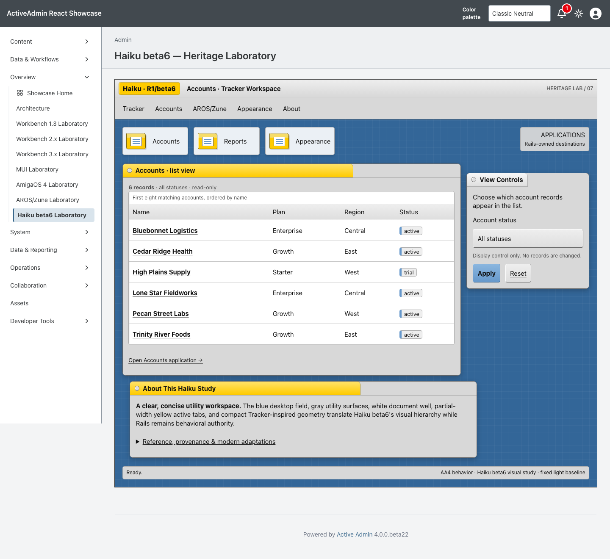
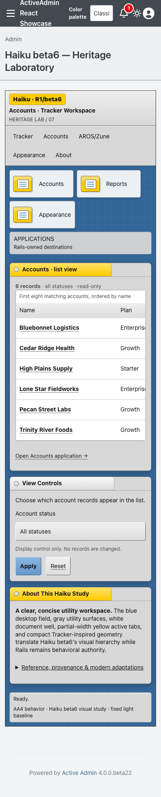

<!-- docs/heritage-haiku-beta6.md -->

# Haiku beta6 Heritage Laboratory

Consumer proof for the seventh promoted theme in [Heritage Themes #103](https://github.com/scarver2/activeadmin-react-showcase/issues/103).
Visit `/admin/haiku_beta6_laboratory` after signing in, or choose **Overview →
Haiku beta6 Laboratory**. It is a separate page rather than a skin on the AROS/Zune
or AmigaOS 4 laboratory.

Presentation comes from stacked `activeadmin-themes` PR #38 at exact head
`0486844e7c9928222216bb0c55ecaaed610a574b`. Showcase commits the installed
stylesheet, maps the gem's immutable 24 semantic roles onto host-owned Rails
markup, and keeps routes, records, authorization, filtering, accessibility, and
native behavior local. It contains no Showcase presentation patch.

## Reference And Provenance

The reference corpus was inspected September 21, 2026:

- [Haiku R1/beta6 source at exact head `71647cf04f5c86a29cb09947e2cc3f13b3f19da1`](https://github.com/haiku/haiku/tree/71647cf04f5c86a29cb09947e2cc3f13b3f19da1), fixing the upstream source boundary.
- [`InterfaceDefs.cpp`](https://github.com/haiku/haiku/blob/71647cf04f5c86a29cb09947e2cc3f13b3f19da1/src/kits/interface/InterfaceDefs.cpp), used for the beta6 blue desktop, gray panel and controls, white document, yellow window-tab, keyboard-navigation, border, and highlight values.
- [`DefaultDecorator.cpp`](https://github.com/haiku/haiku/blob/71647cf04f5c86a29cb09947e2cc3f13b3f19da1/src/servers/app/decorator/DefaultDecorator.cpp), identifying the yellow-tab default decorator.
- [`HaikuControlLook.cpp`](https://github.com/haiku/haiku/blob/71647cf04f5c86a29cb09947e2cc3f13b3f19da1/src/kits/interface/HaikuControlLook.cpp), distinguishing reusable controls from window decoration.
- [Official Haiku GUI guide](https://i18n.haiku-os.org/userguide/data/export/docs/userguide/en/gui.html) and [Appearance guide](https://i18n.haiku-os.org/userguide/data/export/docs/userguide/en/preferences/appearance.html), documenting partial-width yellow tabs, window borders, and the palette model.
- [Haiku source license inventory](https://github.com/haiku/haiku/blob/71647cf04f5c86a29cb09947e2cc3f13b3f19da1/License.md), establishing the upstream licensing boundary.

No Haiku source, HVIF icon, screenshot, bitmap, font, leaf mark, product logo,
or runtime behavior is redistributed. All installed geometry, launcher art,
palette, decoration, responsive rules, and states are original CSS supplied by
the gem. Haiku and related marks belong to their respective owners; this
independent study is not an official product or endorsement.

## Historical Reference → Constraint → Adaptation

| Historical reference | AA4 / modern constraint | Haiku beta6 adaptation |
| --- | --- | --- |
| Beta6 interface defaults | ActiveAdmin owns semantics, authorization, routes, and behavior | Exact reference colors become scoped semantic tokens around ordinary Rails navigation, tables, forms, links, and disclosures |
| Partial-width yellow window tabs | The host must not simulate window-manager controls | Primary and wide semantic regions receive partial yellow headers without fake dragging, stacking, tiling, zoom, or close behavior |
| Tracker-oriented desktop grammar | Dense records need responsive and accessible reading order | A document-like table sits inside a framed workspace with local overflow and source-ordered narrow reflow |
| Small palette with derived secondary colors | Consumer proof requires deterministic output and clear ownership | The gem owns a fixed light baseline; the host adds no palette or selector override |
| Compact historic controls | Pointer, keyboard, focus, and zoom expectations have advanced | Actions retain useful target sizes, native behavior, visible focus, reduced motion, and forced-colors support |

## Behavior And Ownership

ActiveAdmin owns authentication, navigation, resource routes and actions. The
unchanged `Showcase::HeritageAccountsWorkspace` allowlists account status,
orders by name and id, and returns at most eight existing records. Rails escapes
record content and generates every URL. The page adds no write action,
persistence, JavaScript state machine, network dependency, or production data.

Only this route opts into `data-activeadmin-theme="haiku_beta6"`. The gem owns
every `--haiku-beta6-*` token, composition selector, and installed byte.
Showcase owns semantic markup, accessible names, behavior, tests, and evidence.
An integration spec rejects any Haiku beta6 token or selector in the host
entrypoint beyond its explicit stylesheet import.

## Verification

Request coverage verifies authentication, all 24 recipe roles, GET filtering,
escaping, empty recovery, route isolation, and byte-identical installation.
Chromium verifies desktop and narrow layouts, the fixed baseline under host dark
preference, keyboard use, focusable local overflow, no document overflow,
native filtering/navigation, reduced motion, forced colors, and a no-JS path.

Actual browser 200% zoom, physical devices, and additional engines are not
claimed. A 390px viewport is responsive evidence, not genuine browser zoom.

## Screenshot Provenance

Captured from implementation source
`ebc95d94aacc68f94f030037ecce1aadbc930ae9` on September 22, 2026, using
Playwright 1.63.0 / Chromium 153.0.8010.12 on macOS 26.7. The host pins
`activeadmin-themes` exact head
`0486844e7c9928222216bb0c55ecaaed610a574b`; installed Haiku beta6 CSS SHA-256
is `e806b01f5930d837b2d47d25698519361d9ebd544e68edecab8e95d1cec03dc2`.
Seeded synthetic accounts, default zoom, and a fresh page/context were used for
each 1440×1000 desktop and 390×1000 narrow capture. Both images were visually
inspected before review.

```sh
CAPTURE_SHOWCASE_SCREENSHOTS=1 CI=1 PLAYWRIGHT_PORT=3191 mise exec -- npx playwright test test/browser/haiku_beta6_laboratory.spec.ts
```





SHA256:

```text
haiku-beta6-1440.png  99bb596b7340decb75dea7b2f2a5f2856aaa569cef14ebf5028f56a697f015ff
haiku-beta6-390.png   d41033cc379aad1b674902fd2c0878d661e053ca573bd3a7a84aaf6b8966fb19
```

## Collection Remains Open

This PR does not complete #103. Video Toaster 4000/period LightWave, Mercury
Flight, and subsequent Heritage studies remain independently scoped. No
release, deployment, publication, or Rodeo adoption is authorized.

—
Stan Carver II
Made in Texas 🤠
https://stancarver.com
