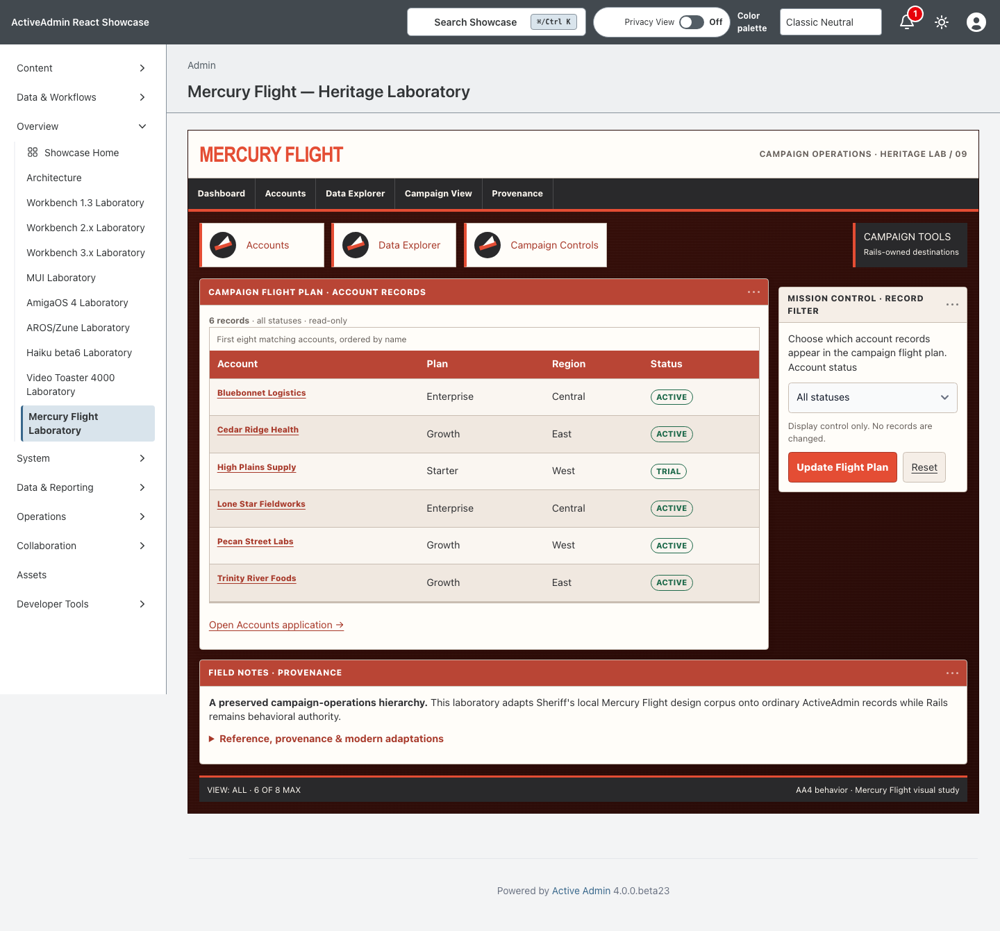
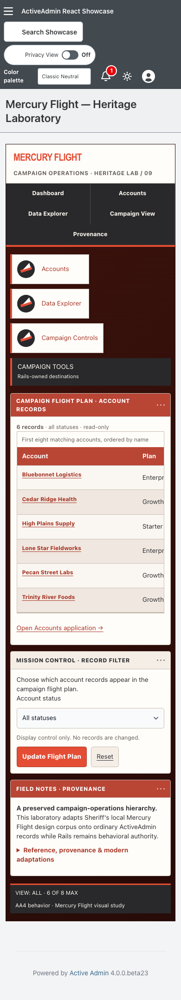

<!-- docs/heritage-mercury-flight.md -->

# Mercury Flight Heritage Laboratory

Consumer proof for the ninth promoted study in [Heritage Themes #103](https://github.com/scarver2/activeadmin-react-showcase/issues/103).
Visit `/admin/mercury_flight_laboratory` after signing in, or choose
**Overview → Mercury Flight Laboratory**. It is a campaign-operations product
study rather than an operating-system desktop or media-production console.

Presentation comes from stable `activeadmin-themes` 0.2.0 at exact merged
commit `96db6599a0668cfa2338769b35b38262ba9f49d1`.
Showcase maps the gem's immutable 24 semantic roles onto host-owned Rails markup
and keeps routes, records, authorization, filtering, accessibility, and native
behavior local. It contains no Showcase presentation patch. The installed
stylesheet is byte-identical to the exact gem composer.

## Reference And Provenance

Sheriff's preserved local corpus under `Projects/Mercury Flight/2026/theme` was
inspected on September 22, 2026. Its stylesheet and page hierarchy provide the
canonical design evidence. The primary inspected file hashes are:

- `theme.scss`: `700106a0b6236aa4b16a1d1e6a24fedac49d4713ebc54ec5c632489ec4ec911c`;
- `foundation_and_overrides.scss`: `8789ceeab9153d09b39e4dc476e60ea4d02efd31f9e8d26d73185f154c044ca3`;
- `pages/index.html.haml`: `e201bbdc5fd0bf82515a5f43654e8f869d8a74338a97f650aba9caa5cf6eb8fc`.

No public redistribution license was found. Local possession is therefore not
treated as permission to publish the corpus. The reference source, markup,
images, fonts, icon font, names, data, and JavaScript are not copied or bundled.
The gem supplies original CSS geometry and system typography.

## Historical Reference → Constraint → Adaptation

| Historical reference | AA4 / modern constraint | Heritage adaptation |
| --- | --- | --- |
| Textured oxblood surround and white operational content | Proprietary JPEG cannot be redistributed | Original layered CSS texture frames a paper-white workspace |
| Condensed coral identity and compact charcoal navigation | AA4 retains route, drawer, and authorization behavior | System condensed typography and route links carry the hierarchy without copying marks |
| Salmon campaign table with compact row actions | Records and filtering must remain truthful and host-owned | Real bounded Account records, GET filtering, semantic table headers, and native resource links occupy the primary surface |
| Contextual account/tutorial/tool areas | Supporting material must not displace the main task | A bounded side control and wide provenance disclosure reflow below the table on narrow screens |
| Small notifications and direct controls | Meaning cannot rely on color | Text, border, shape, status labels, visible focus, and forced-colors behavior reinforce every cue |

## Behavior And Ownership

ActiveAdmin owns authentication, navigation, resource routes and actions. The
unchanged `Showcase::HeritageAccountsWorkspace` allowlists account status,
orders by name and id, and returns at most eight existing records. Rails escapes
record content and generates every URL. The page adds no write action,
persistence, client-side state machine, remote dependency, or production data.

Only this route opts into `data-activeadmin-theme="mercury_flight"`. The gem owns
every `--mercury-flight-*` token, composition selector, and installed byte.
Showcase owns semantic markup, accessible names, behavior, tests, and evidence.
The integration spec rejects any Mercury Flight token or selector in the host
entrypoint beyond its explicit stylesheet import.

The ownership inventory is deliberately bounded:

- `activeadmin-themes` owns the reusable Mercury Flight recipe and all 24
  presentation roles;
- Showcase owns the authenticated route, semantic workspace markup, explicit
  stylesheet import, inherited bounded account query, tests, documentation,
  and exact-head browser evidence;
- the dashboard, Workbench 1.3/2/3, MUI, AmigaOS 4, AROS/Zune, Haiku beta6,
  and Video Toaster 4000 implementations remain inherited unchanged, including
  the MUI dedication and adjacent Ronny Dillard memorial link.

## Verification

Request coverage verifies authentication, all 24 recipe roles, GET filtering,
escaping, empty recovery, route isolation, and byte-identical installation.
Chromium coverage exercises desktop and narrow layouts, keyboard use, focusable
local overflow, no document overflow, native filtering/navigation, fixed-light
presentation under the host dark preference, reduced motion, forced colors, and
a no-JavaScript path.

Actual browser 200% zoom, physical devices, and additional engines are not
claimed. A 390px viewport is responsive evidence, not genuine browser zoom.

The host pins stable `activeadmin-themes` 0.2.0 at exact merged commit
`96db6599a0668cfa2338769b35b38262ba9f49d1`; installed Mercury Flight CSS
SHA-256 is `2ec7fbd18273d14542ea67f0f608d3cd0869599e386036ba9651db4260699ce9`.

## Screenshot Provenance

These screenshots were captured from normal-merge Showcase source
`29b2efe11bbf1042e2a6b2b7c37428a750d5b6b2` after exact Video Toaster parent
`eddb11408f9b631f33b3248f7d2d547a4908be4e`, against stable theme source
`96db6599a0668cfa2338769b35b38262ba9f49d1`. Graft/graph metadata was
unavailable (`NO GRAPH`), so exact Git ancestry and the live stacked base are
the provenance guard. Both artifacts were visually reviewed after capture; the
desktop and narrow views preserve the campaign hierarchy, readable record
links, local table overflow and document-width containment. Historical
reference images do not transfer as implementation evidence.



SHA-256: `48d71100a57ea0fdacece2fdcbe5eb7f045afda205809035c05cfcd4460ab90a`
· 1440 × 1341.



SHA-256: `806f1c4618eaf30069b49c682802ab1c8b2e2323a6738f34edec8deed81e6030`
· 390 × 2147.

```sh
CAPTURE_SHOWCASE_SCREENSHOTS=1 CI=1 PLAYWRIGHT_PORT=3193 mise exec -- npx playwright test test/browser/mercury_flight_laboratory.spec.ts
```

## Collection Remains Open

This slice does not close #103 or authorize release, deployment, publication,
upstream promotion, or Rodeo adoption.

—
Stan Carver II
Made in Texas 🤠
https://stancarver.com
