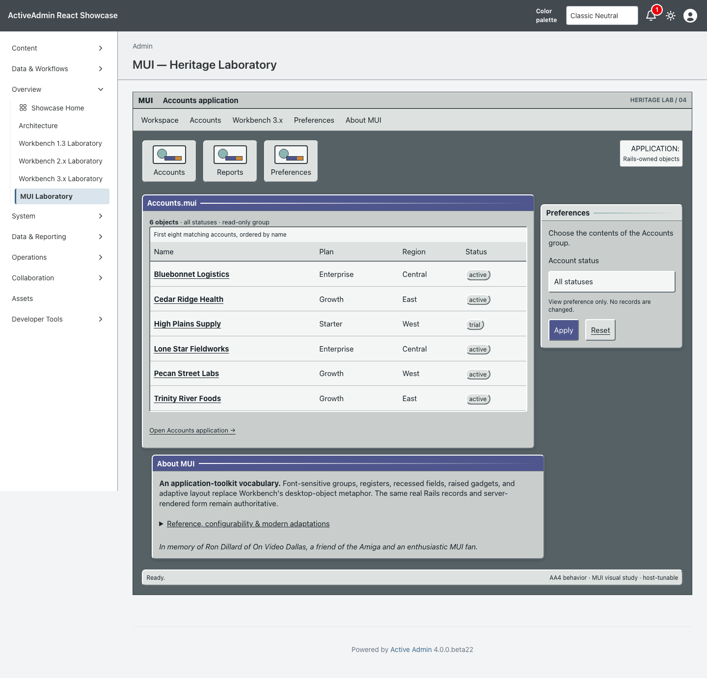
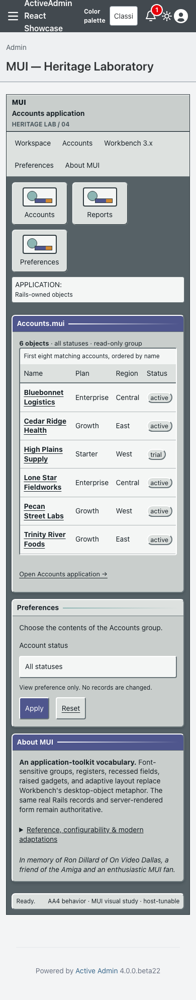

<!-- docs/heritage-mui.md -->

# MUI Heritage Laboratory

Consumer proof for the fourth promoted theme in [Heritage Themes #103](https://github.com/scarver2/activeadmin-react-showcase/issues/103).
Visit `/admin/mui_laboratory` after signing in, or choose **Overview → MUI
Laboratory**. It is a separate page rather than a runtime switch on a Workbench
laboratory.

Presentation comes from stacked `activeadmin-themes` PR #35 at exact head
`0266827e7eb74842bfad05cc387339945ee61452`. Showcase commits the installed
stylesheet, maps the gem's immutable 24 semantic slots onto host-owned Rails
markup, and retains routes, records, authorization, filtering, accessibility,
and native behavior locally.

## Dedication

In memory of Ron Dillard of On Video Dallas, a friend of the Amiga and an enthusiastic MUI fan.

## Reference And Provenance

The reference corpus was inspected September 21, 2026:

- [Magic User Interface public development repository](https://github.com/amiga-mui/muidev), the MUI project's current public identity and documentation home.
- [MUI 3.8 release](https://github.com/amiga-mui/muidev/releases/tag/3.8), anchoring the classic AmigaOS 3.x lineage.
- [AROS Zune Application Development Manual](https://developers.aros.org/documentation/zune-dev/zune-application-development.html), documenting a MUI-compatible object model, font-sensitive layout, resizing, semantic construction, and user-controlled presentation.
- [MUI master API documentation](https://github.com/amiga-mui/muidev/blob/master/files/muimaster.txt), cross-checking application objects, gadgets, requesters, keyboard access, and configuration vocabulary.

No MUI archive, logo, font, screenshot, gadget bitmap, preference file, or
historical asset is redistributed. All shipped geometry and values are original
CSS under the repository license. MUI and Magic User Interface may be trademarks
of their respective owners; this independent study is not an official product
or endorsement.

## Historical Reference → Constraint → Adaptation

| Historical reference | AA4 / modern constraint | MUI adaptation |
| --- | --- | --- |
| Object-oriented application toolkit | AA4 keeps semantic markup, routes, authorization, and behavior | The same 24 Heritage roles style host-owned Rails objects without runtime emulation |
| Font-sensitive automatic layout | Desktop and narrow screens must preserve source order and access | Flexible grids, wrapping registers, intrinsic controls, and responsive group reflow |
| User-controlled look and feel | A package needs a deterministic accessible baseline | Original silver/teal defaults are semantic `--mui-*` tokens rather than a claimed canonical preset |
| Framed groups, registers, lists, fields, and gadgets | Controls must retain native semantics and accessible names | Compact raised frames, recessed data/fields, register navigation, native select/button/link behavior |
| Extensive preference configurability | Consumer proof must not fork selectors or the shared composition API | Showcase changes only `--mui-active` to amethyst under one bounded marker; all 24 slots and selectors remain unchanged |
| Historical focus, contrast, and fixed-screen assumptions | Current access preferences remain authoritative | Visible focus, 44px targets, reduced-motion suppression, forced-colors tokens, and local overflow handling |
| One supplied baseline | Host dark mode must not silently invent a historical variant | Complete scoped tokens and `color-scheme: light` preserve the same presentation in either host preference |

## Behavior And Ownership

ActiveAdmin owns authentication, navigation, resource routes and actions. The
unchanged `Showcase::HeritageAccountsWorkspace` allowlists account status,
orders by name and id, and returns at most eight existing records. Rails escapes
record content and generates every URL. The MUI page adds no write action,
persistence, JavaScript state machine, network dependency, or production data.

The route alone opts into `data-activeadmin-theme="mui"`. The gem owns the
installed source and its composition selectors. Showcase owns semantic markup,
accessible names, behavior, tests, and evidence. Its only presentation input is
the documented one-token preference:

```css
body[data-activeadmin-theme="mui"] .mui-workspace[data-mui-preset="showcase-amethyst"] {
  --mui-active: #4f568d;
}
```

An integration spec proves this block declares exactly one `--mui-*` property.
Browser coverage proves the value reaches primary window and action surfaces
while the same gem-owned slot classes remain in use.

## Verification

Request coverage verifies authentication, every recipe slot, GET filtering,
escaping, empty recovery, exact route isolation, and byte-identical installation.
Chromium verifies desktop and narrow layouts, the host token override, fixed
presentation under host dark preference, keyboard use, focusable local overflow,
no document overflow, reset/native navigation, reduced motion, forced colors,
and a JavaScript-disabled path.

Actual browser 200% zoom, physical devices, and additional engines are not
claimed. A 390px viewport is responsive evidence, not genuine browser zoom.

## Screenshot Provenance

Captured from implementation source
`9967a3cb9505961b46c85fbe02d30e71f9881032` on September 21, 2026, using
Playwright 1.63.0 / Chromium 153.0.8010.12 on macOS 26.7. The host pins
`activeadmin-themes` exact head
`0266827e7eb74842bfad05cc387339945ee61452`; installed MUI CSS SHA-256 is
`8d98d75364189a68c1383932a2b3eebf05443c48ff147ec7656272a363072f8c`.
Seeded synthetic accounts, default zoom, and a fresh page/context were used for
each 1440×1000 desktop and 390×1000 narrow capture. Both images were visually
inspected.

```sh
CAPTURE_SHOWCASE_SCREENSHOTS=1 CI=1 PLAYWRIGHT_PORT=3186 mise exec -- npx playwright test test/browser/mui_laboratory.spec.ts
```





SHA256:

```text
mui-1440.png  9ae4daddf7475ebed413030ba30ec097a2bf0685fe98525adcf60e2e91c463a2
mui-390.png   b588fdc5213eeeebf4f3f17b8221ca49ba674ccc2e49d52becec0b77ef321618
```

## Collection Remains Open

This PR does not complete #103. AmigaOS 4, AROS/Wanderer/Zune, Haiku beta6,
Video Toaster 4000/period LightWave, and Mercury Flight remain independently
scoped. No release, deployment, publication, or Rodeo adoption is authorized.

—
Stan Carver II
Made in Texas 🤠
https://stancarver.com
