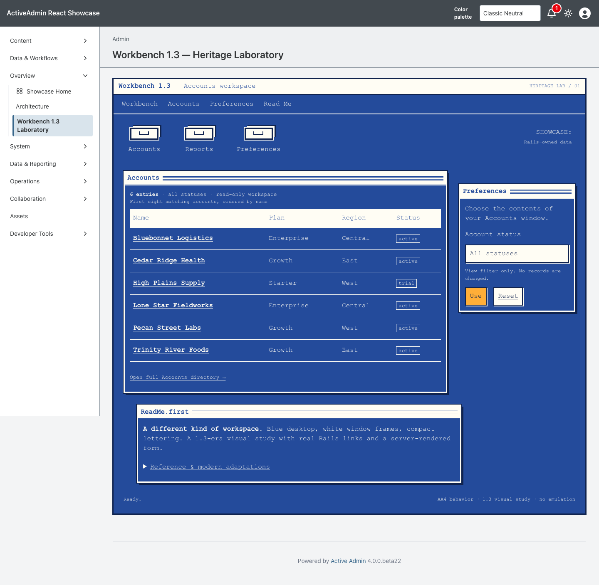
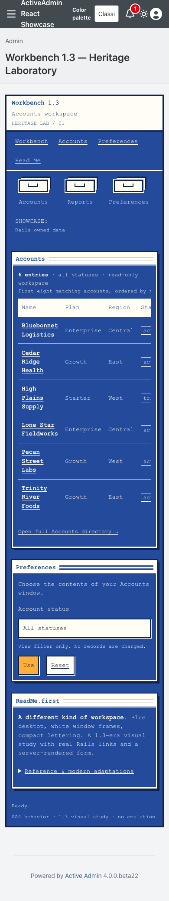

<!-- docs/heritage-workbench-13.md -->

# Workbench 1.3 Heritage Laboratory

Consumer proof for the first promoted theme in [Heritage Themes #103](https://github.com/scarver2/activeadmin-react-showcase/issues/103).
Visit `/admin/workbench_laboratory` after signing in, or choose **Overview →
Workbench 1.3 Laboratory**. This is one authenticated AA4 page, not an emulator
or a claim that the remaining Heritage collection is complete.

The original laboratory established the accepted design at Showcase head
`9c630d5b683cf6780e851d3004f7ddf3d8cb4918`. Presentation now comes from the
deterministic Workbench 1.3 recipe in stacked `activeadmin-themes` PR #32. The
Showcase pins an exact gem commit, commits the installed stylesheet, maps the
gem's immutable composition slots onto semantic Rails markup, and retains all
routes, data, filtering, authorization and accessibility behavior locally.

## Reference And Provenance

Primary visual reference, inspected September 20, 2026:

- [Cloanto / Amiga Forever: Workbench 1.3 environment](https://www.amigaforever.com/screenshots/workbench-1-3/).
- [Its linked still image](https://www.amigaforever.com/gfx/screens/screen-afwb-13.png).

The reference shows a preinstalled 1.3 environment, not a guarantee that every
detail is a factory-default setting. We studied its blue desktop, white frame
lines, white title strips with blue lettering/rules, compact monospaced labels,
drawer metaphor, and orange accents. We did not blend in Workbench 2/3 bevels,
MUI, or AmigaOS 4 conventions.

No reference screenshot, ROM, font, logo, Boing Ball, floppy image or other
historical artwork is redistributed. All shipped geometry is original CSS under
the repository license, copyright Stan Carver II. The small drawer illustrations
are specific to this heritage composition, not additions to the ordinary
functional icon vocabulary. This prototype does not import #108's registry.
Workbench is a trademark of Cloanto Corporation; this is an independent study,
not an official product or endorsement.

## Historical Reference → Constraint → Adaptation

| Historical grammar | AA4 / modern constraint | Prototype adaptation |
| --- | --- | --- |
| Blue screen with white framed windows | Existing AA4 administration remains available | One clearly bounded desktop inside the native page; no global chrome replacement |
| White/blue title strips and ruled borders | Meaningful headings, no fake window controls | Semantic section headings with decorative rules; no nonfunctional close/resize buttons |
| Compact monospaced lettering | Readability and font redistribution rights | System monospace at 16px desktop / 14px narrow; no copied Topaz font or bitmap text |
| Small blue/white/orange color vocabulary | Text and focus contrast | Original approximations `#244b9b`, `#fffdf4`, `#10234e`, `#ffae38`; not claimed exact historical values |
| Drawers and desktop navigation | Native links, keyboard, single activation | Original CSS drawer illustrations accompanying visible labels and ordinary links |
| Overlapping windows | Predictable reading order and access to every control | Offset non-overlapping desktop windows; one-column narrow reflow |
| Orange accent / inversion | Selection cannot be color-only | Hover/focus accent accompanies underlined links, focus outline and textual status; no invented selected-record state |
| Requester-style preferences | Server authority; useful without JS | Native labelled GET form filters existing account statuses; Use/Reset controls change no data |
| Fixed desktop-era viewport | Narrow screens, zoom and touch | Flexible window grid, 44px form/menu controls, locally scrollable table with keyboard focus |
| Historical palette rather than light/dark variants | Host dark preference must not corrupt the study | One deliberate historical treatment under either host preference; no invented “dark Workbench” |
| Pixel-era decoration | User preferences remain authoritative | No motion; explicit reduced-motion and forced-colors treatment; no forced-color opt-out |

## Behavior And Boundaries

ActiveAdmin still owns authentication, navigation, resource routes and actions.
The page displays at most eight existing accounts, ordered by name/id; the filter
accepts only `Account::STATUSES`. Unknown values fall back to all statuses and are
not echoed. Record text is Rails-escaped. Account links lead to existing native
views. The page adds no write action, database field, preference persistence,
JavaScript state machine or network dependency. Existing synthetic seed data is
used for evidence; this is not production or Rodeo data.

The outer AA4 shell intentionally remains visible as the laboratory boundary.
The server-rendered layout opts this route into
`data-activeadmin-theme="workbench-13"`; every presentation selector remains
scoped to that value and the theme workspace. Host dark preference does not
invent a historical dark variant, while forced-colors remains user-controlled.

## Promoted Theme Contract

- **Foundation:** packaged four-color vocabulary and system monospace.
- **Composition:** immutable roles for screen header, navigation, launchers, windows, data, forms, actions and footer.
- **Components:** host-semantic links, native form controls, table, textual status and window framing.
- **Surface:** one read-only account workspace, not new index/show/edit implementations.
- **Hardening:** packaged focus, horizontal table scrolling, narrow reflow and user preferences.

The original CSS drawer illustration remains composition-owned geometry rather
than an addition to the Heroicons-first semantic icon registry. Requiring the
gem performs no installation, asset injection or runtime DOM mutation; the host
explicitly owns its installed CSS file and import.

## Verification

Request tests cover authentication, filtering without mutation, unsupported input,
escaping, the eight-record limit, empty recovery and isolation from other pages.
Chromium checks desktop/narrow layouts, GET filtering/reset, keyboard activation,
native resource links, no-JavaScript use and forced-colors focus. Screenshots and
exact capture provenance are added after visual inspection. No pixel-perfect,
physical-device or multi-browser claim is made.

## Screenshot Provenance

Captured from implementation source `3a84b1d3e597a9fbd37ee77b20db36cc67723eae`
on September 21, 2026, using Playwright 1.63.0 / Chromium 153.0.8010.12
on macOS 26.7. The host pins `activeadmin-themes` exact head
`7ca85b1da9e5c69617178924a30a1080aa250c94`; installed Workbench CSS SHA-256
is `989949d32e52262c63ab472740ccbc81a8645cfdb00cbb6d5fb41dabb8bb4f1c`.
Seeded synthetic accounts, default zoom, and a fresh page load were used at
1440×1000 desktop and 390×1000 narrow. Both focused browser scenarios passed,
including primary/secondary action contrast, bounded whole-page width, and a
keyboard-focusable horizontally scrollable data region at narrow width. Both
images were visually inspected. These are generated Showcase captures;
historical reference images are linked only and are not included in the repo.

```sh
CAPTURE_SHOWCASE_SCREENSHOTS=1 CI=1 PLAYWRIGHT_PORT=3176 mise exec -- npx playwright test test/browser/workbench_laboratory.spec.ts
```





SHA256:

```text
workbench-13-1440.png  820ccd31f845eb6e2662e69c8580552e8d50da03f8745e4f3895f7ac663baf3d
workbench-13-390.png   5b2cf562f08ec93ded08aedb58699b905a24e792515a10aab4e9d37c991cd53a
```

The native AA4 drawer remained open when shrinking an already-loaded desktop
session in the initial capture. The final narrow capture uses a fresh navigation
at 390px and is unobscured. No claim is made to fix that existing cross-breakpoint
shell behavior in this isolated study. Actual browser 200% zoom, physical devices
and additional engines remain separately identified acceptance work; narrow
viewport checks are not mislabeled as browser zoom.

## Collection Remains Open

This PR does not complete #103. Workbench 2.x, Workbench 3.x, MUI, AmigaOS 4,
AROS/Wanderer/Zune, Haiku beta6, Video Toaster 4000/period LightWave, and Mercury
Flight remain separately scoped studies. Mercury Flight requires a local asset
inventory and explicit public-redistribution disposition. The MUI study must carry:

> In memory of Ron Dillard of On Video Dallas, a friend of the Amiga and an enthusiastic MUI fan.

No upstream promotion, publication, deployment or Rodeo adoption is authorized.

—
Stan Carver II
Made in Texas 🤠
https://stancarver.com
