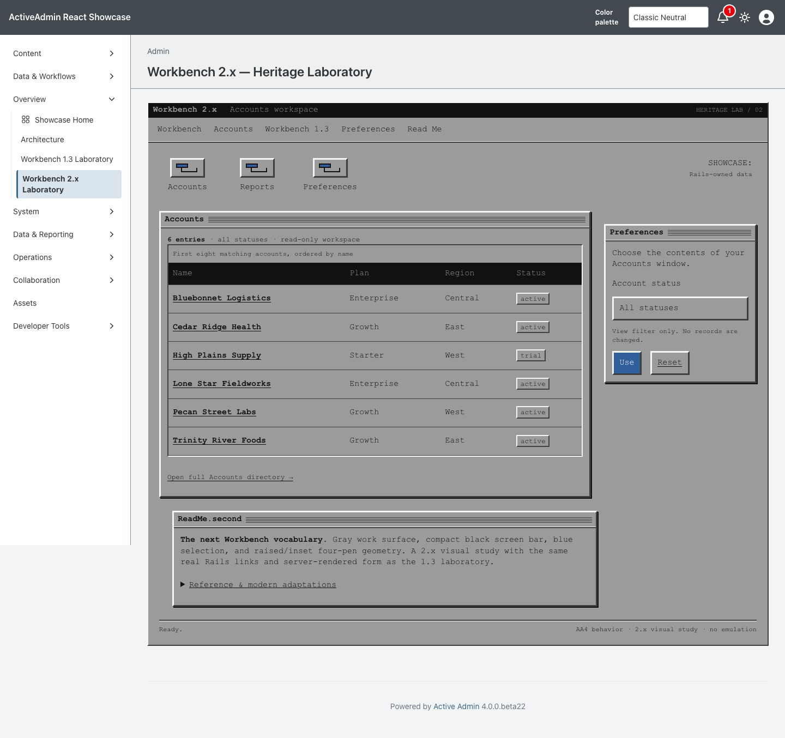
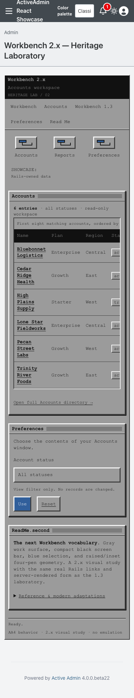

<!-- docs/heritage-workbench-2.md -->

# Workbench 2.x Heritage Laboratory

Consumer proof for the second promoted theme in [Heritage Themes #103](https://github.com/scarver2/activeadmin-react-showcase/issues/103).
Visit `/admin/workbench_2_laboratory` after signing in, or choose **Overview →
Workbench 2.x Laboratory**. This route is intentionally separate from the
Workbench 1.3 laboratory: it proves a distinct theme rather than turning one
page into an ambiguous runtime theme switcher.

Presentation comes from the deterministic Workbench 2.x recipe in stacked
`activeadmin-themes` PR #33 at exact head
`a74d0cd04f328c52e176319e5fcee6f424c66498`. Showcase commits the installed
stylesheet, maps the gem's immutable composition slots onto semantic Rails
markup, and retains all routes, records, filtering, authorization and
accessibility behavior locally.

## Reference And Provenance

The reference corpus was inspected September 21, 2026:

- [AmigaOS developer documentation: RKRM Changes and Additions](https://developer.amigaos3.net/sites/default/files/downloads/2024-02/RKRM%20changes%20and%20additions-%282024-02-21%29.pdf), especially the Release 2 pen roles and menu discussion on pages 66 and 98–99.
- [GUIdebook: Workbench 2.04 screenshots](https://guidebookgallery.org/screenshots/amigaos204), used to compare windows, preferences, menus, requesters, icons and selection across a capture set.
- [Workbench Nostalgia: Release 2.0](https://www.gregdonner.org/workbench/wb_20.html), used for chronology and a visual cross-check.
- [Cloanto / Amiga Forever screenshots](https://www.amigaforever.com/screenshots/), the issue-authorized preservation context; its current public gallery does not expose a focused 2.x capture set.

No reference screenshot, ROM, font, logo, icon, disk image, pointer or gadget
bitmap is redistributed. All shipped geometry is original CSS under the
repository license. The accessible modern hexadecimal values approximate
documented semantic pen roles; they are not claimed as a bit-exact palette dump.
Workbench is a trademark of Cloanto Corporation; this independent study is not
an official product or endorsement.

## Historical Reference → Constraint → Adaptation

| Historical reference | AA4 / modern constraint | Workbench 2.x adaptation |
| --- | --- | --- |
| Release 2 semantic pen roles | Maintainable, reviewable theme tokens | Original CSS properties represent text, shine, shadow, fill, fill text and surface roles |
| Gray work surface, black screen bar, blue selection | Theme must remain visibly distinct from 1.3 without mixing in 3.x or MUI | A separate `:workbench_2` recipe and `workbench-2-*` namespace own one restrained four-pen system |
| Raised windows/gadgets and inset wells | Avoid copied bitmaps, fake controls and misleading behavior | Border-side shine/shadow geometry applies to semantic windows, data regions and real controls; no decorative close/depth gadgets |
| Compact bitmap-era typography | Readability and redistribution rights | Readable system-monospace fallbacks preserve technical rhythm; no historical font is embedded |
| Drawer and disk metaphors | Functional controls need visible labels | Composition-owned original CSS launcher art accompanies ordinary labelled links |
| Requester-style preferences | Rails remains authoritative and useful without JavaScript | A labelled GET form filters allowlisted statuses and changes no record |
| Desktop-first fixed display | Narrow viewports, zoom and touch must remain responsible | Source-order reflow, 44px controls and a keyboard-focusable locally scrolling table preserve access |
| One historical presentation | Host dark preference must not invent a new Workbench variant | `color-scheme: light` and complete scoped tokens preserve the fixed treatment under either host preference |
| Platform-era focus and contrast behavior | Current accessibility preferences remain authoritative | Visible focus plus reduced-motion and forced-colors rules adapt the presentation without emulating the operating system |

## Behavior And Ownership

ActiveAdmin still owns authentication, navigation, resource routes and actions.
The host-owned `Showcase::HeritageAccountsWorkspace` is shared with the accepted
Workbench 1.3 page: it accepts only `Account::STATUSES`, orders by name and id,
and returns at most eight existing accounts. Unknown filters fall back to all
statuses and are not echoed. Rails escapes record content and generates every
resource URL. The page adds no write action, persistence, JavaScript state
machine, network dependency or production data.

The route is server-opted into `data-activeadmin-theme="workbench-2"`; every
presentation selector remains scoped to that attribute and its workspace. The
gem owns the fixed palette, composition and hardening. Showcase owns markup,
accessible names, records, forms, links, tests and evidence. Requiring the gem
has no styling side effect, and there is no host CSS patch.

## Verification

Service specs lock the shared allowlist, ordering and record bound. Request
coverage verifies authentication, semantic markup, recipe slots, GET filtering,
escaping, empty recovery and route isolation. Chromium verifies fresh desktop
and narrow sessions, the fixed presentation under the host dark class,
keyboard use, local table overflow, reset/native navigation, reduced motion,
forced colors and a JavaScript-disabled path.

Actual browser 200% zoom, physical devices and additional engines are not
claimed. A 390px viewport is responsive evidence, not a substitute for genuine
browser zoom.

## Screenshot Provenance

Captured from implementation source
`0f9148054000d649ece51d57dfb69f173dcaea7d` on September 21, 2026, using
Playwright 1.63.0 / Chromium 153.0.8010.12 on macOS 26.7. The host pins
`activeadmin-themes` exact head
`a74d0cd04f328c52e176319e5fcee6f424c66498`; installed Workbench 2.x CSS
SHA-256 is `23ccae22609426973c78e13648fed7d987a744ccfc0dff0bc0a0810c5365e39a`.
Seeded synthetic accounts, default zoom and a fresh page/context were used for
each 1440×1000 desktop and 390×1000 narrow navigation. Both images were visually
inspected. These are generated Showcase captures; historical references are
linked only and not included in the repository.

```sh
CAPTURE_SHOWCASE_SCREENSHOTS=1 CI=1 PLAYWRIGHT_PORT=3183 mise exec -- npx playwright test test/browser/workbench_2_laboratory.spec.ts
```





SHA256:

```text
workbench-2-1440.png  f7331f8ff704331e4e331084da3f7e063066fe398010abc4198f32ac86615668
workbench-2-390.png   4fd2539490ae5a89dac0b21a688ed925fb4c4588b3d82651af02998e758a2ccb
```

## Collection Remains Open

This PR does not complete #103. Workbench 3.x, MUI, AmigaOS 4,
AROS/Wanderer/Zune, Haiku beta6, Video Toaster 4000/period LightWave and Mercury
Flight remain independently scoped. No release, deployment, publication or
Rodeo adoption is authorized.

—
Stan Carver II
Made in Texas 🤠
https://stancarver.com
