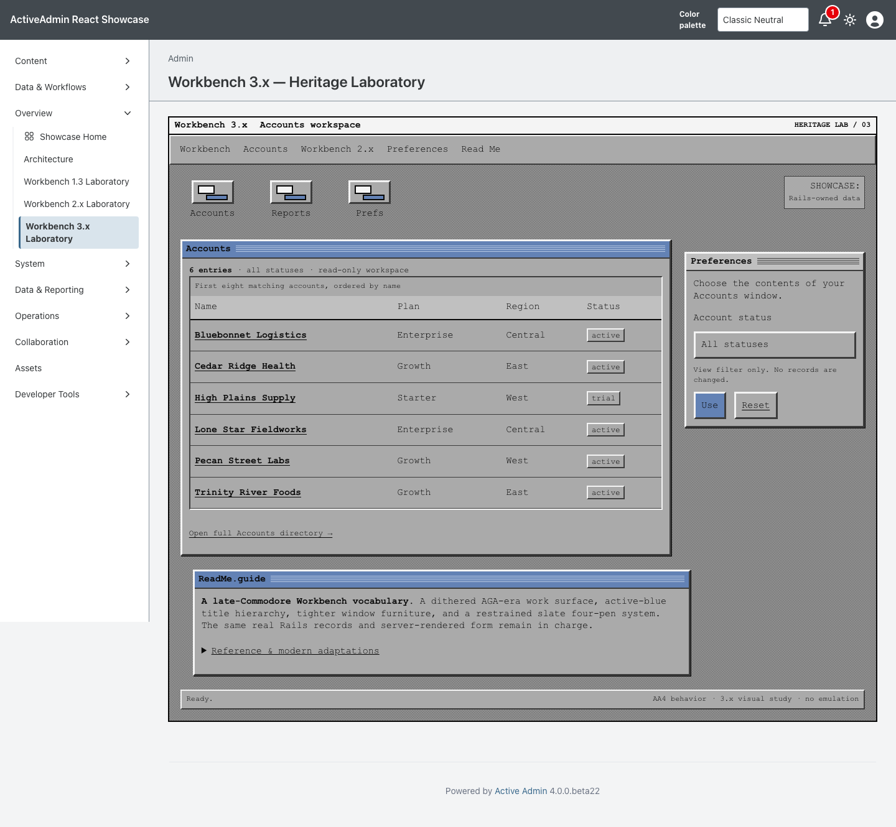
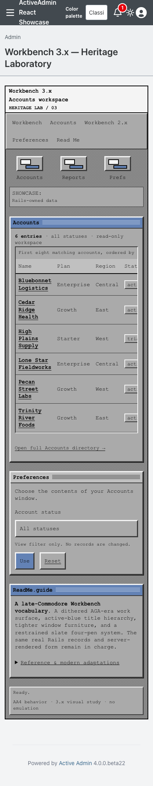

<!-- docs/heritage-workbench-3.md -->

# Workbench 3.x Heritage Laboratory

Consumer proof for the third promoted theme in [Heritage Themes #103](https://github.com/scarver2/activeadmin-react-showcase/issues/103).
Visit `/admin/workbench_3_laboratory` after signing in, or choose **Overview →
Workbench 3.x Laboratory**. This route stays separate from the Workbench 1.3
and 2.x laboratories: each exact page proves one composition without an
ambiguous runtime theme switch.

Presentation comes from the deterministic Workbench 3.x recipe in stacked
`activeadmin-themes` PR #34 at exact head
`01cc8ed5be7fb46bc08125d7821c263395c9af5e`. Showcase commits the installed
stylesheet, maps the gem's immutable composition slots onto separate semantic
Rails markup, and retains all routes, records, filtering, authorization and
accessibility behavior locally.

## Reference And Provenance

The reference corpus was inspected September 21, 2026:

- [Commodore AmigaOS 3.1 Workbench User's Guide](https://www.vht-dk.dk/amiga/diverse/pdf/Commodore_Amiga_OS_3.1_Workbench.pdf), especially its Workbench, Palette, ScreenMode and WBPattern preference descriptions.
- [Cloanto: Amiga Forever Workbench 3.1 improvements](https://www.amigaforever.com/kb/16-120), used to distinguish the last Commodore/Amiga 3.1 release from Cloanto's later enhanced Workbench 3.X.
- [AmigaOS documentation: Workbench Preferences](https://wiki.amigaos.net/wiki/AmigaOS_Manual:_Workbench_Preferences) and [Pattern Preferences](https://wiki.amigaos.net/wiki/AmigaOS_Manual:_Workbench_Pattern_Preferences), used to cross-check screen, icon and separately configurable background behavior.
- [Workbench 3.1 on an emulated Amiga 1200](https://commons.wikimedia.org/wiki/File:Amiga_Workbench_3.1_screenshot.png), a CC BY-SA 4.0/GFDL user capture used to cross-check stock screen-title, active-window, dither and bevel relationships.
- [Amiga Forever Workbench 3.X screenshot](https://www.amigaforever.com/screenshots/workbench-3-x/), inspected only as a post-Commodore comparison, not as stock 3.1 grammar.

No reference screenshot, ROM, font, logo, icon, disk image, pointer, gadget
bitmap or pattern is redistributed. All shipped geometry is original CSS under
the repository license. The accessible modern hexadecimal values approximate
historical semantic roles; they are not claimed as a bit-exact palette dump.
Workbench is a trademark of Cloanto Corporation; this independent study is not
an official product or endorsement.

## Historical Reference → Constraint → Adaptation

| Historical reference | AA4 / modern constraint | Workbench 3.x adaptation |
| --- | --- | --- |
| Workbench 3.1 four-pen lineage | Remain recognizably related to 2.x without becoming a recolor | A separate `:workbench_3` recipe adds an original dithered desktop, white information strip and active/inactive title hierarchy |
| Configurable Workbench/window/screen backgrounds | Do not copy pattern assets or turn the host into an emulator | An original CSS dither applies only to the work surface; readable windows remain solid |
| Blue active windows and gray inactive windows | Preserve meaningful hierarchy with stable semantic markup | Primary and wide headers use active blue while the preferences window remains inactive gray |
| Fine repeated title-bar rules | No fake close, depth, zoom or scrollbar controls | Original CSS rules communicate activity without suggesting unavailable behavior |
| Drawer and tool objects | Functional controls need visible names | Original CSS launcher art remains decorative beside ordinary labelled links |
| Compact historical typography | Readability and redistribution rights | System-monospace fallbacks retain technical rhythm at accessible sizes; no historical font is embedded |
| Pointer-driven fixed displays | Narrow layouts, keyboard access and touch targets | Source-order reflow, 44px controls and a keyboard-focusable locally scrolling table preserve access |
| One historical presentation | Host dark preference must not invent a new variant | `color-scheme: light` and complete scoped tokens preserve the fixed treatment under either host preference |
| Historical focus/contrast conventions | Current user preferences remain authoritative | Visible focus plus reduced-motion and forced-colors rules adapt the presentation without emulation |

## Behavior And Ownership

ActiveAdmin still owns authentication, navigation, resource routes and actions.
The unchanged host-owned `Showcase::HeritageAccountsWorkspace` also serves the
accepted Workbench 1.3 and 2.x pages: it accepts only `Account::STATUSES`, orders
by name and id, and returns at most eight existing accounts. Unknown filters
fall back to all statuses and are not echoed. Rails escapes record content and
generates every resource URL. The page adds no write action, persistence,
JavaScript state machine, network dependency or production data.

The route is server-opted into `data-activeadmin-theme="workbench-3"`; every
presentation selector remains scoped to that attribute and its workspace. The
gem owns the fixed palette, composition and hardening. Showcase owns markup,
accessible names, records, forms, links, tests and evidence. Requiring the gem
has no styling side effect, and there is no host CSS patch.

## Verification

Existing service specs lock the shared allowlist, ordering and record bound.
Request coverage verifies authentication, semantic markup, every recipe slot,
GET filtering, escaping, empty recovery and route isolation. Chromium verifies
fresh desktop and narrow sessions, the dithered surface and active hierarchy,
fixed presentation under the host dark class, keyboard use, local table
overflow without document overflow, reset/native navigation, reduced motion,
forced colors and a JavaScript-disabled path.

Actual browser 200% zoom, physical devices and additional engines are not
claimed. A 390px viewport is responsive evidence, not a substitute for genuine
browser zoom.

## Screenshot Provenance

Captured from implementation source
`b8560a28394991019cc0c2d5db18b9321628ef9b` on September 21, 2026, using
Playwright 1.63.0 / Chromium 153.0.8010.12 on macOS 26.7. The host pins
`activeadmin-themes` exact head
`01cc8ed5be7fb46bc08125d7821c263395c9af5e`; installed Workbench 3.x CSS
SHA-256 is `352c5f0ba3483f73c493a24866321f488220f925b8735724107787ec0d89afae`.
Seeded synthetic accounts, default zoom and a fresh page/context were used for
each 1440×1000 desktop and 390×1000 narrow navigation. Both images were visually
inspected. These are generated Showcase captures; historical references are
linked only and not included in the repository.

```sh
CAPTURE_SHOWCASE_SCREENSHOTS=1 CI=1 PLAYWRIGHT_PORT=3184 mise exec -- npx playwright test test/browser/workbench_3_laboratory.spec.ts
```





SHA256:

```text
workbench-3-1440.png  3e66ed9420136823016c496058094b700f5c0827ec0b1be7a4de3cf0c6e7ba87
workbench-3-390.png   31f6da69bdc175eb855ee82c58eef07068010f311ae8d53b360cc0590e9a24f6
```

## Collection Remains Open

This PR does not complete #103. MUI, AmigaOS 4, AROS/Wanderer/Zune, Haiku
beta6, Video Toaster 4000/period LightWave and Mercury Flight remain
independently scoped. No release, deployment, publication or Rodeo adoption is
authorized.

—
Stan Carver II
Made in Texas 🤠
https://stancarver.com
