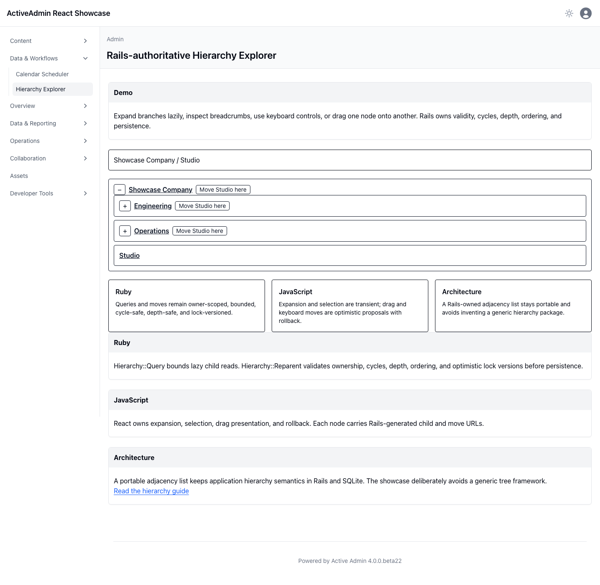

<!-- docs/hierarchy-explorer.md -->

# Hierarchy Explorer

The Hierarchy Explorer demonstrates recursive administrative data without moving hierarchy policy into the browser. Open **Data & Workflows → Hierarchy Explorer** to expand the deterministic organization, select nodes, inspect breadcrumbs, and reparent through pointer drag or keyboard-accessible controls.

## Demo

Children load only when a branch opens. Moves appear optimistically, but Rails validates ownership, a four-level depth limit, ordering, and the submitted lock version around Ancestry's cycle-safe tree mechanics. Rejected proposals restore the prior tree. A nested ActiveAdmin list and ordinary edit forms remain available without JavaScript.

## Ruby

`Hierarchy::Query` scopes direct-child reads to the authenticated administrator, applies the application's sibling order, and caps each response at 50 nodes. `Hierarchy::Reparent` resolves parents through the same owner scope, locks the moved record, and asks Ancestry to persist the cycle-safe materialized-path move.

## JavaScript

`HierarchyExplorer` owns expansion, selection, loading indicators, breadcrumbs, and drag/keyboard presentation. It consumes Rails-generated URLs and treats every move as reversible until the server returns a canonical node.

## Architecture

The SQLite schema uses Ancestry's portable materialized path plus a cached depth and explicit sibling positions. Ancestry owns generic parent, ancestor, descendant, subtree, and cycle semantics. Administrator ownership, authorization, bounded lazy loading, four-level depth policy, ordering, locking, and React rollback remain application-owned.

## Screenshot

This durable capture was produced by Playwright in real Chromium from the
deterministic synthetic hierarchy. It supplements the browser interaction suite.

—
Stan Carver II
Made in Texas 🤠
https://stancarver.com
