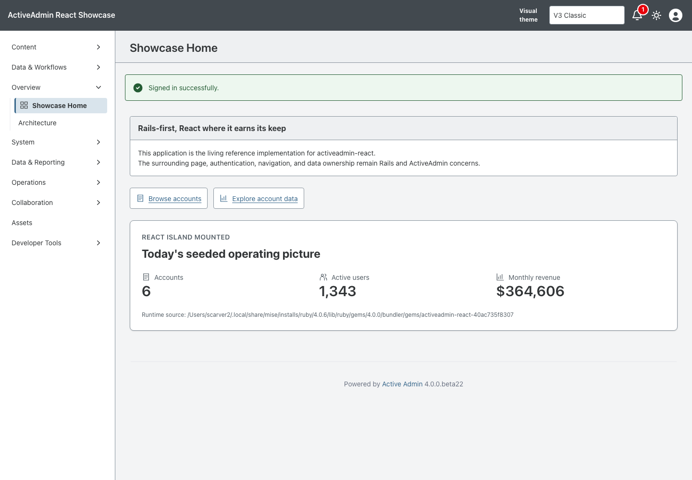
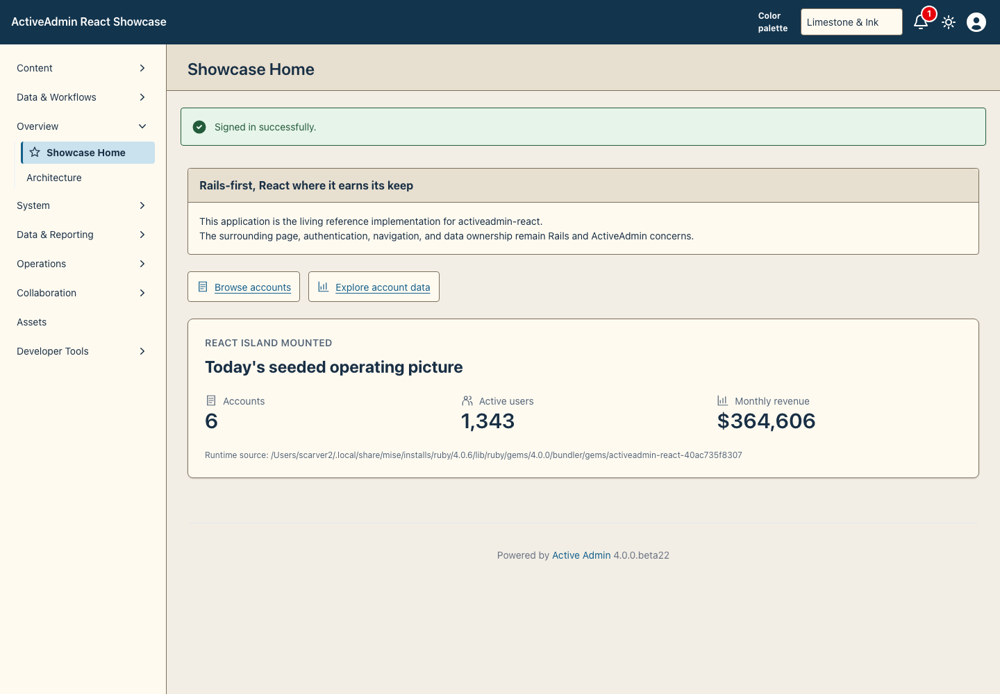
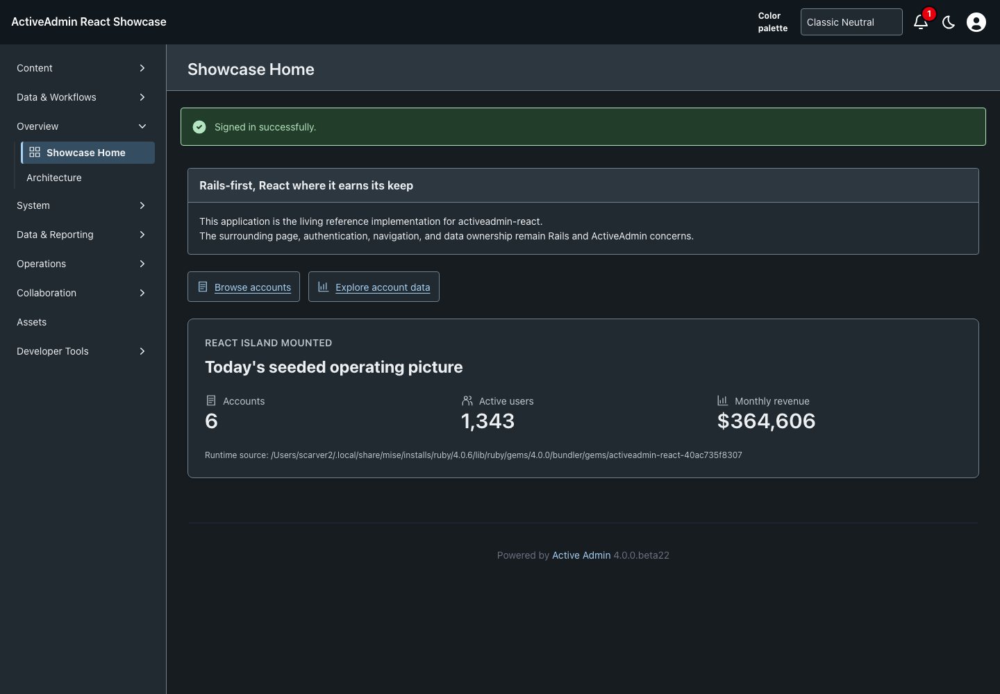
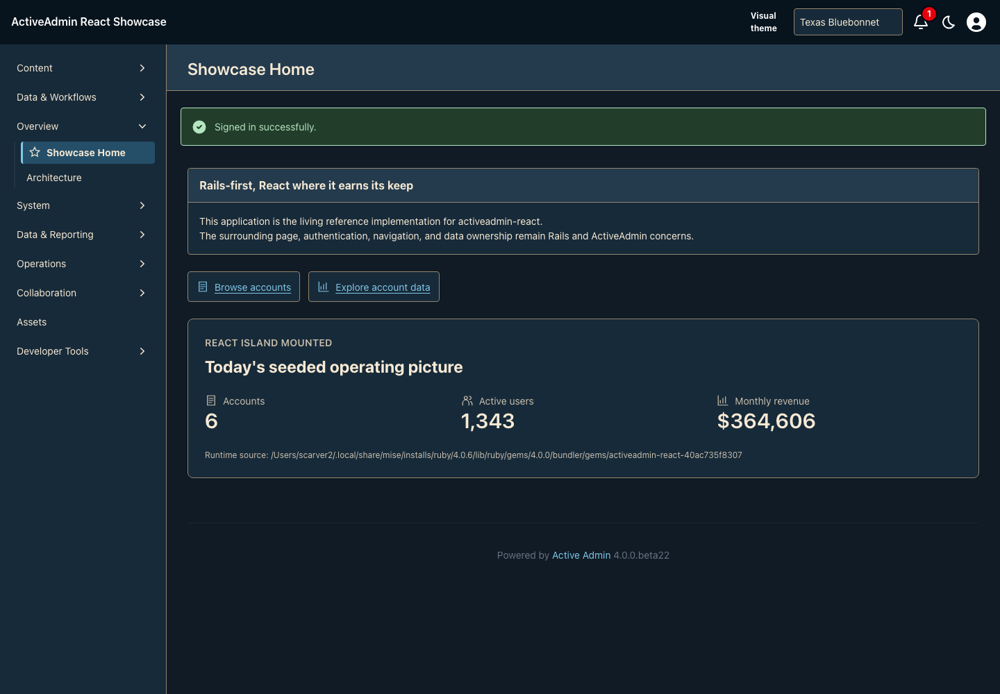

<!-- docs/icon-exploration.md -->

# Texas Bluebonnet Icon Exploration

Historical PR #72 architecture proof. The corrective child is documented in
[Semantic Icons](semantic-icons.md); the original images and descriptions below
remain historical evidence, not the current functional vocabulary.

This is a Showcase-only review candidate, not an upstream icon API or a broad
rollout. The existing Classic and Texas Bluebonnet palette values are unchanged.

## Design Boundary

- Functional geometry first: dashboard, records, people, reports.
- A single outlined five-point star marks Showcase Home under Texas Bluebonnet.
  Classic uses the dashboard grid. No hats, boots, rope, cartoons or mascots.
- Original 24-unit SVG geometry, 1.65-unit square-ended strokes, no fills.
- Navigation, two server-rendered dashboard shortcuts, and the existing
  FoundationStatus React island are the only adoption sites.
- The metric card now consumes existing semantic surface/text/border tokens;
  no token values, business data, permissions or persistence rules change.

`public/showcase-icons.svg` owns the shared geometry. `showcase_icon` and
`ThemeIcon` render decorative references with `aria-hidden` and `focusable=false`.
Visible text remains the accessible name. CSS uses currentColor and the existing
theme marker; neither renderer stores preference state or replaces native actions.
The existing user, notification and theme-toggle icons are deliberately untouched.

## Review Images

Captured from source commit `929d21d5bc587587a2bb32f5d4118fd95252607d`, based on
the refreshed #69 head `1b5890ddb573f364407549b81c29b1f98b328911`.
Playwright 1.63.0 / real Chromium 153.0.8010.12, macOS 26.7, September 19, 2026
(America/Chicago), viewport 1440×1000 at default zoom. Test-host reset/seed data,
authenticated `/admin`, native theme selector and native light/dark toggle.
All three adoption sites are visible together on the same dashboard.

Command: `CAPTURE_SHOWCASE_SCREENSHOTS=1 CI=true PLAYWRIGHT_PORT=3197 mise exec -- npx playwright test test/browser/theme_icons.spec.ts`.
Both browser scenarios passed, including server-rendered navigation/shortcuts
without JavaScript. Images were visually inspected; labels, thin icon silhouettes,
selected navigation and light/dark surfaces remain readable at this viewport.

| Classic | Texas Bluebonnet |
| --- | --- |
|  |  |
|  |  |

SHA256 artifact hashes:

```text
icons-v3-light.png        8243a8cef3d1f11e56163049e487821dbfcbffab7c35c1332561dcb0125a49fa
icons-v3-dark.png         a8f2566ab6fd90b1b608719dd7369716d41105531230d83575e778bc4429b567
icons-v3_texas-light.png  a0899757cc357e683f26f9148cad7efa61349a55f540632d1601876dc1245d44
icons-v3_texas-dark.png   424f04b2aec882c52dde34f5af5e0bfbad563b2807eb107fb915c527b73cd37d
```

This is not multi-browser, physical-device, full accessibility or responsive
acceptance. Human visual approval is required before expanding the vocabulary.
No upstream promotion to `activeadmin-themes` or `activeadmin-react` is proposed.
A future novelty/cartoon theme, if requested, must remain a separate design system.

—
Stan Carver II
Made in Texas 🤠
https://stancarver.com
