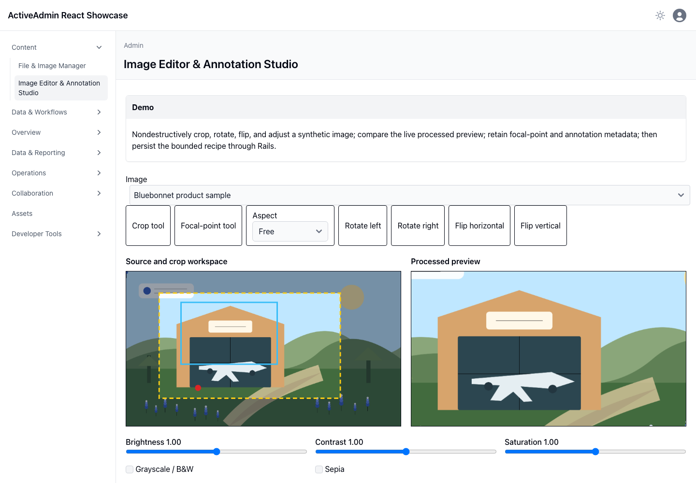
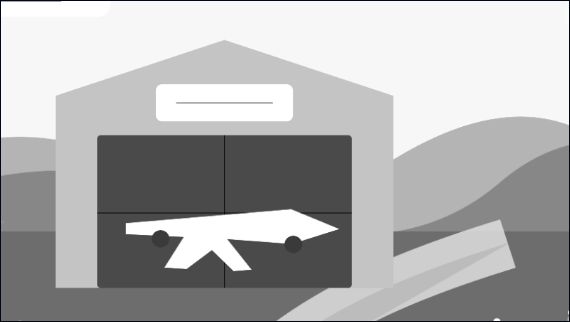

<!-- docs/image-annotation.md -->

# Image Editor & Annotation Studio

## Demo

Select a recognizable synthetic Active Storage image, drag a normalized crop, choose common aspect presets, rotate in 90° steps, flip either axis, and tune brightness, contrast, saturation, grayscale, or sepia. The original focal-point and allowlisted annotation-region tools remain available. Reset exploratory edits, revert to the saved state, and persist the finished recipe through Rails.

## Ruby

Rails authorizes the development asset boundary and validates MIME identity, labels, coordinate bounds, crop geometry, rotations, flips, and bounded tonal controls. Only normalized coordinates and transformation intent are stored in `ImageAnnotation#edit_specification`; the original Active Storage blob remains immutable.

## JavaScript

React draws the immutable source with a yellow crop box, blue annotation region, and red focal marker, then applies the recipe to a separate processed-preview canvas. Pointer geometry is normalized against the displayed bounds; labeled controls and keyboard focal movement keep the interaction accessible.

## Architecture

Active Storage owns original bytes and future derivative policy. React provides a fast interactive preview, but Rails owns and validates the portable transformation recipe that a server image-processing backend can consume later. The editor deliberately excludes painting, layers, masks, and unbounded browser raster pipelines. Replacing an image creates a distinct asset boundary; recipes and annotations remain tied to their original asset.

## Screenshots

These durable captures were produced by Playwright in real Chromium from the
deterministic synthetic Active Storage image. They supplement the browser interaction suite.
Regenerate them with `CAPTURE_SHOWCASE_SCREENSHOTS=1 bin/browser-test`.

—
Stan Carver II
Made in Texas 🤠
https://stancarver.com
