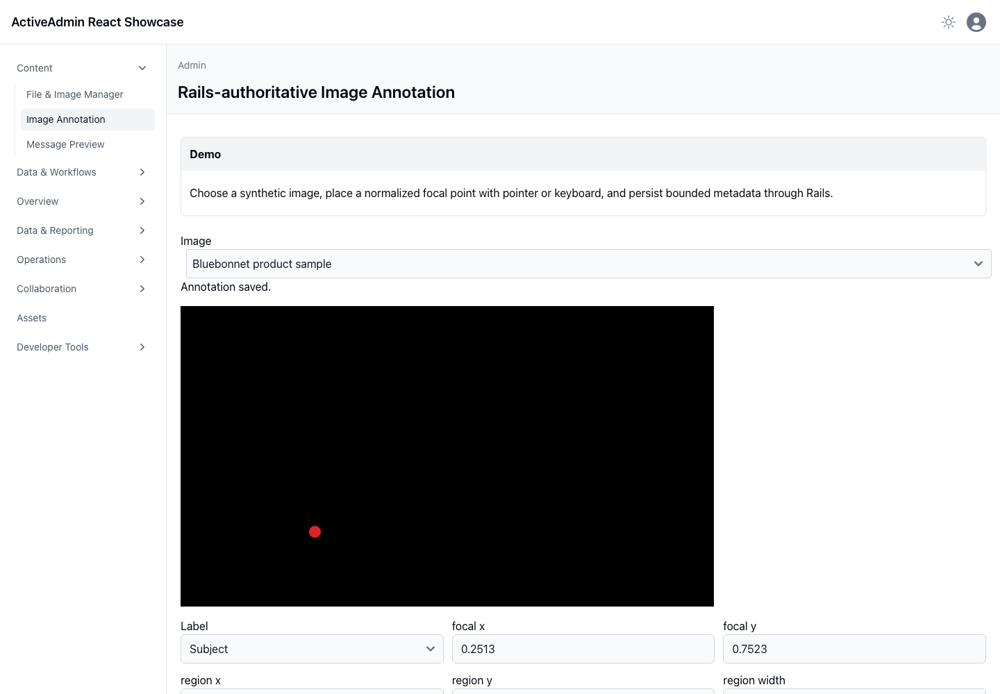

<!-- docs/image-annotation.md -->

# Image annotation editor

## Demo

Select a synthetic Active Storage image, place a focal point with pointer or arrow keys, define one allowlisted region, and persist normalized metadata.

## Ruby

Rails authorizes the development asset boundary and validates MIME identity, labels, coordinate bounds, and regions. Only normalized coordinates and transformation intent are stored.

## JavaScript

React draws the image and overlays on a responsive canvas. Pointer geometry is normalized against the displayed bounds; the same values remain editable using labeled numeric inputs.

## Architecture

Active Storage owns bytes and derivative policy. The editor never stores an opaque browser document or becomes a general graphics editor. Replacing an image creates a distinct asset boundary; annotations remain tied to their original asset.

+## Screenshot

This durable capture was produced by Playwright in real Chromium from the
synthetic Active Storage image. It supplements the browser interaction suite.

—
Stan Carver II
Made in Texas 🤠
https://stancarver.com
