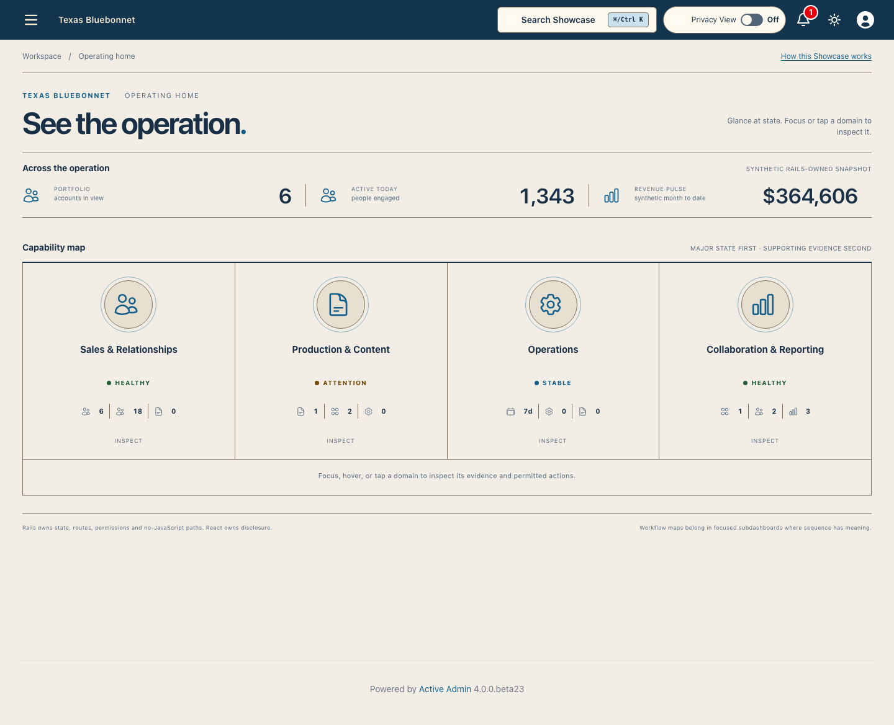
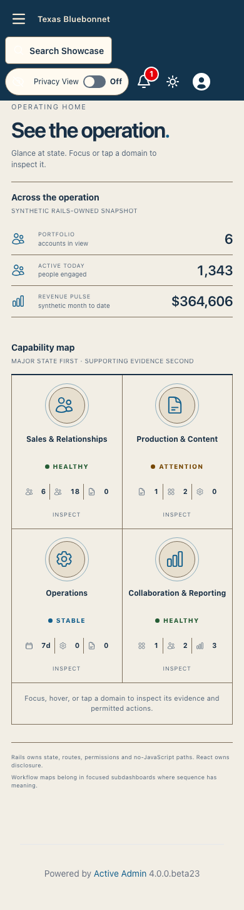
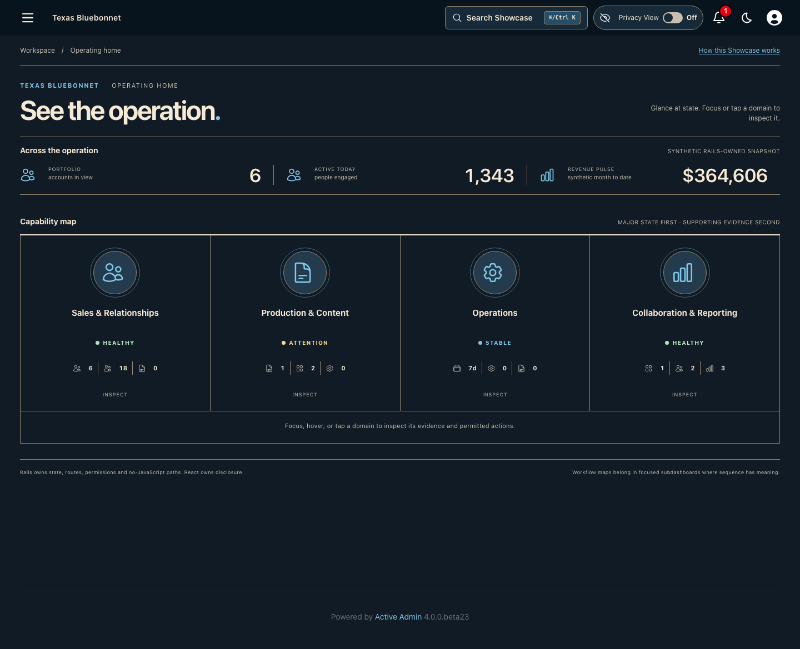
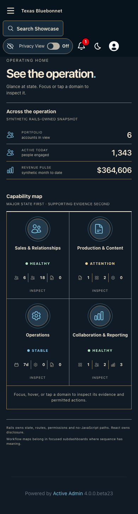
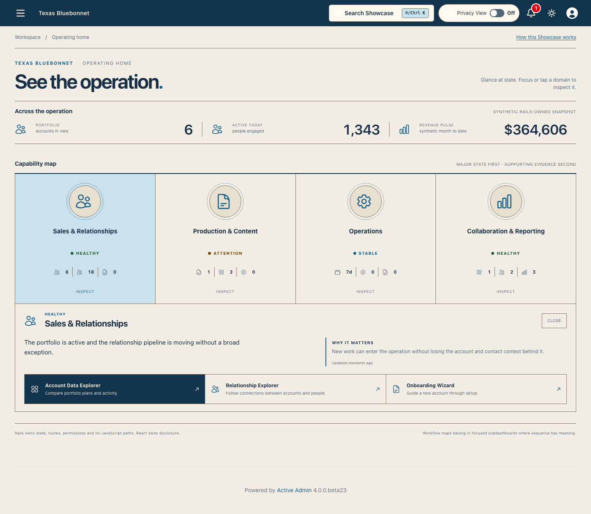
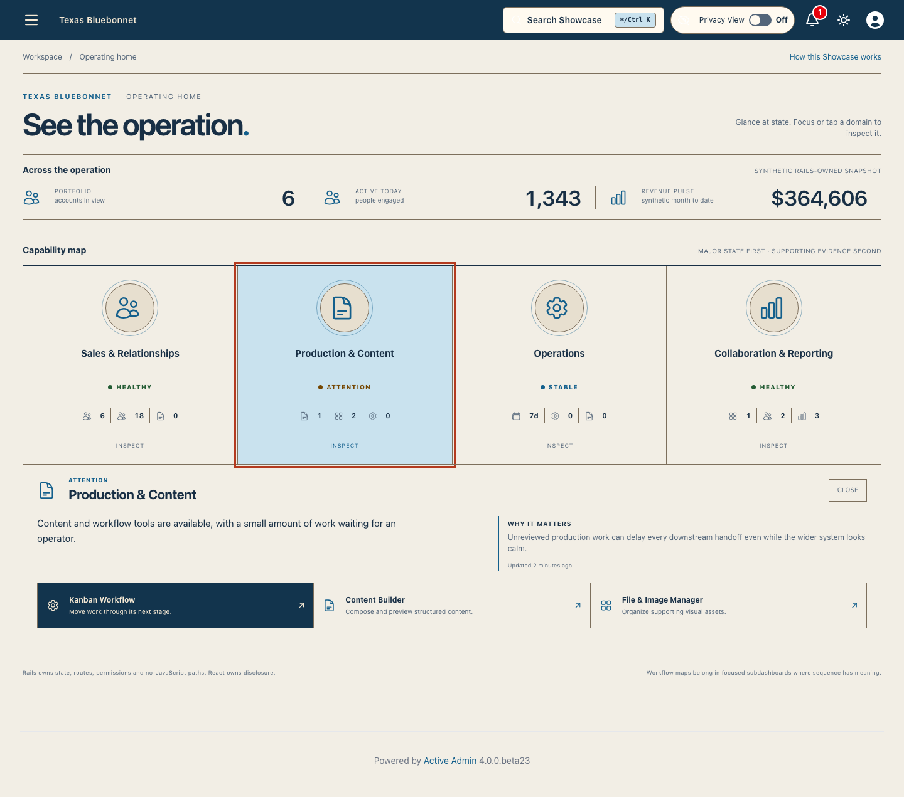
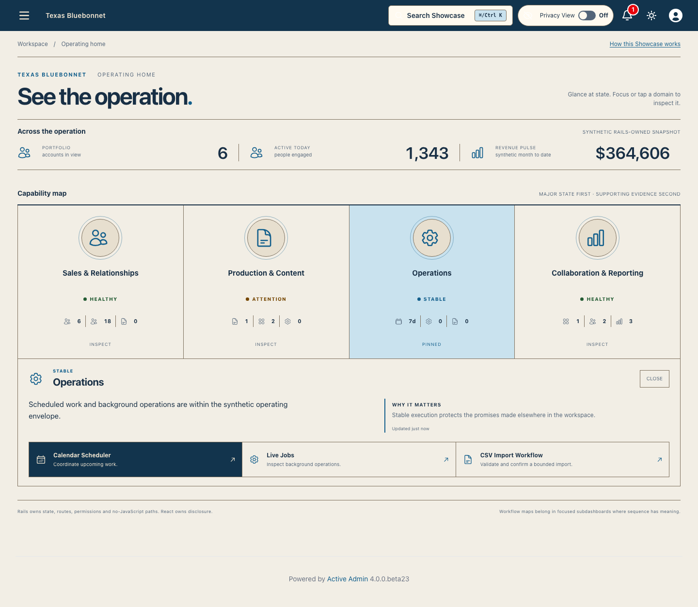

<!-- docs/master-dashboard.md -->

# Master Dashboard

Issue [#87](https://github.com/scarver2/activeadmin-react-showcase/issues/87)
adds a Showcase-owned capability demonstration on the reusable Texas Bluebonnet
theme. It is not a second theme implementation and it is not a canonical Rodeo
dashboard. `activeadmin-themes` owns the installed composition stylesheet;
Showcase owns the synthetic information architecture, Rails data contract, React
disclosure behavior, native destinations, and browser evidence in this document.

## Reference Translation

Three Sheriff-supplied references informed the information hierarchy without
contributing assets, copied markup, business names, or palette values:

- the launcher reference established major, icon-led capability anchors;
- the operational cockpit established a restrained cross-domain signal strip;
- the workflow map is reserved for focused subdashboards where sequence and
  handoffs carry real meaning.

The resulting governing model is **Glance first. Inspect second. Act third.** At
rest, four large semantic icons, synthesized state labels, and compact minor
indicators answer “where should I look?” without explanatory paragraphs. Hover or
keyboard focus reveals contextual evidence. Click/tap pins the same disclosure for
touch users. The disclosure explains why the state matters, records freshness, and
offers only Rails-owned destinations. The client does not derive business health.

## Inventory And Ownership Preservation

The operating home exposes exactly four icon-first domains and twelve secondary
indicators. This inventory is the review boundary for the capability:

| Domain | Secondary indicators | Native actions |
| --- | --- | --- |
| Sales & Relationships | Accounts, Contacts, New work | Account Data Explorer, Relationship Explorer, Onboarding Wizard |
| Production & Content | Documents, Assets, Queued imports | Kanban Workflow, Content Builder, File & Image Manager |
| Operations | Calendar, Live jobs, Imports | Calendar Scheduler, Live Jobs, CSV Import Workflow |
| Collaboration & Reporting | Unread activity, Messages, Reports | Activity Center, Operator Chat, Analytics |

The large domains translate the launcher reference; the cross-domain metric strip
translates the operating-cockpit reference. Workflow maps remain deliberately
reserved for focused subdashboards. Global Search and Privacy View remain owned
by their merged parent capabilities: this dashboard neither duplicates their
state nor changes their authorization, persistence, or destination contracts.
Their appearance in dashboard screenshots records composition compatibility only.

## Rails And React Boundary

`Showcase::WorkspaceCatalog` owns the synthetic state conclusion, deterministic
supporting indicators, freshness, explanatory copy, semantic icon names, and
server-generated ActiveAdmin URLs. Each destination continues to own its
authorization and behavior. The ActiveAdmin dashboard supplies the three
cross-domain signals and renders a complete grouped-link fallback when JavaScript
is unavailable.

`MasterDashboard` presents that contract. It does not query records, authorize
destinations, invent health rules, implement Global Search, or implement Privacy
View. The shared header controls visible in current evidence are inherited from
the approved parent; the dashboard adds no search or privacy state. Its functional
glyphs come from the accepted Heroicons-first semantic
registry. The existing ActiveAdmin drawer remains on demand and retains its native
trigger, Escape handling, and Turbo lifecycle.

## Visual Evidence

The primary captures prove the quiet resting surface in both presentations and
representative viewports.

| Presentation | Desktop — 1440 × 1000 | Narrow — 390 × 1000 |
| --- | --- | --- |
| Light |  |  |
| Dark |  |  |

Three separate captures prove representative disclosure grammar rather than
substituting a resting screenshot for interaction evidence.

| Hover | Keyboard focus | Touch-equivalent pin |
| --- | --- | --- |
|  |  |  |

The focused Chromium scenario proves four major anchors, twelve minor indicators,
resting-state terseness, three disclosure mechanisms, native links, narrow layout,
light/dark presentation, no document-level horizontal overflow, and native drawer
open/Escape behavior. Component tests independently cover resting, hover/focus,
pin, and close states. Request specs prove authentication, server data, native
fallback links, installed theme opt-in, and the absence of dashboard-owned Global
Search and Privacy behavior.

## Provenance

Captured from committed application source
`221dae0e43f4f99439bc2d6dfb1f857e6f03f150` on 2026-09-28 with Playwright
1.63.0 / Chromium on macOS. Earlier dashboard captures were replaced because
evidence does not transfer across the refreshed parent header and interaction
rewrite.

```sh
CI=1 PLAYWRIGHT_PORT=3183 CAPTURE_SHOWCASE_SCREENSHOTS=1 mise exec -- \
  npx playwright test test/browser/master_dashboard.spec.ts
```

```text
e6c153d3660ef34d2ddaa2396ece2330b205e8ab9129902eab25a8d5dbcce4ad  master-dashboard-1440-light.png
b02627fa7b0c984a69403dd8929b35df67711bd94af3eeb01e647b3ca5ffde86  master-dashboard-1440-dark.png
e4c0fddc00e0c0bc950310894831073165abf9b6c38e641ffb5a71c96e0414bb  master-dashboard-390-light.png
bbdeaef50e92308662b82cc4814325dc991edd694bccdc5704d3b4d291ab505a  master-dashboard-390-dark.png
543b7c0bf45d31f6f4ec1857e74ff0a640e1e04ca654a25cb7116a4a927acc53  master-dashboard-disclosure-sales.png
881f2a0b653248700745a8c7e38ba4bf8bf1c6e4e6d46fd7e4e37f41497e2d90  master-dashboard-disclosure-production.png
d4f7820dac296926361a29d300f479a2b7f905da5c30d7e2d67dcb64b00a9023  master-dashboard-disclosure-operations.png
```

This evidence does not claim multi-browser, physical-device, publication,
deployment, release, or Rodeo adoption acceptance.

—
Stan Carver II
Made in Texas 🤠
https://stancarver.com
