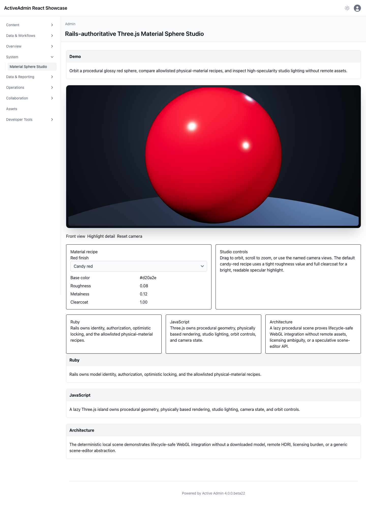

<!-- docs/material-sphere-studio.md -->

# Three.js Material Sphere Studio

## Demo

Orbit and zoom a procedural glossy red sphere, use named camera views, and compare three Rails-allowlisted physical-material recipes. The default candy-red finish combines low roughness, full clearcoat, and a neutral key/fill/rim rig so the specular response reads immediately. The material recipe remains available through the server-rendered fallback.

## Ruby

Rails owns the material-sphere identity, administrator ownership, finish allowlist, numeric material recipes, optimistic locking, and generated configuration endpoint. Unsupported finish identifiers, stale writes, unauthenticated requests, and cross-owner updates are rejected.

## JavaScript

The Three.js chunk loads only on this page. It generates bounded sphere and floor geometry locally, applies `MeshPhysicalMaterial`, tone maps the studio lighting, caps device pixel ratio at two, respects reduced-motion preferences, handles WebGL context loss, and disposes controls, animation frames, listeners, renderer, geometry, and materials on unmount.

## Architecture

The sphere intentionally replaces the issue's earlier spacecraft/assembly example. That product decision supersedes glTF loading, component raycasting, and exploded-view requirements; the remaining purpose is a focused GPU, physically based material, camera, persistence, fallback, and lifecycle integration proof. No third-party model, texture, HDRI, network request, or attribution is required. This remains an application-local showcase rather than a generic scene-editor API in `activeadmin-react`.

## Screenshot

This durable capture is produced by Playwright in real Chromium from deterministic Rails configuration and the code-generated scene. It supplements the browser interaction suite.

Regenerate it with:

```sh
CAPTURE_SHOWCASE_SCREENSHOTS=1 npm run browser:test -- test/browser/material_sphere_studio.spec.ts
```



—
Stan Carver II
Made in Texas 🤠
https://stancarver.com
