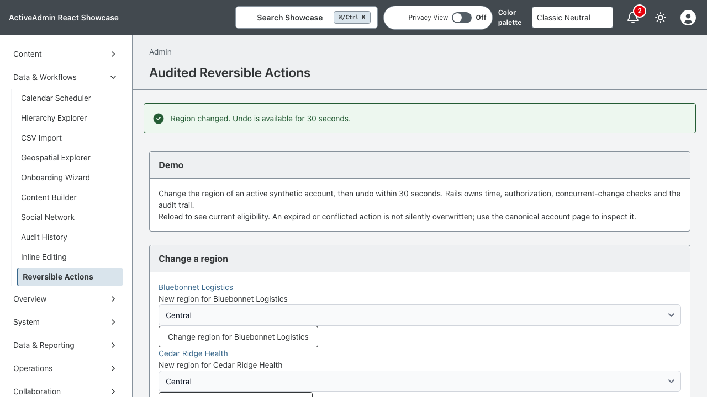
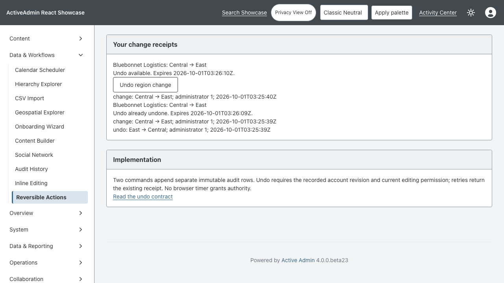

<!-- docs/reversible-actions.md -->

# Audited Reversible Actions

Issue [#99](https://github.com/scarver2/activeadmin-react-showcase/issues/99)
demonstrates one bounded command: change an active synthetic account's region,
then undo for 30 seconds from the server-recorded change time.

Open **Data & Workflows → Reversible Actions**. The ordinary Rails form includes
a generated request key and expected account revision. The receipt shows before
and after values, the absolute UTC deadline, current eligibility, and audit events.
Reloading recalculates eligibility; a stale form can still submit, but Rails refuses
an expired or conflicting undo. The browser clock never authorizes a mutation.
The account link remains the canonical recovery path.

## Authority and Audit

The existing inline-edit policy permits region changes only on active accounts.
Undo requires the receipt owner, current permission, matching applied revision and
value, and a deadline strictly later than server time. A concurrent change to any
account field invalidates undo; this intentionally does not attempt a field merge.
Changing an account to trial removes region-edit permission and blocks undo.

Both commands transact record updates and distinct audit rows together. Database
uniqueness enforces one original receipt per owner/request key and one event of
each kind per receipt. Retrying the same original input returns its receipt;
reusing its key with different input is rejected. Repeating a successful undo
returns its receipt without another write, even after the original window expires.
Persisted audit events are read-only through the application model. This is an
application audit trail, not a cryptographic or database-administrator tamper-proof
ledger. No API permits arbitrary event edits.

SQLite remains the accepted topology. Optimistic account revisions and transaction
locks prevent silently overwriting a stale account. No background job or client
timer is needed. The forms, status announcements and audit history work without
JavaScript; a toast is unnecessary for correctness.

## Verification and Operations

RSpec covers idempotency, exact expiry, stale revisions, authorization loss,
cross-owner access, audit immutability, malformed input and canonical recovery.
Chromium covers keyboard undo, no-JavaScript undo, and a real server-expired form.
The expiry browser example takes about 30 seconds deliberately; it does not alter
the server clock or shorten production rules with a test-only endpoint.

Run `mise exec -- bundle exec rspec`, then (not concurrently, because the browser
harness resets the test database) run
`mise exec -- npx playwright test test/browser/reversible_actions.spec.ts`.
Set `CAPTURE_SHOWCASE_SCREENSHOTS=1` to refresh the browser evidence.

The migration creates receipts and audit events. Rollback drops both tables and
their history; it does not reverse already accepted account mutations. Export or
retain the database backup before rollback. No publication, deployment, external
delivery, generic gem extraction or Rodeo adoption is included.

See [Inline editing](inline-editing.md) and [Architecture](../ARCHITECTURE.md).

—
Stan Carver II
Made in Texas 🤠
https://stancarver.com
