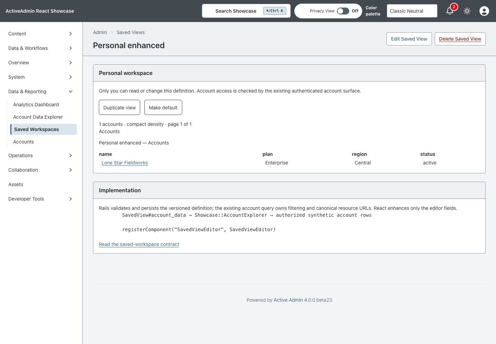
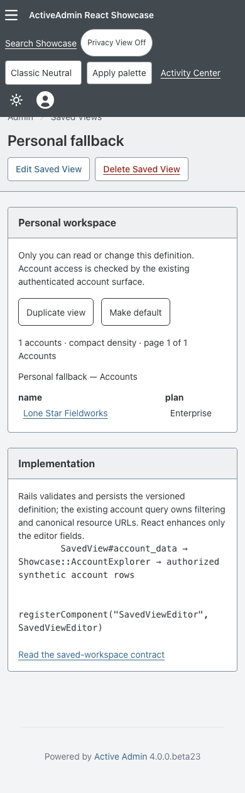

<!-- docs/saved-workspaces.md -->

# Personal Saved Workspaces

Issue [#90](https://github.com/scarver2/activeadmin-react-showcase/issues/90)
adds named personal views of the existing synthetic account dataset.
Open **Data & Reporting → Saved Workspaces**, create a definition, then save.
The Account Data Explorer also links to the list and your chosen default.

## Ownership and Contract

Rails scopes every read, edit, duplicate, default selection, and deletion to the
authenticated administrator. Definitions contain only schema version 1, bounded
account filters, an allowlisted sort/direction/page size, visible columns, grouping,
and density. They never contain SQL, arbitrary URLs, executable code, or credentials.
Account records retain the Showcase's existing authenticated shared synthetic-data
policy; owning a definition does not grant additional access to records.

`SavedView#normalized_definition` rejects unknown schema versions and fields.
`Showcase::AccountExplorer` remains the query authority. Names are unique per owner,
updates use optimistic locking, and a partial unique index enforces one default
per owner. Default selection is serialized under the owner's lock. Deleting the
default leaves no default; the default-workspace URL then returns to the list.

## Interaction and Fallback

Create, rename, edit, duplicate, favorite, choose default, and delete use ordinary
ActiveAdmin Rails forms. React progressively enhances the definition editor and
announces column/density/group choices; it does not submit a separate authority.
The same named fields and results remain available with JavaScript disabled.

Saved view URLs are stable: `/admin/saved_views/:id?page=2`. Grouping applies within
each bounded page, not to an unbounded full-dataset query. Name stays visible so
every row retains its canonical account link. Revenue values are currently cents,
matching the account endpoint's explicit field name. Unsupported historical
definitions display recovery instructions instead of running an approximate query;
editing them starts from the current supported defaults and requires explicit save.

The definition is personal. Team sharing is deliberately not introduced.

## Verification

RSpec covers definition validation, persistence, owner isolation, default uniqueness,
stale writes, duplication, pagination, and stale-schema recovery. Vitest checks named
form fields, column toggles, and live editor state. Chromium exercises persisted
filters, keyboard input, validation errors, stale edits, and default/duplicate workflows
with and without JavaScript.

Local verification: 740 RSpec examples pass (93.72% line coverage), 299 Vitest
tests pass (100% coverage), TypeScript, Vite build, RuboCop, RBS and Brakeman pass.
Vitest was run with `--maxWorkers=1` because concurrent workers timed out under
local host load. Hosted CI remains the independent full-suite gate.

Run `mise exec -- bundle exec rspec` and `mise exec -- npm run check`.
Run browser tests after RSpec finishes: the browser harness resets the same local
test database. `UPDATE_SCREENSHOTS=1` with the saved-workspace browser spec captures
the desktop and narrow screenshots under `docs/screenshots/`.

The migration is reversible; rolling it back deletes personal view definitions but
does not alter account records. No background services or external delivery are added.

See [Account Data Explorer](data-explorer.md), [Architecture](../ARCHITECTURE.md),
and [activeadmin-react](https://github.com/scarver2/activeadmin-react).

—
Stan Carver II
Made in Texas 🤠
https://stancarver.com
