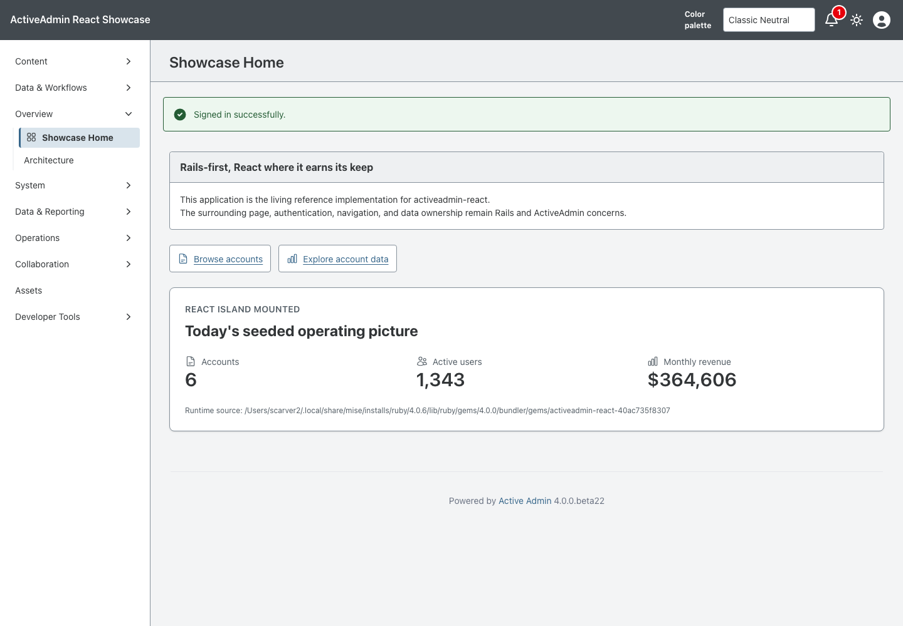
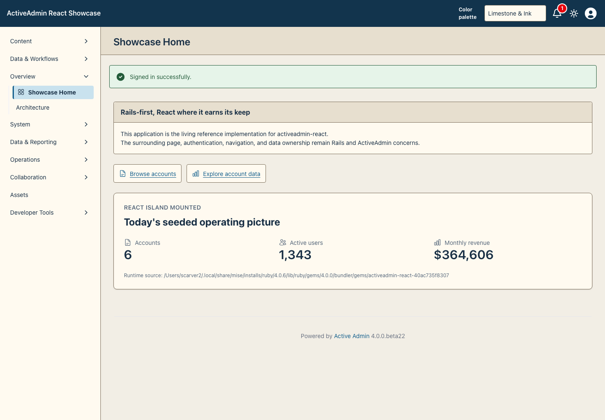
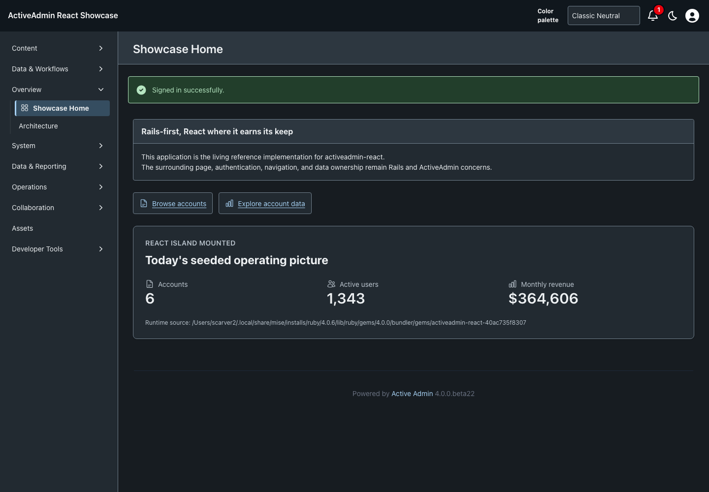
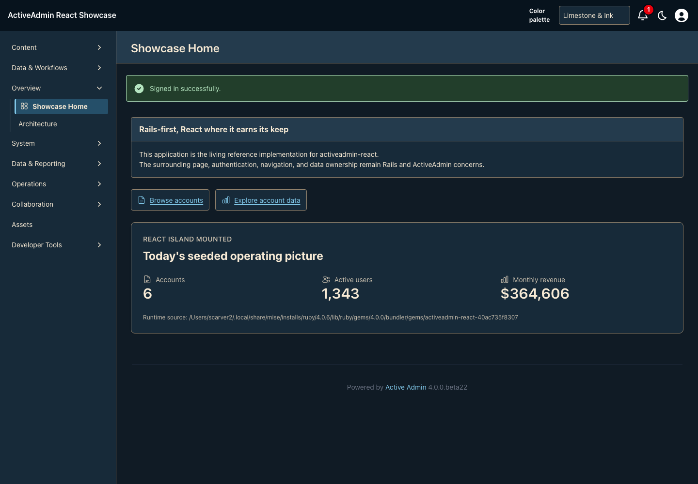

<!-- docs/semantic-icons.md -->

# Semantic Icons

Showcase-only follow-up to [PR #72](https://github.com/scarver2/activeadmin-react-showcase/pull/72),
implementing [#104](https://github.com/scarver2/activeadmin-react-showcase/issues/104).
The architecture proof remains intact; commodity glyphs now use Heroicons rather
than bespoke drawings. No upstream gem API or broad navigation rollout is implied.

## Shared Meaning, Separate Presentation

`app/frontend/icons/registry.json` is the single semantic mapping consumed by the
Rails `showcase_icon` helper and React `ThemeIcon`. Callers request meaning, not
library names. Both render the same local SVG sprite without JavaScript geometry
bundles, runtime downloads, or a second React-specific vocabulary.

| Semantic name | Heroicons 24 outline glyph |
| --- | --- |
| dashboard | squares-2x2 |
| records | document-text |
| people, customers | users |
| reports | chart-bar |
| calendar | calendar-days |
| settings | cog-6-tooth |
| filters | adjustments-horizontal |
| navigation | bars-3 |

Settings means gear; view/filter tuning means sliders; collapsed navigation means
hamburger. Existing adoption stays limited to Showcase Home navigation, two
dashboard shortcuts and the FoundationStatus React island. Additional semantic
entries establish conventions, not new controls or changed native behavior.

Heroicons is primary. If a future meaning is missing, evaluate Lucide, then Tabler;
record the exact version, asset, license and reason before adding an exception.
There is no silent runtime fallback or mixed-library substitution. Neither fallback
library is bundled today because Heroicons supplies every requested functional icon.
Commercial assets require an independently verified license before adoption.

## Source And License

Eight unmodified SVGs are vendored from
[Heroicons v2.2.0](https://github.com/tailwindlabs/heroicons/tree/ca7b62ead85d617ef4deacc56a82a5f3482184ef/optimized/24/outline),
commit `ca7b62ead85d617ef4deacc56a82a5f3482184ef`, paths
`optimized/24/outline/<glyph>.svg` using the exact names above.
Their [MIT license](../vendor/icons/heroicons/LICENSE) and Tailwind Labs copyright
are retained. Vendored files intentionally retain upstream bytes rather than adding
project prologs. The public sprite changes only the SVG wrapper into a named symbol;
RSpec compares every child element/attribute against its vendored source.

Only this small explicit subset ships, rather than a whole icon package. Native
SVG caching is shared across Rails and React; package tree-shaking is unnecessary.
To upgrade, replace the pinned originals and corresponding symbol children, update
this provenance record, run asset/renderer/browser checks, and review screenshots.

The five-point `landmark` remains original project artwork under the repository MIT
license (Stan Carver II). It is not a functional fallback. A composition may opt in
with `data-showcase-icon-family="bluebonnet"` on an ancestor plus `landmark: true`
or the React `landmark` prop. Color palettes never activate this signature: skin
changes color, while composition owns icon presentation. No composition rollout is
part of this PR.

## Accessibility And Verification

Icons inherit semantic foreground colors through `currentColor`, with Heroicons'
1.5-unit round outline. They remain decorative (`aria-hidden`, `focusable=false`).
Visible labels remain authoritative; an icon-only control must supply its own
accessible name. Selected/status meaning must not depend on icon color alone.

Regression coverage checks shared semantic mapping, frozen Ruby data, exact sprite
geometry, unique symbols, license presence, prohibited executable/remote content,
label ownership, keyboard navigation, no-JavaScript links and palette-independent
signature behavior. Browser images are evidence for these adoption sites, not
multi-browser, physical-device or whole-application accessibility acceptance.

## Review Evidence

Captured from committed source `051f7bad0ad2c6595d63d7560d8f7c29947e8039`,
stacked on #72 at `5a0b2150b1e701eb21ad1ed8fb02eef1e092a390`.
September 20, 2026; macOS 26.7; Playwright 1.63.0 / Chromium 153.0.8010.12;
1440×1000, default zoom, seeded test host at `/admin`. Both focused scenarios
passed, including keyboard and no-JavaScript navigation. All four images were
visually inspected: glyphs render, labels remain readable, and layout is unchanged.
`v3_texas` is the persisted legacy key for the Limestone & Ink palette, not the
separate Texas Bluebonnet composition. These captures do not claim #73 coverage.

```sh
CAPTURE_SHOWCASE_SCREENSHOTS=1 CI=1 PLAYWRIGHT_PORT=3175 mise exec -- npx playwright test test/browser/theme_icons.spec.ts
```

| Classic Neutral | Limestone & Ink |
| --- | --- |
|  |  |
|  |  |

SHA256:

```text
semantic-icons-v3-light.png        09474e0ee77d7ebb6838274b8129723226ebb8f14b1a9218e07f66526ea213c8
semantic-icons-v3-dark.png         463a1d07c26c54b8f12aa8e14accc56b80a8ab3db6a02909c49ea11e1f9c8809
semantic-icons-v3_texas-light.png   c1176451813e7ac2e94384894d665b46bbc140611a23675f992611509608ff0c
semantic-icons-v3_texas-dark.png    2315e520e899b47cfce0810f49b67da49fd0560bfbdba8b7c3263a0ca153508f
```

—
Stan Carver II
Made in Texas 🤠
https://stancarver.com
