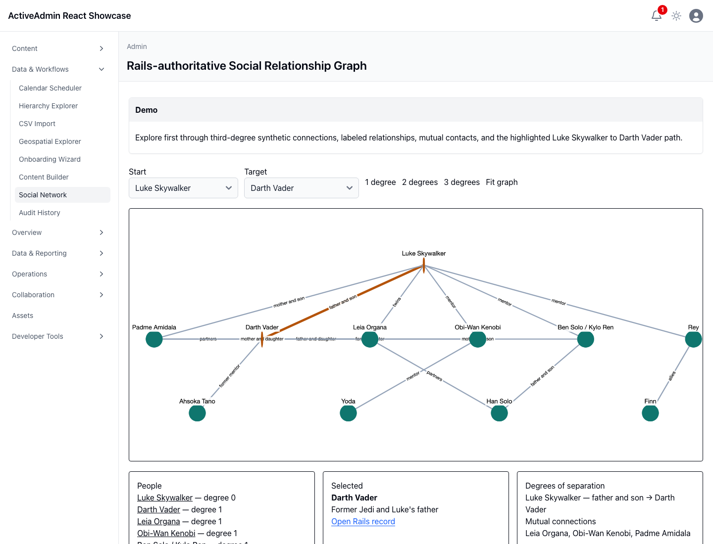

<!-- docs/social-network.md -->

# Social Relationship Graph

## Demo

Explore a deterministic, cross-generation Star Wars-inspired network without copyrighted images, logos, or dialogue. The default Luke Skywalker → Darth Vader view makes their labeled father-and-son edge immediately recognizable, while the wider sparse graph preserves meaningful first-, second-, and third-degree discovery, mutual connections, and shortest paths. Cytoscape provides pan, zoom, layout, and pointer selection; the adjacent lists preserve keyboard access.

## Ruby

Rails owns identities, concise relationship labels, canonical undirected edges, authorization, record URLs, mutual-connection semantics, and breadth-first projections. Depth is capped at three, with at most 50 nodes and 100 edges.

## JavaScript

The lazily loaded Cytoscape island renders only the projection Rails returns. Layout, pan/zoom, selection, and path highlighting are transient. Loading, failure, disconnected, and empty projections remain explicit.

## Architecture

The normalized SQLite model stays database-portable and deliberately bounded. This is a recognizable social-network demonstration, not a CRM model or generic graph database layer.

## Screenshot

This durable capture was produced by Playwright in real Chromium from the
deterministic synthetic relationship graph. It supplements the browser
interaction suite.

—
Stan Carver II
Made in Texas 🤠
https://stancarver.com
