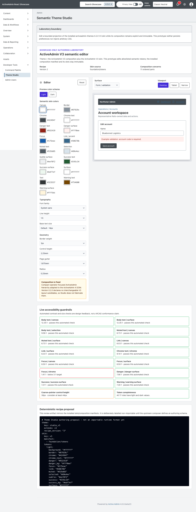
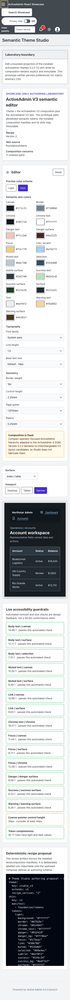
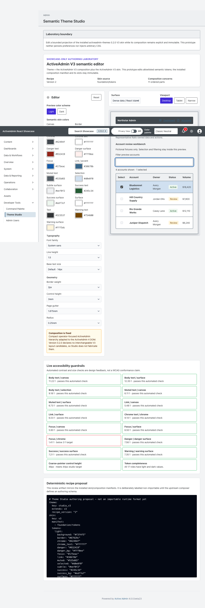
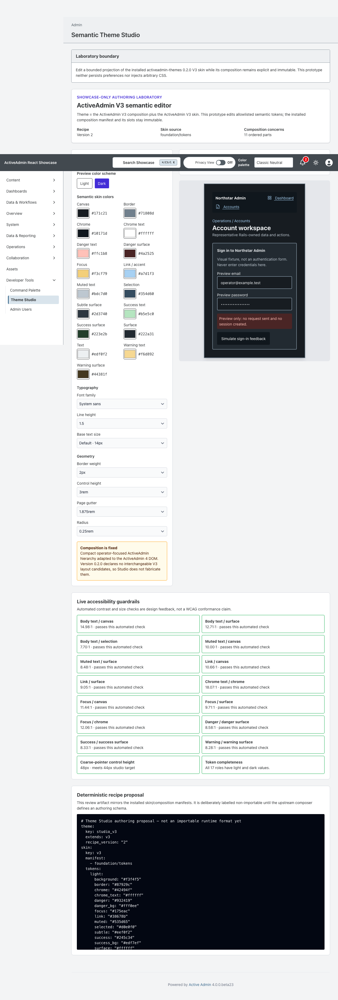

<!-- docs/theme-studio.md -->

# Theme Studio prototype

[Documentation](README.md) · [Issue #83](https://github.com/scarver2/activeadmin-react-showcase/issues/83)

Theme Studio is a Showcase-only semantic editor for the pinned
`activeadmin-themes` 0.2.0 contract. It deliberately does not establish a
second theme engine or a generic runtime schema.

## Architecture mapping

The prototype reads `ActiveAdmin::Themes.registry.fetch(:v3)` and projects the
gem's existing value objects without replacing them:

- `Theme` remains the binding between one `Skin` and one `Composition`.
- `Skin` remains the owner of the ordered `foundation/tokens` manifest.
- `Composition` remains the owner of the ordered structural manifest and its
  host-applied semantic slots.
- `Theme#recipe_version` and the ActiveAdmin version requirement remain visible
  provenance rather than editor-owned metadata.

The V3 skin already declares semantic light/dark colors, typography and bounded
geometry tokens, so the editor can safely expose allowlisted values for those
roles. V3 0.2.0 does not declare interchangeable navigation, workspace or
page-header variants. Those composition controls therefore remain read-only;
the prototype does not invent a parallel layout model.

## Interaction boundary

React owns reversible preview state, surface and viewport simulation, automated
contrast feedback, and the deterministic authoring proposal. Edits are not
persisted. Reset reconstructs the exact Rails-projected baseline. Color inputs
can change only declared semantic roles; typography and geometry use bounded
allowlists. There is no arbitrary CSS input or injection path.

The preview covers index/table, show/detail, form/validation, dashboard,
dense-data React island and credential-free login/feedback surfaces in desktop,
tablet and narrow frames. The dense workbench filters fictional accounts and
shows local selection; its selected-row and keyboard-focus appearance uses the
same projected semantic roles. Login fields are read-only synthetic fixtures,
with autocomplete deliberately disabled: they are not an authentication surface
and must never collect credentials. Its simulated submission sends no request.
The preview uses the shared Heroicons
semantic registry for functional icons. Light and dark token values are edited
independently.

Rails renders the installed theme, skin, composition, manifest and recipe
version as a useful no-JavaScript fallback. Authentication remains the native
ActiveAdmin boundary.

## Accessibility guardrails

The editor reports text, muted text, link, focus and status contrast ratios,
including actual surface, selection and chrome pairs rather than only canvas.
Scoped preview CSS applies declared border weights and control heights to
representative controls and paints a visible semantic focus outline. It never
changes the host's real theme, forms or login.

The remaining feedback includes
light/dark token completeness, and the current coarse-pointer control height.
These are immediate design guardrails, not a claim of WCAG conformance. Manual
keyboard, zoom, forced-colors, reduced-motion and assistive-technology review
remain required before a generated theme could be accepted.

## Export exploration

The deterministic preview mirrors the installed skin and composition manifest
order and emits only allowlisted state. It is explicitly labelled an authoring
proposal, not an importable format. A future upstream composer must define and
validate any real `theme.yml` schema before the Showcase exports runnable
recipes.

## Remaining acceptance boundaries

The preview/guardrail follow-up advances Showcase to 0.38.0 independently of the
original 0.34.0 prototype. It does not close #83 or claim the full authoring
architecture is accepted.

| Area | Current support | Remaining boundary |
| --- | --- | --- |
| Skin | All installed semantic light/dark roles, reversible editing | Saved authoring and upstream schema acceptance are not implied |
| Typography / geometry | Installed font, base size, line height, radius, border, gutter, control height | Heading scale, weight, spacing, content width and density presets need declared upstream tokens/contracts |
| Composition | Installed V3 manifest and semantic slots remain immutable | No fabricated navigation, action or panel-placement candidates |
| Iconography | Shared installed semantic registry | No unsupported icon-family, stroke or mapping editor |
| Preview | Six representative surfaces; desktop/tablet/narrow and light/dark | Manual accessibility acceptance remains required |
| Export | Deterministic, explicitly non-importable authoring proposal | Real runnable recipe export waits for an upstream validated authoring schema |

Dense selection and login feedback are disposable React fixture state, not CRM
persistence or authentication. No additional dependency, migration, upstream
engine source, publication or deployment is introduced.

## Refresh and preservation

The 0.38.0 follow-up starts from accepted master `80f93c6eb4723debf621ae6f7ff82bc1a03fe5a6`
after #167. Local verification: 793 RSpec examples (zero failures), 324 frontend
tests (100% statement/branch/function/line coverage), TypeScript, Vite production
build, 608 Ruby files checked without offenses, and RBS validation. Chromium
proof exercises keyboard selection/focus, actual token styling, desktop/narrow
views, credential-free feedback and the no-JavaScript contract.

This branch preserves the original prototype commit `9b5ab4c` and its pending registration, documentation, version and browser-proof intent while refreshing onto master `04b756e` after #162. The original `showcase-83-theme-studio` worktree and its uncommitted files remain untouched. The version is reconciled to the next minor, 0.34.0, for this bounded prototype capability; the upstream authoring schema remains outside this release.

The consumed gem remains pinned at merged revision `96db6599a0668cfa2338769b35b38262ba9f49d1`. No reusable theme source is copied into Showcase; this is a preview projection. Native icons remain the installed semantic registry, not an invented icon-pack switcher.

Use the existing [testing](testing.md) and [deployment](deployment.md) procedures. No migration, remote service, publication or deployment is introduced. Browser evidence covers real desktop/narrow viewports, keyboard reset and no-JavaScript inspection.

—
Stan Carver II
Made in Texas 🤠
https://stancarver.com
